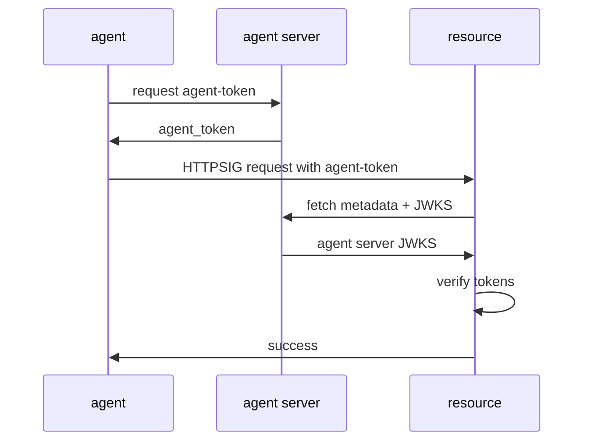
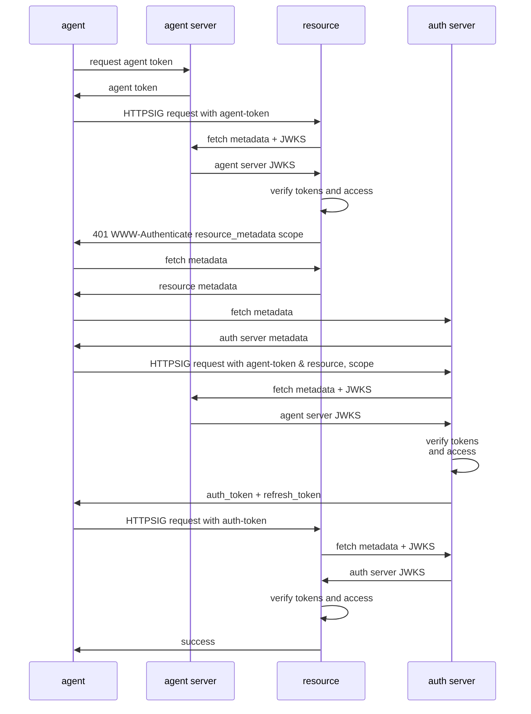
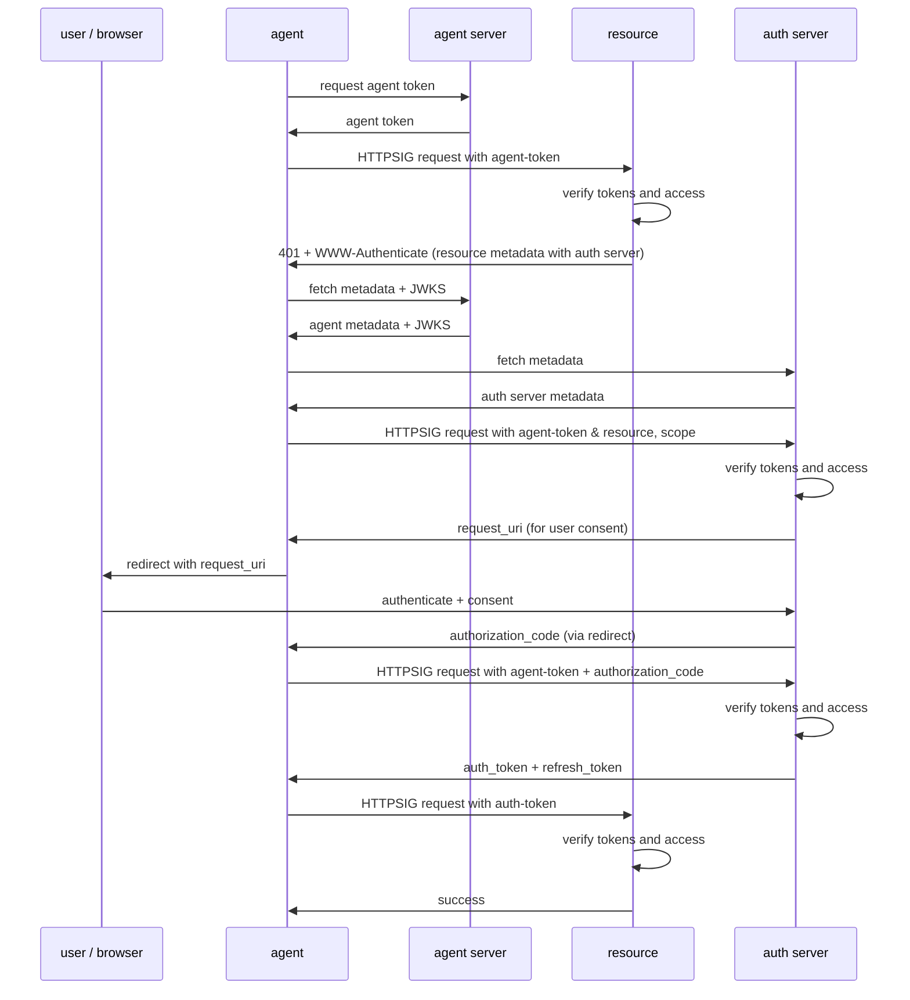
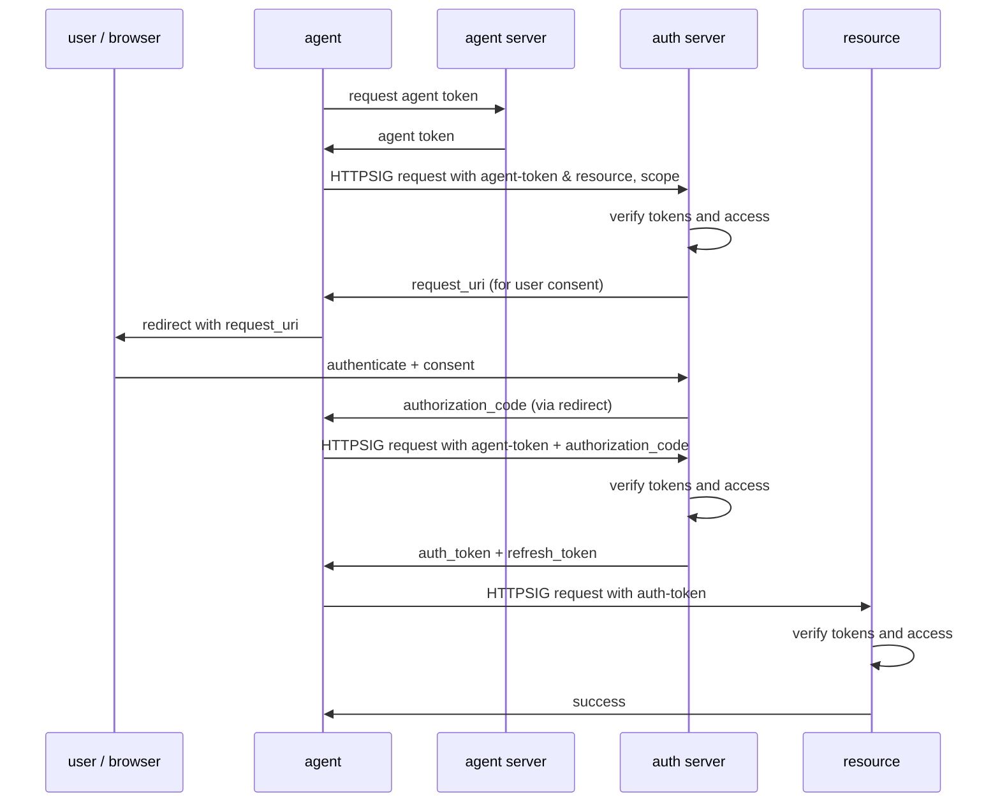
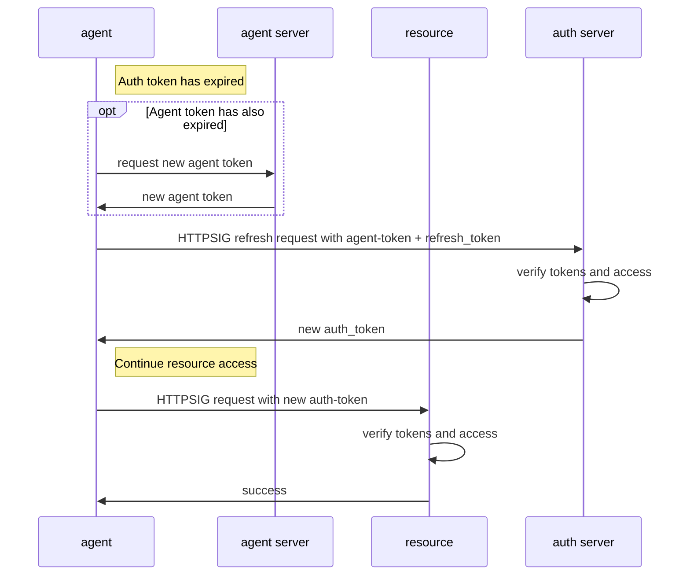

# Agent Auth (AAuth)

**Author:**  
Dick Hardt  
Hellō Identity  
Email: dick.hardt@hello.coop  
URI: https://github.com/DickHardt

**Date:** October 30, 2025  
**Status:** Internet-Draft (Exploratory)

---

## Abstract

**Agent Auth (AAuth)** is an exploratory specification that reimagines authorization for the modern web, where autonomous agents, distributed applications, and dynamic ecosystems have replaced the traditional client-server model that OAuth 2.0 was designed for.

This document explores how proof-of-possession security, cryptographically verified agent identity, and discoverable metadata can address the evolved requirements of today's internet:
- Eliminating bearer token exfiltration through mandatory HTTP Message Signing (HTTPSig) on every request
- Enabling distributed applications with ephemeral keys instead of long-lived shared secrets
- Supporting dynamic agent ecosystems without pre-registration requirements
- Providing fine-grained access control based on verified agent identity, not just user identity
- Facilitating meaningful user consent with extensible authorization context

AAuth builds on OAuth 2.1's authorization concepts (scopes, authorization_details, PKCE, redirect-based consent) while introducing fundamental changes: HTTPS-based agent identities, proof-of-possession tokens bound to ephemeral keys, request integrity and replay protection via HTTPSig, and agent-aware authorization decisions.

This is an **exploration and explainer**, not a ready-to-adopt draft. It paints a picture of how modern authorization could work. The normative text and examples were created with assistance from coding agents and may contain mistakes. The goal is to spark discussion about addressing the gap between OAuth 2.0's design assumptions and today's security and architectural realities.

---

## 1. Introduction

OAuth 2.0 was created to replace the anti-pattern of users providing their passwords to applications to scrape their data from web sites. Users could then authorize an application to scoped access of their data without sharing their passwords.  The internet has evolved significantly since the release of OAuth 2.0.

- **Security requirements have changed.**  

  Exfiltration of bearer tokens has become a common attack vector. While proof-of-possession with digital signatures is now practical and widely supported, bearer tokens and shared secrets are still used in most deployments.

- **Applications are distributed and more diverse.**

  The OAuth 2.0 client was typically a server. Today it may be one of many widely distributed instance of a desktop, mobile, or command line application where managing a single long lived shared secret or private key is impractical.
  
- **Agents have loosened the client-server model.**

  Tightly bound, pre-registered client and server relationships are giving way to more open and dynamic ecosystems. In environments like the **Model Context Protocol (MCP)**, a client may interact with *any* server, not just those it was pre-registered with. 
  
- **Enterprise systems span multiple trust domains.**

  Organizations deploy hundreds of applications across vendors, each requiring access to resources in different security contexts. Role-based authorization is often insufficient. Fine-grained, dynamic access control requires verifying both the calling application and user's identity.

- **OAuth scopes have become insufficient for modern authorization.**

  Traditional OAuth scopes like read or write provide only coarse-grained labels that fail to convey what data will be accessed, under what conditions, for what purpose, or for how long. This opacity prevents meaningful user consent and makes it impossible to enforce least privilege.

AAuth addresses these evolved requirements by redefining the relationships between three web participants:

- **Agents:** the applications and autonomous processes
- **Resources:** the APIs and data endpoints agents need to access
- **Auth Servers:** the systems that authenticate users and issue authorization

AAuth's protocol features directly address each trend:

- **HTTP Message Signing (HTTPSig)** replaces bearer tokens and shared secrets. Every request an agent makes is cryptographically signed with an ephemeral key it controls, eliminating token exfiltration as an attack vector and providing verifiable proof-of-possession and message integrity on every interaction.

> This aligns with web-bot-auth IETF WG HTTPSig agent authentication individual draft https://datatracker.ietf.org/doc/draft-meunier-web-bot-auth-architecture/ 

- **HTTPS-based agent identity and delegation** addresses distributed applications. Agents are identified by HTTPS URLs rather than pre-registered client IDs and redirect URIs. Each agent instance receives a short-lived agent token binding its own ephemeral signing key to the agent's identity, enabling rapid revocation of compromised instances without managing long-lived shared secrets.

- **Discoverable metadata** enables dynamic agent ecosystems. Each participant publishes a metadata document describing their capabilities and endpoints. Resources declare their trusted auth servers, auth servers advertise their features, and agents present their identity and policies. This allows any agent to interact with any resource or auth server without pre-established relationships.

- **Verifiable application and user identity** supports multi-domain trust. Auth tokens can contain both the agent's cryptographically verified identity and user identity claims from the auth server, enabling fine-grained access control decisions based on who is requesting access and on whose behalf.

- **Extensible authorization context** goes beyond simple scopes. Resources can provide detailed authorization requests conveying what data will be accessed, under what conditions, for what purpose, and for how long. This enables meaningful user consent, fine-grained policy enforcement, and least privilege access control.

## 2. Terminology

### 2.1 New Definitions

- **agent server**: The authoritative HTTPS origin that represents an agent identity, `agent_id`. It publishes metadata and keys at `https://agent.example/.well-known/agent-metadata` and issues **agent tokens** to subordinate agents.

- **agent**: An autonomous process acting under the authority of an agent server. The agent signs all requests using a key delegated by the agent server.

> **agent** was chosen rather than reusing **client** to reduce confusion between AAuth and OAuth.

- **agent token**: A proof-of-possession JWT issued by an agent server to an agent, binding the agent's signing key and granting it authority to act on behalf of the agent server. Presented to a resource by the agent to make an authenticated call, and presented to the auth server when requesting authorization.

- **auth server**: The system that authenticates the user, evaluates authorization requests, and issues **auth tokens** binding the agent's key to the granted permissions.

- **auth token**: A proof-of-possession JWT issued by the auth server to the agent, enabling access to a resource. May contain identity claims, scopes, or both.

> **auth** was chosen over **access**, **authorization** or **authentication** to indicate a new token that can represent both authn and authz.

- **resource**: A protected HTTPS endpoint that enforces authorization and publishes metadata describing its trusted auth server and signing requirements.

> **resource** was chosen rather than reusing **resource server** to reduce confusion between AAuth and OAuth.

### 2.2 Existing Definitions

The following terms are defined in existing specifications and reused in AAuth:

- **authorization code**: A short-lived credential representing the resource owner's authorization, exchanged for tokens. (OAuth 2.0 [RFC 6749] Section 1.3.1)

- **authorization_details**: A JSON array containing detailed authorization requirements, enabling fine-grained access control beyond simple scopes. (OAuth 2.0 Rich Authorization Requests [RFC 9396])

- **JSON Web Key (JWK)**: A JSON representation of a cryptographic key. (RFC 7517)

- **JSON Web Key Set (JWKS)**: A JSON object representing a set of JWKs. (RFC 7517 Section 5)

- **JWK Thumbprint**: A deterministic identifier for a JWK, computed as a hash of its canonical representation. (RFC 7638)

- **refresh token**: A credential used to obtain new access tokens without user interaction. (OAuth 2.0 [RFC 6749] Section 1.5)

- **request_uri**: The URI returned by the auth server that represents that an agent request. It serves the same purpose as it does in OAuth 2.0 PAR (Pushed Authorization Requests). [RFC 9126] Section 2.2

- **scope**: A space-delimited list of access privileges requested or granted. (OAuth 2.0 [RFC 6749] Section 3.3)

- **user**: A human or organization (resource owner) whose identity and consent are represented by the auth server. (OAuth 2.0 [RFC 6749] Section 1.1)

### 2.3 Future Work Placeholders

The following concepts are placeholders for future specification work:

- **agent delegation claims**: A mechanism by which an agent server can specify constraints on what actions an agent instance is authorized to perform. This would be expressed as claims within the agent token and evaluated by resources when an agent presents an agent token, or by auth servers when granting authorization. *(To be defined in a future version)*

- **scope URL**: A mechanism for expressing rich authorization requirements as a URL that the auth server can fetch. This would enable detailed access control specifications without embedding complex authorization details directly in protocol messages. *(To be defined in a future version)*


## 3. Protocol Overview

This section provides a high-level overview of the relationships between protocol participants.

### 3.1. Agent to Agent Server

The agent server is the authoritative identity provider for agents. It issues **agent tokens** that bind an agent instance's ephemeral signing key to the agent server's HTTPS identity and an agent instance's identifier. The agent server publishes metadata at `/.well-known/agent-metadata` describing the agent and a `jwks_uri` containing the public keys used to sign agent tokens. Agent tokens may be short-lived to enable frequent reevaluation of an agent's authorization.

The specifics of how an agent requests and receives agent tokens from its agent server are out of scope for this specification, and may include the agent presenting an auth token to an agent server to prove authentication of a user.

Future work may define **agent delegation claims** that may be included in the **agent token**.


### 3.2. Agent to Resource 

Agents interact with resources using **HTTP Message Signing (HTTPSig)** to prove possession of their signing key. Resources validate the cryptographic signature and may require:

- **Authentication only**: Agent presents a `Signature-Key` header containing an agent token (as a JWT). The resource fetches the agent server's JWKS and validates the signature chain (HTTPSig signature → agent token → agent server public key).

- **Authorization required**: Agent needs an `auth-token` from a trusted auth server. The resource responds with `Agent-Auth` providing its metadata url and access requirements. After obtaining an auth token, the agent presents it in the `Signature-Key` header (as a JWT). The resource fetches the auth server's JWKS and validates the signature chain (HTTPSig signature → auth token → auth server public key).

Resources requiring authorization publish metadata describing their trusted auth server and access requirements.

### 3.3. Agent to Auth Server

The auth server issues **auth tokens** that authorize agents to access specific resources. The agent presents its agent token and access requirements to the auth server `agent_request_endpoint`, which validates the agent's identity and the resource's access policy and may:

- **Direct grant**: Issue an auth token immediately for autonomous/machine-to-machine scenarios
- **User consent**: Return a `request_uri` (per PAR) that the agent uses to redirect the user to the `agent_authorization_endpoint`

Auth tokens may be refreshed using refresh tokens bound to the agent instance identifier, which is the `sub` claim in an **agent token**.


## 4. Protocol Flows

### 4.1. Agent Token Only (No Auth Server)

The simplest flow where an agent authenticates directly to a resource using only an agent token.



### 4.2. Autonomous Agent (No User)

An autonomous agent requests authorization from an auth server without user interaction (machine-to-machine).



### 4.3.User Authorization Required

Full flow including user authentication and consent.



### 4.4. Pre-configured Agent

An agent with pre-existing knowledge of the auth server and resource (skips discovery).



### 4.5. Auth Token Refresh

When the auth token expires, the agent can refresh it using the refresh token. If the agent token has also expired, the agent must first obtain a new agent token.




## 5. Protocol Details

This section describes each step in the protocol flow.

### 5.1. Agent Token Acquisition

The agent obtains an agent token from its agent server. The specifics of this interaction are out of scope for this specification.

The agent token **MUST** be a signed JWT containing at minimum:
- `iss` (REQUIRED): The agent server's HTTPS URL
- `sub` (REQUIRED): A unique identifier for this agent instance
- `iat` (REQUIRED): Issued at timestamp
- `exp` (REQUIRED): Expiration timestamp
- `cnf` (REQUIRED): Confirmation object containing:
  - `jwk` (REQUIRED): JSON Web Key - the agent's public signing key

**Example agent token payload:**
```json
{
  "iss": "https://agent.example",
  "sub": "agent-instance-abc123",
  "iat": 1730217600,
  "exp": 1730218200,
  "cnf": {
    "jwk": {
      "kty": "EC",
      "crv": "P-256",
      "x": "WKn-ZIGevcwGIyyrzFoZNBdaq9_TsqzGl96oc0CWuis",
      "y": "y77t-RvAHRKTsSGdIYUfweuOvwrvDD-Q3Hv5J0fSKbE",
      "alg": "ES256"
    }
  }
}
```

### 5.2. Resource Request with Agent Token

The agent **MUST** sign the request to the resource using HTTPSig with the key contained in the agent token's `cnf.jwk` claim and include the `Signature-Key` header with the `jwt` member containing the agent token.

**Example HTTP request:**
```http
GET /api/data HTTP/1.1
Host: resource.example
Signature-Input: sig1=("@method" "@target-uri" "signature-key");created=1730217600
Signature: sig1=:...signature bytes...:
Signature-Key: jwt="eyJhbGc...agent-token-jwt..."
```

### 5.3. Agent-Auth Challenge

If the resource requires authorization beyond authentication, it **MUST** respond with a 401 status and an `Agent-Auth` header (using HTTP structured fields per RFC 8941) specifying where to find authorization requirements.

The `Agent-Auth` header **MUST** include:
- `httpsig`: The authentication scheme, indicating HTTPSig authentication is required
- `resource_metadata`: Parameter containing the URL to the resource's metadata document (which contains the auth server location)

The header **MAY** include:
- `scope`: Parameter with a space-separated list of scope values indicating required permissions

**Example response:**
```http
HTTP/1.1 401 Unauthorized
Agent-Auth: httpsig; resource_metadata="https://resource.example/.well-known/oauth-protected-resource"; scope="data.read data.write"
```

### 5.4. Agent Auth Request

The agent **MUST** make a signed request to the auth server's `agent_request_endpoint` (discovered via resource metadata and auth server metadata).

The request **MUST**:
- Be signed using HTTPSig with the agent's key
- Include the `Signature-Key` header with the agent token as a JWT
- Include parameters describing the requested authorization

Request parameters:
- `resource` (REQUIRED): The resource URL
- `scope` (OPTIONAL): Requested scopes from the Agent-Auth header

**Example request:**
```http
POST /agent/authorize HTTP/1.1
Host: auth.example
Content-Type: application/x-www-form-urlencoded
Content-Digest: sha-256=:X48E9qOokqqrvdts8nOJRJN3OWDUoyWxBf7kbu9DBPE=:
Signature-Input: sig1=("@method" "@target-uri" "content-type" \
  "content-digest" "signature-key");created=1730217600
Signature: sig1=:...signature bytes...:
Signature-Key: jwt="eyJhbGc...agent-token-jwt..."

resource=https://resource.example&scope=data.read+data.write
```

### 5.5. Authorization Response

The auth server **MUST** validate:
- The HTTPSig signature using the public key from the agent token's `cnf.jwk` claim
- The agent token's JWT signature using the agent server's public key (matched by `kid` from JOSE header)
- The agent token has not expired (current time < `exp` claim)
- The public key in the agent token's `cnf.jwk` matches the key used to sign the HTTPSig request

The auth server **MAY** respond with:

**Direct grant (no user consent required)**

If policy permits autonomous authorization, the auth server issues an auth token directly. See section 5.7 for auth token response details.

**User consent required**

The auth server returns a `request_uri` that represents the authorization request.

Response parameters:
- `request_uri` (REQUIRED): URI representing the authorization request (per PAR RFC 9126)
- `expires_in` (REQUIRED): Lifetime in seconds for the authorization request

```http
HTTP/1.1 200 OK
Content-Type: application/json

{
  "request_uri": "urn:ietf:params:oauth:request_uri:xyz123",
  "expires_in": 600
}
```

### 5.6. User Consent Flow (Conditional)

If `request_uri` was provided, the agent **MUST** direct the user to the `agent_authorization_endpoint` with the `request_uri` parameter.

The user authenticates with the auth server and reviews consent showing:
- The agent's identity (from agent metadata)
- The resource being accessed
- The requested scopes or authorization details

After the user consents, the auth server redirects back to the agent with an authorization code.

**Example agent authorization endpoint URL:**
```
https://auth.example/agent/consent?request_uri=urn:ietf:params:oauth:request_uri:xyz123
```

**Example callback:**
```
https://agent.example/callback?code=AUTH_CODE_123&state=...
```

### 5.7. Auth Token Request

The agent **MUST** exchange the authorization code for an auth token by making a signed request to the `agent_token_endpoint`.

The request **MUST**:
- Be signed using HTTPSig
- Include the `Signature-Key` header with the agent token as a JWT
- Include the following parameters:
  - `grant_type` (REQUIRED): Must be `authorization_code`
  - `code` (REQUIRED): The authorization code received from the callback

**Example request:**
```http
POST /agent/token HTTP/1.1
Host: auth.example
Content-Type: application/x-www-form-urlencoded
Content-Digest: sha-256=:X48E9qOokqqrvdts8nOJRJN3OWDUoyWxBf7kbu9DBPE=:
Signature-Input: sig1=("@method" "@target-uri" "content-type" \
  "content-digest" "signature-key");created=1730217600
Signature: sig1=:...signature bytes...:
Signature-Key: jwt="eyJhbGc...agent-token-jwt..."

grant_type=authorization_code&code=AUTH_CODE_123
```

### 5.8. Auth Token Response

The auth server **MUST** validate:
- The HTTPSig signature using the public key from the agent token's `cnf.jwk` claim
- The agent token's JWT signature using the agent server's public key (matched by `kid` from JOSE header)
- The agent token has not expired
- The authorization code is valid and matches the original request

Response parameters:
- `auth_token` (REQUIRED): The auth token JWT
- `expires_in` (REQUIRED): Lifetime in seconds
- `refresh_token` (OPTIONAL): Refresh token for obtaining new auth tokens

**Example response:**

```http
HTTP/1.1 200 OK
Content-Type: application/json

{
  "auth_token": "eyJhbGc...",
  "expires_in": 3600,
  "refresh_token": "eyJhbGc..."
}
```

When issuing a refresh token, the auth server **MUST**:
- Bind the refresh token to the agent instance identifier (`sub` from agent token)
- Store this binding for validation during token refresh

### 5.9. Auth Token Refresh

When the auth token expires, the agent **MAY** request a new token using the refresh token.

Before making the refresh request, the agent **MUST** check if its agent token has expired. If the agent token has expired, the agent **MUST** obtain a new agent token from the agent server (per section 5.1) before proceeding with the refresh request.

The request **MUST**:
- Be signed using HTTPSig
- Include the `Signature-Key` header with the agent token as a JWT
- Include the following parameters:
  - `grant_type` (REQUIRED): Must be `refresh_token`
  - `refresh_token` (REQUIRED): The refresh token received with the original auth token

**Example refresh request:**
```http
POST /agent/token HTTP/1.1
Host: auth.example
Content-Type: application/x-www-form-urlencoded
Content-Digest: sha-256=:X48E9qOokqqrvdts8nOJRJN3OWDUoyWxBf7kbu9DBPE=:
Signature-Input: sig1=("@method" "@target-uri" "content-type" \
  "content-digest" "signature-key");created=1730217600
Signature: sig1=:...signature bytes...:
Signature-Key: jwt="eyJhbGc...agent-token-jwt..."

grant_type=refresh_token&refresh_token=eyJhbGc...
```

The auth server **MUST** validate:
- The HTTPSig signature using the public key from the agent token's `cnf.jwk` claim
- The agent token's JWT signature using the agent server's public key (matched by `kid` from JOSE header)
- The agent token has not expired
- The refresh token is valid and has not been revoked
- The agent token's `sub` claim matches the agent instance identifier bound to the refresh token

If the `sub` values do not match, the auth server **MUST** reject the request with an error.

**Example refresh response:**

Response parameters:
- `auth_token` (REQUIRED): The new auth token JWT
- `expires_in` (REQUIRED): Lifetime in seconds

> **Note:** A new `refresh_token` is not included in the refresh response because the existing refresh token remains valid and does not need to be rotated. In OAuth 2.0 bearer token flows, refresh token rotation is a security measure to detect token theft. However, in AAuth, every refresh request is cryptographically signed by the agent using its private key (via HTTPSig), and the refresh token is bound to the agent's instance identifier (`sub` claim). This proof-of-possession binding means a stolen refresh token cannot be used without also possessing the agent's private key, eliminating the security rationale for rotation. The agent continues using the original refresh token for subsequent requests until it is explicitly revoked or expires.

```http
HTTP/1.1 200 OK
Content-Type: application/json

{
  "auth_token": "eyJhbGc...",
  "expires_in": 3600,
}
```

### 5.10. Authorized Resource Request

The agent **MUST** make a signed request to the resource including the `Signature-Key` header with the auth token as a JWT.

The request **MUST** be signed using HTTPSig with the same key referenced in both the agent token and auth token.

**Example request:**
```http
GET /api/data HTTP/1.1
Host: resource.example
Signature-Input: sig1=("@method" "@target-uri" "signature-key");created=1730217600
Signature: sig1=:...signature bytes...:
Signature-Key: jwt="eyJhbGc...auth-token-jwt..."
```

### 5.11. Success Response

The resource **MUST** validate:
- The HTTPSig signature using the public key from the auth token's `cnf.jwk` claim
- The auth token's JWT signature using the auth server's public key (matched by `kid` from JOSE header)
- The auth token has not expired
- The public key in the auth token's `cnf.jwk` matches the key used to sign the HTTPSig request
- The auth token's `iss` matches the trusted auth server
- The auth token's `aud` matches the resource being accessed
- The requested operation is authorized by the `scope` claim

If validation succeeds, the resource returns the requested data.

**Example response:**
```http
HTTP/1.1 200 OK
Content-Type: application/json

{
  "data": [...]
}
```

## 6. Metadata Documents

### 6.1. Agent Metadata

Agent servers **MUST** publish metadata at `/.well-known/agent-metadata` or the agent's HTTPS URL.

The following fields are required:

- `agent_id` (string): The agent's HTTPS URL
- `jwks_uri` (string): URL to the agent's JSON Web Key Set

The following fields are required if an agent requests user authorization:

- `name` (string): Human-readable agent name
- `logo_uri` (string): URL to agent logo
- `policy_uri` (string): URL to privacy policy
- `tos_uri` (string): URL to terms of service
- `homepage` (string): Agent homepage URL


**Example:**
```json
{
  "agent_id": "https://agent.example",
  "jwks_uri": "https://agent.example/jwks.json",
  "name": "Example Agent",
  "logo_uri": "https://agent.example/logo.png",
  "policy_uri": "https://agent.example/privacy",
  "tos_uri": "https://agent.example/tos",
  "homepage": "https://agent.example"
}
```

### 6.2. Auth Server Metadata

Auth servers **MUST** publish metadata compatible with RFC 8414 (OAuth 2.0 Authorization Server Metadata).

**Additional required fields for AAuth:**
- `agent_request_endpoint` (string): Endpoint for agent authorization requests
- `agent_token_endpoint` (string): Endpoint for token exchange
- `agent_authorization_endpoint` (string): Base endpoint for user consent flow (agent redirects user here with `request_uri` parameter)
- `agent_signing_algs_supported` (array): Supported HTTPSig algorithms (e.g., `["rsa-pss-sha256", "ecdsa-p256-sha256"]`)

**Optional fields:**
- `agent_device_authorization_endpoint` (string): Endpoint for device flow

**Example:**
```json
{
  "issuer": "https://auth.example",
  "jwks_uri": "https://auth.example/jwks.json",
  "agent_request_endpoint": "https://auth.example/agent/authorize",
  "agent_token_endpoint": "https://auth.example/agent/token",
  "agent_authorization_endpoint": "https://auth.example/agent/consent",
  "agent_signing_algs_supported": ["rsa-pss-sha256", "ecdsa-p256-sha256"],
  "scopes_supported": ["profile", "email", "data.read", "data.write"]
}
```

### 6.3. Resource Metadata

Resources **MAY** publish metadata describing their authorization requirements.

**Recommended fields:**
- `resource` (string): The resource's HTTPS URL
- `auth_server` (string): The trusted auth server's metadata URL
- `scopes_supported` (array): Available scopes
- `scope_descriptions` (object): Human-readable descriptions of scopes
- `agent_signing_algs_supported` (array): Accepted HTTPSig algorithms

**Example:**
```json
{
  "resource": "https://resource.example",
  "auth_server": "https://auth.example/.well-known/oauth-authorization-server",
  "scopes_supported": ["data.read", "data.write"],
  "scope_descriptions": {
    "data.read": "Read your data records",
    "data.write": "Create and modify your data records"
  },
  "agent_signing_algs_supported": ["rsa-pss-sha256", "ecdsa-p256-sha256"]
}
```

## 7. Agent Token

The agent token is a signed JWT that binds an agent instance to the agent server's identity.

### 7.1. Required Claims

- `iss` (REQUIRED): The agent server's HTTPS URL (issuer)
- `sub` (REQUIRED): A unique identifier for this specific agent instance
- `agent_id` (REQUIRED): The agent server's HTTPS URL
- `iat` (REQUIRED): Issued at time (Unix timestamp)
- `exp` (REQUIRED): Expiration time (Unix timestamp)
- `cnf` (REQUIRED): Confirmation claim object containing:
  - `jwk` (REQUIRED): JSON Web Key (RFC 7517) - the agent's public signing key

### 7.2. Optional Claims

- `jti` (OPTIONAL): Unique token identifier for revocation tracking
- `scope` (OPTIONAL): Space-separated scopes pre-authorized for this agent instance
- `aud` (OPTIONAL): Intended audience(s) for the token (string or array of strings)
- Additional claims: Agent servers **MAY** include custom claims for delegation policies

### 7.3. Signing

Agent tokens **MUST** be signed by the agent server using an algorithm from its published JWKS.

The token **MUST** use the JWS Compact Serialization format.

The JOSE header **MUST** include:
- `typ` (Type): A token type identifier (e.g., `"agent-token"`) that specifies this is an agent token
- `kid` (Key ID): Identifies the signing key in the agent server's JWKS

The `kid` value **SHOULD** be the JWK thumbprint (RFC 7638) of the signing key.

### 7.4. Validation

Recipients **MUST** validate:
1. Extract the JWT from the `Signature-Key` header's `jwt` member
2. Extract the `kid` from the JWT JOSE header
3. Verify the JWT JOSE header contains `typ` with value `"agent-token"` (or an application-specific agent token type)
4. Fetch the JWKS from the agent server's `jwks_uri` (from metadata at `agent_id`)
5. Match the signing key by `kid` or JWK thumbprint
6. Verify the JWT signature using the matched public key
7. Verify the `exp` claim (current time **MUST** be less than the expiration time)
8. Verify the `iat` claim (token **MUST NOT** be issued in the future)
9. Verify the `iss` claim matches the expected agent server
10. Verify the `agent_id` claim is present and matches the `iss` claim
11. Verify the `sub` claim is present and unique to this agent instance
12. Verify the `cnf.jwk` contains a valid public key
13. Verify that the key in `cnf.jwk` matches the key used to sign the HTTPSig request

**Non-normative example:**
```json
{
  "iss": "https://agent.example",
  "sub": "agent-instance-abc123",
  "agent_id": "https://agent.example",
  "iat": 1730217600,
  "exp": 1730218200,
  "jti": "unique-token-id-123",
  "cnf": {
    "jwk": {
      "kty": "EC",
      "crv": "P-256",
      "x": "WKn-ZIGevcwGIyyrzFoZNBdaq9_TsqzGl96oc0CWuis",
      "y": "y77t-RvAHRKTsSGdIYUfweuOvwrvDD-Q3Hv5J0fSKbE",
      "alg": "ES256"
    }
  },
  "scope": "data.read"
}
```

## 8. Auth Token

The auth token is a proof-of-possession JWT issued by the auth server that authorizes the agent to access a resource.

### 8.1. Required Claims

- `iss` (REQUIRED): The auth server's HTTPS URL
- `sub` (REQUIRED): The user identifier (if user authorization was granted), or the agent instance identifier (if autonomous)
- `agent_id` (REQUIRED): The agent server's HTTPS URL
- `aud` (REQUIRED): The resource URL this token authorizes access to
- `exp` (REQUIRED): Expiration time (Unix timestamp)
- `iat` (REQUIRED): Issued at time (Unix timestamp)
- `cnf` (REQUIRED): Confirmation claim object containing:
  - `jwk` (REQUIRED): JSON Web Key (RFC 7517) - the agent's public signing key

### 8.2. Optional Claims

- `scope` (OPTIONAL): Space-separated authorized scopes
- `jti` (OPTIONAL): Unique token identifier
- User identity claims (when user authorization was granted):
  - `name` (OPTIONAL): User's full name
  - `email` (OPTIONAL): User's email address
  - `email_verified` (OPTIONAL): Email verification status (boolean)
  - Additional standard claims per OpenID Connect Core 1.0 Section 5.1

### 8.3. Signing

Auth tokens **MUST** be signed by the auth server using an algorithm from its published JWKS.

The token **MUST** use the JWS Compact Serialization format.

The JOSE header **MUST** include:
- `typ` (Type): A token type identifier (e.g., `"auth-token"`) that specifies this is an auth token
- `kid` (Key ID): Identifies the signing key in the auth server's JWKS

The `kid` value **MUST** be a unique value such as the JWK thumbprint (RFC 7638) of the signing key.

### 8.4. Validation

Recipients (resources) **MUST** validate:
1. Extract the JWT from the `Signature-Key` header's `jwt` member
2. Extract the `kid` from the JWT JOSE header
3. Verify the JWT JOSE header contains `typ` with value `"auth-token"` (or an application-specific auth token type)
4. Fetch the JWKS from the auth server's `jwks_uri` (from metadata)
5. Match the signing key by `kid`
6. Verify the JWT signature using the matched public key
7. Verify the `exp` claim (current time **MUST** be less than the expiration time)
8. Verify the `iat` claim (token **MUST NOT** be issued in the future)
9. Verify the `iss` claim matches the trusted auth server
10. Verify the `aud` claim matches the resource URL being accessed
11. Verify the `agent_id` claim is present
12. Verify the `cnf.jwk` contains a valid public key
13. Verify that the key in `cnf.jwk` matches the key used to sign the HTTPSig request
14. Verify the `scope` claim (if present) authorizes the requested operation

**Non-normative example (with user authorization):**
```json
{
  "iss": "https://auth.example",
  "sub": "user-12345",
  "agent_id": "https://agent.example",
  "aud": "https://resource.example",
  "exp": 1730221200,
  "iat": 1730217600,
  "scope": "data.read data.write",
  "cnf": {
    "jwk": {
      "kty": "EC",
      "crv": "P-256",
      "x": "WKn-ZIGevcwGIyyrzFoZNBdaq9_TsqzGl96oc0CWuis",
      "y": "y77t-RvAHRKTsSGdIYUfweuOvwrvDD-Q3Hv5J0fSKbE",
      "alg": "ES256"
    }
  },
  "name": "Alice Smith",
  "email": "alice@example.com",
  "email_verified": true
}
```

**Non-normative example (autonomous agent, no user):**
```json
{
  "iss": "https://auth.example",
  "sub": "agent-instance-abc123",
  "agent_id": "https://agent.example",
  "aud": "https://resource.example",
  "exp": 1730221200,
  "iat": 1730217600,
  "scope": "data.read",
  "cnf": {
    "jwk": {
      "kty": "EC",
      "crv": "P-256",
      "x": "WKn-ZIGevcwGIyyrzFoZNBdaq9_TsqzGl96oc0CWuis",
      "y": "y77t-RvAHRKTsSGdIYUfweuOvwrvDD-Q3Hv5J0fSKbE",
      "alg": "ES256"
    }
  }
}
```

## 9. HTTP Message Signing Profile

AAuth uses HTTP Message Signing (HTTPSig) as defined in RFC 9421. This section provides a profile for AAuth implementations.

### 9.1. Signature Algorithm Requirements

Implementations **MUST** support at least one of:
- `rsa-pss-sha256` (RSA PSS using SHA-256)
- `ecdsa-p256-sha256` (ECDSA using P-256 and SHA-256)

Implementations **SHOULD** support both algorithms for maximum interoperability.

### 9.2. Covered Components

Signatures **MUST** cover the following HTTP message components:

For all requests:
- `@method`: The HTTP method
- `@target-uri`: The full request URI
- `signature-key`: The Signature-Key header field
- `content-type` (if request includes a body)
- `content-digest` (if request includes a body, per RFC 9530)

### 9.3. Signature Parameters

The `Signature-Input` header **MUST** include:
- `created`: Signature creation timestamp

The `Signature-Input` header **MAY** include:
- `keyid`: Optional reference to the public key

The `created` timestamp **MUST NOT** be more than 60 seconds in the past or future to prevent replay attacks.

**Note:** The `keyid` parameter is optional because the signing key is provided in the `cnf.jwk` claim of the token included in the request (either `agent-token` or `auth-token`).

### 9.4. Example Signature

**Request:**
```http
POST /agent/authorize HTTP/1.1
Host: auth.example
Content-Type: application/x-www-form-urlencoded
Content-Digest: sha-256=:X48E9qOokqqrvdts8nOJRJN3OWDUoyWxBf7kbu9DBPE=:
Signature-Input: sig1=("@method" "@target-uri" "content-type" \
  "content-digest" "signature-key");created=1730217600
Signature: sig1=:...signature bytes...:
Signature-Key: jwt="eyJhbGc...agent-token-jwt..."

resource=https://resource.example&scope=data.read
```

### 9.5. Key Discovery

AAuth uses two distinct key discovery mechanisms for different verification purposes:

#### HTTPSig Signature Verification

To verify the HTTPSig signature on a request, recipients **MUST**:
1. Extract the JWT from the `Signature-Key` header's `jwt` member
2. Extract the public key from the JWT's `cnf.jwk` claim
3. Use that key to verify the HTTPSig signature

The `keyid` parameter in `Signature-Input` is **NOT REQUIRED** because the signing key is directly available in the JWT's `cnf.jwk` claim.

#### JWT Signature Verification

To verify the JWT signature on agent tokens or auth tokens, recipients **MUST**:
1. Extract the `kid` (Key ID) from the JWT JOSE header
2. Fetch the JWKS from the token issuer's `jwks_uri` (from metadata)
3. Match the key by `kid` or JWK thumbprint (RFC 7638)
4. Verify the JWT signature using the matched public key

Agent servers and auth servers **MUST** include a `kid` property in:
- The JOSE header of all JWTs they issue
- Each key in their published JWKS

The `kid` value **SHOULD** be the JWK thumbprint (RFC 7638) of the key for deterministic identification.

### 9.6. Signature Verification

Verifiers **MUST**:
1. Parse the `Signature-Input` header to extract covered components and parameters
2. Verify the `created` timestamp is within acceptable bounds (≤60 seconds skew)
3. Extract the JWT from the `Signature-Key` header's `jwt` member
4. Extract the public key from the JWT's `cnf.jwk` claim
5. Reconstruct the signature base from the covered components
6. Verify the signature using the public key and specified algorithm

### 9.7. Replay Prevention

While HTTPSig signatures include timestamps, applications **SHOULD** implement additional replay prevention:
- Track recently seen `created` timestamps per agent
- Reject requests with duplicate `created` values within the validity window
- Use nonces for high-value operations

### 9.8. Signature-Key Header Field

The `Signature-Key` HTTP header field conveys the public key material used to verify an HTTPSig signature. This header **MUST** be included in all AAuth requests that use HTTP Message Signing.

#### 9.8.1. Header Field Syntax

The `Signature-Key` header field is a Structured Header as defined in RFC 8941. Its value **MUST** be an `sf-dictionary`.

The dictionary **MUST** use **exactly one** of the following key-discovery modes:

**Mode 1: Anonymous/Pseudonymous Key (jwk)**
- `jwk` – `sf-binary`: Base64-encoded UTF-8 JWK JSON (RFC 7517)

**Mode 2: Identified Signer via JWT (jwt)**
- `jwt` – `sf-string`: A compact-serialization JWS/JWT string

**Mode 3: Metadata-based Key Lookup (id + well-known)**
- `id` – `sf-string`: A canonical identifier for the signer (e.g., an HTTPS URL)
- `well-known` – `sf-token`: The metadata profile name (e.g., `aauth-agent`, `openid-configuration`)
- `kid` – `sf-string` (OPTIONAL): The Key ID identifying which key in the JWKS to use

**Note:** Header field values **MUST** be sent on a single line on the wire (no obs-folding per RFC 9112), even though examples in this document may be line-wrapped for readability.

#### 9.8.2. Semantics

##### Mode 1: Anonymous/Pseudonymous Key (jwk)

When the `jwk` member is present:

1. The value **MUST** be an `sf-binary` item (base64-encoded)
2. When decoded, the value **MUST** be valid UTF-8 encoded JSON conforming to the JWK specification (RFC 7517)
3. The JWK **MUST** include the key parameters required for signature verification (e.g., `kty`, `crv`, `x`, `y` for ECDSA keys; `kty`, `n`, `e` for RSA keys)
4. The JWK **SHOULD** include an `alg` parameter specifying the signing algorithm
5. This public key is used directly to verify the HTTPSig signature
6. This mode is intended for **pseudonymous or anonymous signing**: recipients can recognize the same entity over time by the stable key (e.g., via a JWK thumbprint per RFC 7638), but no explicit identity is required

**Example:**
```http
GET /api/data HTTP/1.1
Host: resource.example
Signature-Input: sig1=("@method" "@target-uri" "signature-key");created=1730217600
Signature: sig1=:...signature bytes...:
Signature-Key: jwk=:eyJrdHkiOiJFQyIsImNydiI6IlAtMjU2IiwieCI6IldLbi1aSUdldmN3R0l5eXJ6Rm9aTkJkYXE5X1RzcXpHbDk2b2MwQ1d1aXMiLCJ5IjoieTc3dC1SdkFIUktUc1NHZEZZVWZ3ZXVPdndydkRELVEzSHY1SjBmU0tiRSIsImFsZyI6IkVTMjU2In0=:
```

##### Mode 2: Identified Signer via JWT (jwt)

When the `jwt` member is present:

1. The value **MUST** be a compact-serialization JWS/JWT string (RFC 7519)
2. Recipients **MUST** verify the JWT signature before using any claims
3. The JWT JOSE header **MUST** contain a `typ` (Type) parameter that identifies the token profile (e.g., `"agent-token"`, `"auth-token"`, or other application-defined types)
4. Token verification rules (issuer validation, audience validation, key discovery, expiration checks, etc.) are determined **from the JWT itself** — specifically from the JWT's `typ`, `iss`, `aud`, and other standard claims — **not from the HTTP header**
5. The JWT payload **MUST** contain a `cnf` (confirmation) claim with a `jwk` member per RFC 7800
6. The public key in the `cnf.jwk` claim is the key used to verify the HTTPSig signature
7. The signer's identity is derived **from the JWT itself** (e.g., from `iss`, `sub`, or `agent_id` claims), not from the `Signature-Key` header

**Example:**
```http
GET /api/data HTTP/1.1
Host: resource.example
Signature-Input: sig1=("@method" "@target-uri" "signature-key");created=1730217600
Signature: sig1=:...signature bytes...:
Signature-Key: jwt="eyJhbGciOiJFUzI1NiIsInR5cCI6ImFnZW50LXRva2VuIiwia2lkIjoiYWJjMTIzIn0.eyJpc3MiOiJodHRwczovL2FnZW50LmV4YW1wbGUiLCJzdWIiOiJhZ2VudC1pbnN0YW5jZS1hYmMxMjMiLCJleHAiOjE3MzAyMTgyMDAsImNuZiI6eyJqd2siOnsia3R5IjoiRUMiLCJjcnYiOiJQLTI1NiIsIngiOiJXS24tWklHZXZjd0dJeXlyekZvWk5CZGFxOV9Uc3F6R2w5Nm9jMENXdWlzIiwieSI6Ink3N3QtUnZBSFJLVHNTR2RJWVVmd2V1T3Z3cnZERC1RM0h2NUowZlNLYkUifX19.signature"
```

##### Mode 3: Metadata-based Key Lookup (id + well-known)

When the `id` member is present, the `well-known` member **MUST** also be present:

1. `id` **MUST** be an `sf-string` whose value is a canonical identifier for the signer (e.g., an HTTPS URL that serves as `agent_id` or issuer)
2. `well-known` **MUST** be an `sf-token` naming the metadata profile (e.g., `aauth-agent`, `openid-configuration`)
3. The verifier **MUST** construct the metadata URL by appending `/.well-known/{well-known}` to the `id` value
   - For example: if `id="https://agent.example"` and `well-known=aauth-agent`, the metadata URL is `https://agent.example/.well-known/aauth-agent`
4. The verifier **MUST** retrieve the metadata document from the constructed URL
5. The verifier **MUST** discover the signing keys from the metadata (e.g., via the `jwks_uri` field)
6. If the `kid` member is also present:
   - The `kid` value **MUST** be an `sf-string` that identifies which JWK in the resolved JWKS to use for HTTPSig signature verification
   - The verifier **MUST** match the key by the `kid` value
7. If the `kid` member is absent:
   - If the JWKS contains exactly one key, that key **MUST** be used
   - If the JWKS contains multiple keys, the verifier **SHOULD** attempt verification with each key until one succeeds, or **MAY** reject the request
8. This mode is used when the verifier needs to look up keys and other metadata for a known identity rather than carrying keys inline

**Example with kid:**
```http
GET /api/data HTTP/1.1
Host: resource.example
Signature-Input: sig1=("@method" "@target-uri" "signature-key");created=1730217600
Signature: sig1=:...signature bytes...:
Signature-Key: id="https://agent.example"; well-known=aauth-agent; kid="abc123"
```

**Example without kid (single key in JWKS):**
```http
GET /api/data HTTP/1.1
Host: resource.example
Signature-Input: sig1=("@method" "@target-uri" "signature-key");created=1730217600
Signature: sig1=:...signature bytes...:
Signature-Key: id="https://agent.example"; well-known=aauth-agent
```

**Example with OpenID Configuration:**
```http
GET /api/data HTTP/1.1
Host: auth.example
Signature-Input: sig1=("@method" "@target-uri" "signature-key");created=1730217600
Signature: sig1=:...signature bytes...:
Signature-Key: id="https://auth.example"; well-known=openid-configuration; kid="key-2023"
```

#### 9.8.3. Usage in AAuth

In AAuth, the `Signature-Key` header **MUST** use one of the following modes:

**For agent-to-resource requests:**
- **Mode 2 (jwt)**: Containing an agent token when only authentication is required, or an auth token when authorization is required
- **Mode 3 (id + well-known)**: Using `well-known=aauth-agent` to reference the agent's metadata for key discovery

**For agent-to-auth-server requests:**
- **Mode 2 (jwt)**: Containing an agent token in the JWT
- **Mode 3 (id + well-known)**: Using `well-known=aauth-agent` to reference the agent's metadata

The token type (when using Mode 2) is identified by the `typ` parameter in the JWT JOSE header, and verification follows the rules defined in Section 7 (Agent Token) or Section 8 (Auth Token) as appropriate.

Recipients **MUST NOT** assume a particular token type based on the HTTP endpoint or context; they **MUST** inspect the JWT's `typ` header parameter (for Mode 2) or the metadata profile (for Mode 3) to determine the appropriate validation rules.

**Mode 1 (jwk)** is not typically used in standard AAuth flows but **MAY** be used in scenarios where anonymous or pseudonymous agent interactions are acceptable to the resource or auth server.

 


---

## 10. Agent-Auth Response Header

A resource responds with an `Agent-Auth` challenge header (using HTTP structured fields per RFC 8941) when an agent request lacks sufficient authorization or when HTTPSig signing is required.

> **Note:** Resources **MAY** also include a `WWW-Authenticate` challenge header to support clients using other authentication protocols (e.g., OAuth 2.1 with Bearer tokens). The `Agent-Auth` header is specific to AAuth protocol interactions.

### 10.1. Request for HTTPSig only

If the resource merely requires signed requests but no token:
```
Agent-Auth: httpsig
```
The agent learns that it must sign subsequent requests using HTTPSig and its agent key.

### 10.2. Request for Authorization

When authorization is required, the header uses structured fields with parameters:
```
Agent-Auth: httpsig; resource_metadata="https://resource.example/.well-known/oauth-protected-resource"; scope="data.read data.write"
```

### 10.3. Rich Authorization Request (Future Work)

> **Note:** This section describes a placeholder for future work on rich authorization requests using a scope URL mechanism.

A future extension may specify a URL-based mechanism for detailed authorization requirements:

```
Agent-Auth: httpsig; resource_metadata="https://resource.example/.well-known/oauth-protected-resource"; scope_url="https://resource.example/authz/req/3f5a"
```

The auth server would fetch the `scope_url` and receive a JSON document describing detailed authorization requirements. The exact format and semantics remain to be defined.


## 11. Security Model

- All participants (agent, agent server, auth server, resource) use **HTTP Message Signing** for message integrity and replay protection.  
- **Agent tokens** and **auth tokens** are both **proof-of-possession**.  
- Tokens are reusable for their valid lifetime; replay prevention is achieved through per-request signatures.  
- Agent server and auth server key rotation is achieved by updating the JWKS at each origin's `jwks_uri`. Agents rotate their keys when acquiring an agent token.  

---

## 12. Relationship to OAuth 2.1

### 12.1. OAuth 2.1 Foundation

AAuth builds upon the OAuth 2.1 framework, reusing many of its core mechanisms while introducing fundamental changes to address modern security requirements and autonomous agent scenarios. The following OAuth 2.1 concepts and mechanisms are retained in AAuth:

**Protocol Flows:**
- Authorization code flow with user consent
- Client credentials flow for autonomous access
- Refresh token mechanism for obtaining new tokens
- Redirect-based user authentication via browser

**Authorization Concepts:**
- Scopes as space-delimited strings for access privileges
- Authorization details (RFC 9396) for fine-grained authorization
- Resource owner consent and authentication
- Authorization server as central policy decision point

**Token Lifecycle:**
- Short-lived access/auth tokens with expiration
- Optional refresh tokens for long-lived access
- Token revocation capabilities
- Token binding to specific resources (audience restriction)

**Security Mechanisms:**
- PKCE (Proof Key for Code Exchange) for authorization code protection and CSRF protection
- Exact string matching for redirect URI validation
- Optional state parameter for application state management
- TLS/HTTPS requirements for all communications

**Metadata and Discovery:**
- Authorization server metadata (RFC 8414) for endpoint discovery
- Dynamic client registration concepts (RFC 7591)
- Well-known URIs for metadata publication

**Error Handling:**
- Standard error response format with `error`, `error_description`, `error_uri`
- HTTP status codes (401, 400, etc.)
- Error codes for different failure scenarios

**Extension Points:**
- Custom grant types
- Additional token endpoint parameters
- Extensible scope definitions

### 12.2. Key Differences from OAuth 2.1

While AAuth leverages OAuth 2.1's foundation, it introduces significant changes to address security, scalability, and dynamic authorization requirements:

| **Aspect** | **OAuth 2.1** | **AAuth 1.0** |
|------------|---------------|---------------|
| **Client/Agent Identity** | Pre-registered `client_id` assigned by authorization server | HTTPS URL (`agent_id`) with self-published metadata document |
| **Client/Agent Registration** | Required (manual or dynamic via RFC 7591) | Optional; agents self-identify via HTTPS URLs and metadata |
| **Token Security** | Bearer tokens (recommended with DPoP or mTLS for sender-constraint) | Proof-of-possession only; all tokens require HTTPSig |
| **Request Integrity & Replay Protection** | Optional (only with DPoP or mTLS extensions) | Mandatory on every request via HTTPSig; cryptographic binding of request method, URI, headers, and body |
| **Client/Agent Authentication** | Client credentials (secret, mTLS, JWT) or none (public clients) | HTTP Message Signing (HTTPSig) on every request using ephemeral keys |
| **Access/Auth Token Format** | Opaque or structured (JWT per RFC 9068), not parsed by client | Signed JWT containing `cnf.jwk`, `agent_id`, and authorization claims |
| **Instance Management** | Single `client_id` for all instances | Each agent instance has unique `sub` in agent token |
| **Key Management** | Long-lived client credentials or certificates | Ephemeral signing keys per instance in agent token `cnf.jwk` |
| **Token Binding** | Optional (via DPoP or mTLS extensions) | Mandatory; all tokens bound to agent's ephemeral key |
| **Refresh Token Security** | Rotation or sender-constraint (DPoP/mTLS) required for public clients | Bound to agent instance identifier (`sub`); no rotation needed due to proof-of-possession |
| **Discovery** | Authorization server metadata optional (RFC 8414) | Expected; agent metadata, auth server metadata (RFC 8414-compatible), resource metadata |
| **Resource Server Authorization** | Configured out-of-band | Resources publish metadata with trusted auth server location |
| **Token Response** | `access_token`, `token_type`, `expires_in`, `scope`, `refresh_token` | `auth_token`, `expires_in`, `refresh_token` (no `token_type`; always proof-of-possession) |
| **Access Control** | Based on user identity and scopes | Based on verified agent identity (`agent_id`), user identity (if present), scopes, and future agent delegation policies |
| **Agent-Specific Policies** | Not applicable; client identity not cryptographically verified in requests | Resources can enforce policies based on which agent is accessing with agent identity cryptographically bound to every request |
| **Token Introspection** | Optional (RFC 7662) for opaque tokens | Not needed; auth tokens are self-contained signed JWTs |
| **Agent Delegation** | Not applicable | Agent server issues agent tokens with delegation constraints (future) |
| **Backward Compatibility** | Compatible with OAuth 2.0 (with restrictions) | New protocol; not backward compatible with OAuth 2.0/2.1 |

### 12.3. Access Control Based on Agent Identity

A significant capability in AAuth is the ability for resources to make access control decisions based on the verified identity of the agent making the request, in addition to traditional user identity and scope-based authorization.

**Current Capabilities:**

Resources can enforce policies such as:
- **Agent allowlisting/denylisting**: Only specific agents (identified by `agent_id`) are permitted to access certain resources or perform specific operations
- **Agent-specific rate limiting**: Different rate limits for different agents based on trust level or service agreements
- **Agent-specific scope interpretation**: The same scope may grant different access levels to different agents
- **Combined agent + user authorization**: Access requires both a specific user AND a specific agent (e.g., financial data accessible only via approved financial management apps)

The `agent_id` in the auth token is cryptographically verified through:
1. The auth token is signed by the trusted auth server
2. The auth token contains the `agent_id` from the agent token
3. The agent token was validated by the auth server during authorization
4. The agent's signing key proves possession and binds the request to the agent instance

**Example authorization decision:**
```
IF auth_token.agent_id == "https://trusted-agent.example" 
   AND auth_token.scope contains "data.write"
   AND auth_token.sub == valid_user_id
THEN allow access to sensitive resource
```

**Future Capabilities:**

Future versions of AAuth will support **agent delegation policies** where the agent server can include claims in the agent token that further constrain what the agent instance is authorized to do:

- **Purpose limitation**: Agent token specifies the agent can only access healthcare data for appointment scheduling
- **Time restrictions**: Agent token limits access to business hours only
- **Data minimization**: Agent token specifies maximum data volume or fields that can be accessed
- **Contextual constraints**: Agent token requires specific user interaction patterns or approval workflows

Resources and auth servers would evaluate these delegation claims alongside traditional authorization to implement fine-grained, least-privilege access control that respects constraints from both the agent server and the authorization server.

### 12.4. OAuth 2.1 Authorization Server Migration to AAuth

An OAuth 2.1 authorization server can be extended to support AAuth by implementing the following additional functionality:

#### 12.4.1. New Endpoints

- **`agent_request_endpoint`**: Endpoint to receive agent authorization requests
  - Accepts HTTPSig-signed requests with `Signature-Key` header containing agent token
  - Validates agent token JWT signature and HTTPSig signature
  - Evaluates authorization policy for autonomous agents vs. user consent requirement
  - Returns either direct grant (auth token) or `request_uri` for user consent

- **`agent_token_endpoint`**: Endpoint for token exchange and refresh
  - Accepts HTTPSig-signed requests with `Signature-Key` header containing agent token
  - Exchanges authorization codes for auth tokens
  - Processes refresh token requests with agent instance binding validation
  - Returns auth tokens with `cnf.jwk` claim containing agent's public key

- **`agent_authorization_endpoint`**: User consent flow endpoint
  - Accepts `request_uri` parameter (similar to PAR RFC 9126)
  - Displays agent identity from agent metadata
  - Shows requested scopes/authorization_details with resource context
  - Returns authorization code via redirect to agent's registered redirect URI

#### 12.4.2. HTTP Message Signing Support

- **HTTPSig verification library**: Implement RFC 9421 HTTP Message Signatures
  - Support for `rsa-pss-sha256` and `ecdsa-p256-sha256` algorithms
  - Verification of covered components (`@method`, `@target-uri`, headers, content-digest)
  - Timestamp validation (created parameter within acceptable skew)
  - Replay attack prevention (tracking seen signatures/timestamps)

- **Signature validation flow**:
  1. Extract agent-token or auth-token from request headers
  2. Parse JWT to get `cnf.jwk` claim containing agent's public key
  3. Use public key to verify HTTPSig signature
  4. Verify JWT signature using AS or agent server public key from JWKS

#### 12.4.3. Agent Token Validation

- **Agent metadata fetching and caching**:
  - Fetch agent metadata from `https://agent_id/.well-known/agent-metadata`
  - Retrieve JWKS from agent server's `jwks_uri`
  - Cache metadata and keys with appropriate TTL
  - Support key rotation and cache invalidation

- **Agent token JWT validation**:
  - Verify JWT signature using agent server's public key (matched by `kid`)
  - Validate required claims: `iss`, `sub`, `agent_id`, `iat`, `exp`, `cnf.jwk`
  - Ensure `iss` matches `agent_id`
  - Verify token not expired and not issued in future
  - Extract and validate `cnf.jwk` contains valid public key

- **Agent identity binding**:
  - Verify HTTPSig signature was created with key matching `cnf.jwk` in agent token
  - Bind authorization grant to specific agent instance (`sub` from agent token)
  - Store agent instance identifier with refresh token for later validation

#### 12.4.4. Token Issuance Changes

- **Auth token structure**:
  - Include `agent_id` claim (from validated agent token)
  - Include `cnf.jwk` claim (copy from agent token) for proof-of-possession
  - Set `aud` claim to specific resource URL (not just generic audience)
  - For user authorization: set `sub` to user identifier
  - For autonomous authorization: set `sub` to agent instance identifier

- **Refresh token binding**:
  - Bind refresh token to agent instance identifier (`sub` from agent token)
  - Store binding in refresh token database or encode in encrypted refresh token
  - During refresh: validate `sub` in current agent token matches bound agent instance
  - Reject refresh if agent instance mismatch (different `sub` value)

- **No refresh token rotation**:
  - Unlike OAuth 2.1 public clients, AAuth refresh tokens don't require rotation
  - Proof-of-possession via HTTPSig eliminates token theft risk
  - Same refresh token reused until expiration or explicit revocation

#### 12.4.5. Authorization Policy Engine Updates

- **Agent-aware policy decisions**:
  - Evaluate policies based on `agent_id` in addition to user and scopes
  - Support agent allowlists/denylists for specific resources or scopes
  - Implement agent-specific authorization rules
  - Support combined agent + user authorization requirements

- **Autonomous vs. user consent logic**:
  - Determine if agent request can be auto-approved (direct grant)
  - Or requires user interaction (return `request_uri`)
  - Based on agent identity, requested scopes, resource sensitivity, user preferences

- **Future: Agent delegation policy evaluation**:
  - Parse agent delegation claims from agent token (when defined)
  - Enforce constraints specified by agent server
  - Combine with AS authorization policies for least-privilege decisions

#### 12.4.6. Metadata Publication

- **Extended authorization server metadata** (RFC 8414 compatible):
  - Add `agent_request_endpoint` URL
  - Add `agent_token_endpoint` URL
  - Add `agent_authorization_endpoint` URL
  - Add `agent_signing_algs_supported` array (e.g., `["rsa-pss-sha256", "ecdsa-p256-sha256"]`)
  - Optionally add `agent_device_authorization_endpoint` for device flow
  - Publish at `/.well-known/oauth-authorization-server`


#### 12.4.8. Implementation Considerations

**Incremental deployment**: AS can support both OAuth 2.1 and AAuth simultaneously:
- Existing OAuth 2.1 endpoints continue to work
- New AAuth endpoints added alongside
- Shared user database and policy engine
- Separate client (OAuth) vs. agent (AAuth) registration if needed

**Key management**: 
- Reuse existing AS signing keys and JWKS infrastructure
- No changes to AS key rotation procedures
- Agent public keys retrieved dynamically from agent servers

**Performance optimizations**:
- Cache agent metadata and JWKS to reduce external fetches
- Implement efficient agent token validation pipeline
- Consider async signature verification for high-volume scenarios
- Use connection pooling for metadata fetches

**Security considerations**:
- Validate agent metadata comes from trusted HTTPS origins
- Implement rate limiting on metadata fetches per agent
- Monitor for suspicious patterns in agent token usage
- Log agent identity in audit trails for access tracking


#### 13. Browser-Based Agent Considerations

**HTTP Message Signing in Browsers:**

Modern browsers support the cryptographic operations required for HTTPSIG through the Web Crypto API (`crypto.subtle`):
- RSA-PSS with SHA-256
- ECDSA with P-256 and SHA-256  
- Ephemeral key pair generation and storage
- Secure key storage in IndexedDB (non-extractable keys)

Browsers **allow** JavaScript to set the custom headers required by AAuth:
- ✅ `Content-Digest` - allowed
- ✅ `agent-token` - allowed
- ✅ `auth-token` - allowed
- ✅ `Signature` - allowed
- ✅ `Signature-Input` - allowed

However, **CORS preflight** is required:
- Any custom headers trigger CORS preflight (OPTIONS request)
- Servers must explicitly allow these headers via `Access-Control-Allow-Headers`
- Cross-origin requests require server CORS configuration

**CORS Support:**

For browser-based agents, resources and auth servers **MUST**:
- Configure CORS headers on `agent_request_endpoint`, `agent_token_endpoint`, and protected resource endpoints
- Include in `Access-Control-Allow-Headers`: `content-digest`, `agent-token`, `auth-token`, `signature`, `signature-input`
- Support preflight OPTIONS requests
- Set appropriate `Access-Control-Allow-Origin` policies (consider specific origins vs. wildcard based on security requirements)
- Include `Access-Control-Expose-Headers` if responses contain custom headers

**Example CORS configuration:**
```http
Access-Control-Allow-Origin: https://browser-agent.example
Access-Control-Allow-Methods: GET, POST, OPTIONS
Access-Control-Allow-Headers: content-type, content-digest, agent-token, auth-token, signature, signature-input
Access-Control-Max-Age: 86400
```


---

## Author's Address

Dick Hardt  
Hellō Identity  
Email: dick.hardt@hello.coop  
URI: https://github.com/DickHardt
