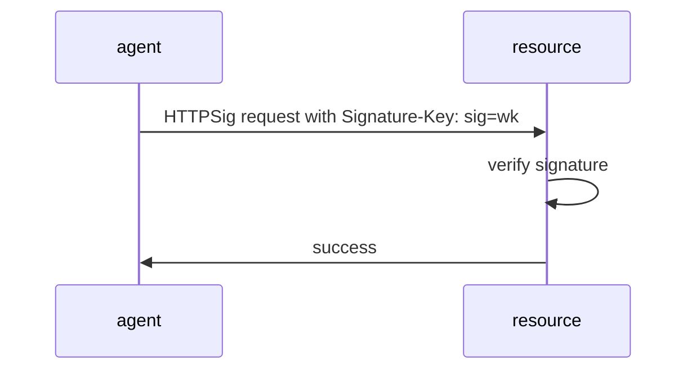
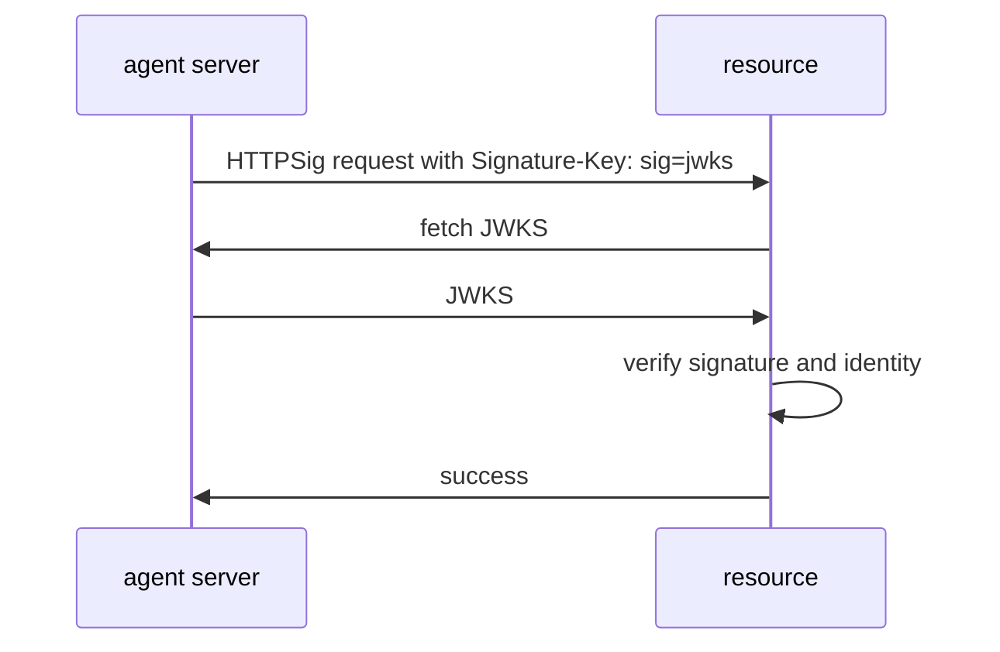
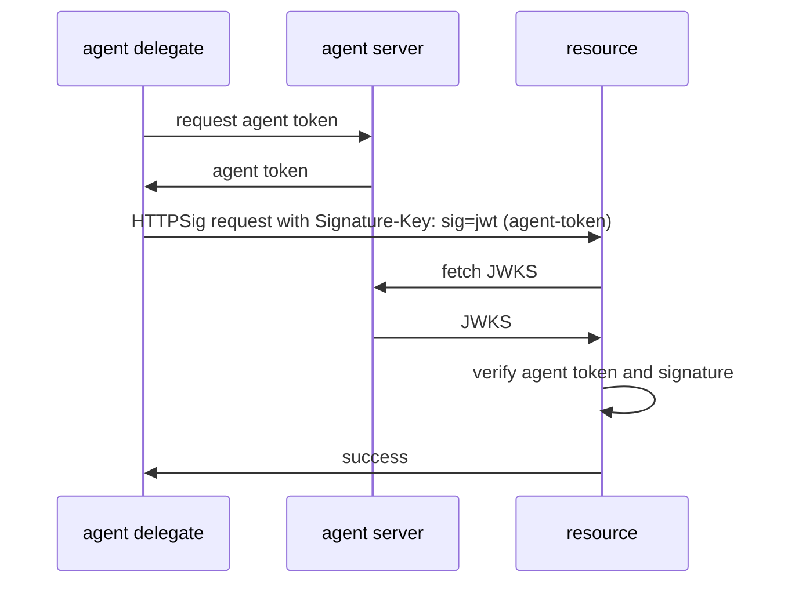
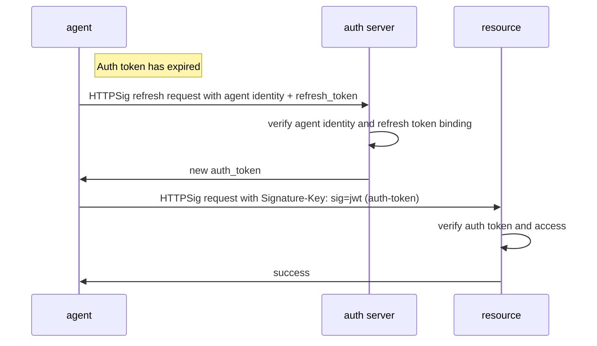

# Agent Auth (AAuth)

**Author:**
Dick Hardt
Email: dick.hardt@hello.coop

**Date:** November 21, 2025

---

## TL;DR

AAuth eliminates secrets management and token exfiltration attacks through:
- **HTTP Message Signatures** - every request cryptographically signed, tokens can't be stolen
- **Ephemeral keys** - no secrets to manage, keys in memory only
- **Unified auth** - single protocol for authentication and authorization
- **Agent identity** - verify both the app and the user

---

## Preamble

**Agent Auth (AAuth)** is an exploratory specification examining what new capabilities and features may be useful to address use cases that are not well-served by existing protocols like OAuth 2.0, OpenID Connect (OIDC), and SAML. While these protocols excel in their designed use cases, the internet has evolved in ways that create gaps AAuth aims to fill.

The document explores use cases requiring capabilities beyond OAuth 2.0 and OIDC's design:
- **From bearer tokens to proof-of-possession**: Every request is cryptographically signed, eliminating token exfiltration as an attack vector
- **From pre-registered client IDs to HTTPS-based agent identities**: Enabling dynamic ecosystems without registration bottlenecks
- **From long-lived shared secrets to ephemeral keys**: Supporting distributed application instances with rapid revocation
- **From separate authentication and authorization protocols to unified auth**: Single flow provides both identity and delegated access
- **From user-only authorization to agent-aware access control**: Resources can enforce policies based on verified agent identity
- **From coarse scopes to rich authorization context**: Enabling meaningful user consent and least-privilege access

AAuth builds on proven patterns from OAuth 2.1 (authorization code flow, refresh tokens, metadata discovery) and OIDC (identity claims, user authentication) while introducing capabilities for modern agent-based architectures.

**This is an exploration and explainer, not a ready-to-adopt draft.** Coding agents were used to create the boilerplate normative text and examples. There may be mistakes. The objective is to paint a picture of how modern authorization could work and spark discussion about addressing the gap between OAuth 2.0's assumptions and today's security and architectural realities.

---

## Table of Contents

1. [Introduction](#1-introduction)
2. [Terminology](#2-terminology)
3. [Protocol Overview](#3-protocol-overview)
4. [Protocol Flows](#4-protocol-flows)
5. [Agent Tokens](#5-agent-tokens)
6. [Auth Tokens](#6-auth-tokens)
7. [Metadata Documents](#7-metadata-documents)
8. [Protocol Details](#8-protocol-details)
9. [Agent-Auth Response Header](#9-agent-auth-response-header)
10. [HTTP Message Signing Profile](#10-http-message-signing-profile)
11. [Error Responses](#11-error-responses)
12. [Security Model](#12-security-model)
13. [IANA Considerations](#13-iana-considerations)

**Appendixes:**
- [Appendix A: Relationship to OAuth 2.1 and OIDC](#appendix-a-relationship-to-oauth-21-and-oidc)
- [Appendix B: Long Tail Agent Servers](#appendix-b-long-tail-agent-servers)
- [Appendix C: Agent Token Acquisition Patterns](#appendix-c-agent-token-acquisition-patterns)
- [Appendix D: Relationship to Web-Bot-Auth](#appendix-d-relationship-to-web-bot-auth)

---

## 1. Introduction

OAuth 2.0 was created to replace the anti-pattern of users providing their passwords to applications to scrape their data from web sites. Users could then authorize an application to scoped access of their data without sharing their passwords. The internet has evolved significantly since the release of OAuth 2.0.

- **Security requirements have changed.**

  Exfiltration of bearer tokens has become a common attack vector. While proof-of-possession with digital signatures is now practical and widely supported, bearer tokens and shared secrets are still used in most deployments.

- **Applications are distributed and more diverse.**

  When OAuth 2.0 was created, the client was typically a server. Today it may also be one of many widely distributed instances of a desktop, mobile, or command line application where managing a single long lived shared secret or private key is impractical.

- **Agents have loosened the client-server model.**

  Tightly bound, pre-registered client and server relationships are giving way to more open and dynamic ecosystems. In environments like the **Model Context Protocol (MCP)**, a client may interact with *any* server, not just those it was pre-registered with.

- **Enterprise systems span multiple trust domains.**

  Organizations deploy hundreds of applications across vendors, each requiring access to resources in different security contexts. Role-based authorization is often insufficient. Fine-grained, dynamic access control requires verifying both the calling application and user's identity.

- **OAuth scopes have become insufficient for modern authorization.**

  Traditional OAuth scopes like read or write provide only coarse-grained labels that fail to convey what data will be accessed, under what conditions, for what purpose, or for how long. This opacity prevents meaningful user consent and makes it impossible to enforce least privilege.

- **Applications need unified authentication and authorization in agent-centric scenarios.**

  OAuth 2.0 provides authorization (delegated access). OpenID Connect provides authentication (user identity via SSO, alongside SAML). Both protocols excel in their designed use cases—OIDC for browser-based SSO to web applications, OAuth 2.0 for user-delegated API access.

  However, agent-based applications often need both authentication and authorization in contexts where the separation creates friction:

  - Agents calling APIs need to prove both their own identity and user identity in a single request
  - Resources need both who is calling (agent) and on whose behalf (user) for access decisions
  - Managing separate OAuth and OIDC flows for agent scenarios adds complexity
  - The token model (separate access tokens and ID tokens) doesn't fit agent-to-resource calls where both identities matter

  AAuth provides a unified approach for these agent-centric use cases, where a single auth token contains agent identity, user identity, and authorization claims.

AAuth addresses these evolved requirements by redefining the relationships between three web participants:

- **Agents:** the applications and autonomous processes
- **Resources:** the protected APIs and data endpoints agents need to access
- **Auth Servers:** the systems that authenticate users and issue authorization

AAuth's protocol features directly address each trend:

- **Unified authentication and authorization** eliminates the OAuth/OIDC split. AAuth uses "auth" to represent both authentication and authorization in a single protocol. Auth tokens contain both identity claims and authorization scopes, giving resources everything they need for access control decisions. The auth server determines whether to perform authentication-only, authorization-only, or both based on policy and context. This eliminates confusion about when to use OAuth vs. OIDC and prevents common mistakes like misusing ID tokens for API access.

- **HTTP Message Signing (HTTPSig)** replaces bearer tokens and shared secrets. Every request an agent makes is cryptographically signed with an ephemeral key it controls, eliminating token exfiltration as an attack vector and providing verifiable proof-of-possession and message integrity when calling both an auth server and a protected resource

- **HTTPS-based agent identity and delegation** addresses distributed applications. Agents are identified by HTTPS URLs rather than pre-registered client IDs and redirect URIs. An agent identity can be used directly by an agent server (publishing metadata and keys), or delegated to agent delegates through short-lived agent tokens that bind ephemeral signing keys to the agent's identity, enabling rapid key rotation without managing long-lived shared secrets.

- **Discoverable metadata** enables dynamic agent ecosystems. Each participant publishes a metadata document describing their capabilities and endpoints. Resources declare their trusted auth servers, auth servers advertise their features, and agents present their identity and policies. This allows any agent to interact with any resource or auth server without pre-established relationships.

- **Verifiable application and user identity** supports multi-domain trust. Auth tokens can contain both the agent's cryptographically verified identity and user identity claims from the auth server, enabling fine-grained access control decisions based on who is requesting access and on whose behalf.

- **Extensible authorization context** goes beyond simple scopes. Resources can provide detailed authorization requests conveying what data will be accessed, under what conditions, for what purpose, and for how long. This enables meaningful user consent, fine-grained policy enforcement, and least privilege access control.

- **Progressive authentication levels** allow resources to request different levels of authentication based on their needs: pseudonymous access for abuse prevention, identified access for agent-based policies, or full authorization for user consent and enterprise controls.

## 2. Terminology

### 2.1 New Definitions

- **agent**: An autonomous process or application identified by an HTTPS URL (`agent_id`). An agent may act directly as an **agent server** or as an **agent delegate** using delegated authority from an agent server.

> **agent** was chosen rather than reusing **client** as they have different features and capabilities.

- **agent server**: An agent acting with its authoritative identity, using its published JWKS to sign requests directly. The agent server publishes metadata and keys at `https://agent.example/.well-known/agent-server` and may issue **agent tokens** to delegate its identity to agent delegates. For simplified key management in shared hosting environments, see [Appendix B](#appendix-b-long-tail-agent-servers).

- **agent delegate**: An agent acting under delegated authority from an agent server. An agent delegate proves its identity by presenting an **agent token** (JWT) that binds its signing key to the agent server's identity. Agent delegates include server workloads (e.g., SPIFFE workloads), application installations (mobile, desktop, CLI), and device-specific deployments. The signing key **MAY** be ephemeral (generated at startup, kept in memory only) or persisted, but **SHOULD** be rotated frequently. Ephemeral keys simplify key management by eliminating secure storage requirements.

- **agent token**: A proof-of-possession JWT issued by an agent server to an agent delegate, binding the delegate's signing key and granting it authority to act on behalf of the agent server. Presented to a resource or auth server to prove agent identity. The JWT header includes `"typ": "agent+jwt"` (media type: `application/agent+jwt`).

- **auth server**: The system that authenticates the user, evaluates authorization requests, and issues **auth tokens** binding the agent's key to the granted permissions.

- **auth token**: A proof-of-possession JWT issued by the auth server to an agent, enabling access to a resource. May contain identity claims, scopes, or both. The JWT header includes `"typ": "auth+jwt"` (media type: `application/auth+jwt`).

> **auth** was chosen over **access**, **authorization** or **authentication** to indicate a new token that can represent both authn and authz.

- **request token**: An opaque string issued by the auth server representing a pending authorization request. The agent uses this token at the `agent_authorization_endpoint` to initiate user consent. Similar to `request_uri` in PAR (RFC 9126) but represented as an opaque token value rather than a URI.

- **resource**: A protected HTTPS endpoint that enforces authorization and publishes metadata describing its trusted auth server and signing requirements. Multiple API endpoints may share a single resource identifier for authorization purposes.

> **resource** was chosen rather than reusing **resource server** as they have different features.

### 2.2 Existing Definitions

The following terms are defined in existing specifications and reused in AAuth:

- **refresh token**: A credential used to obtain new access tokens without user interaction. (OAuth 2.0 [RFC 6749] Section 1.5)

- **user**: A human or organization (resource owner) whose identity and consent are represented by the auth server. (OAuth 2.0 [RFC 6749] Section 1.1)

## 3. Protocol Overview

This section provides a high-level overview of the relationships between protocol participants.

### 3.1. Authentication Levels

AAuth supports three progressive levels of authentication, allowing resources to choose the appropriate level based on their security and policy requirements:

**1. Pseudonymous Access (Signature Only)**

An agent signs requests with an ephemeral key without revealing its identity. The resource can use the key for rate limiting and abuse prevention but cannot make identity-based access decisions.

- Agent uses: `Signature-Key: sig=wk; kty="OKP"; crv="Ed25519"; x="..."`
- Resource gets: Proof of key possession, no identity
- Use case: Public APIs, abuse prevention, rate limiting per key

**2. Identified Access (Agent Identity)**

An agent proves its identity using either:
- **Agent server**: Direct use of published JWKS (`sig=jwks`)
- **Agent delegate**: Delegated identity via agent token (`sig=jwt` with agent-token)

- Agent server uses: `Signature-Key: sig=jwks; id="https://agent.example"; kid="..."`
- Agent delegate uses: `Signature-Key: sig=jwt; jwt="<agent-token>"`
- Resource gets: Verified agent identity (`agent_id`)
- Use case: Agent allowlists/denylists, agent-specific policies, agent-based rate limits

**3. Authorized Access (Auth Token)**

An agent obtains authorization from an auth server, which may involve user consent or enterprise policy evaluation. The auth token binds the agent's identity and key to the granted permissions.

- Agent uses: `Signature-Key: sig=jwt; jwt="<auth-token>"`
- Resource gets: Agent identity, authorization claims, optionally user identity
- Use case: User data access, enterprise policy enforcement, fine-grained authorization

### 3.2. Agent to Resource

Agents interact with resources using **HTTP Message Signing (HTTPSig)** to prove possession of their signing key. The agent includes a [`Signature-Key` header](https://github.com/dickhardt/signature-key) indicating the authentication level:

- **Pseudonymous**: `sig=wk` with inline public key parameters
- **Agent server**: `sig=jwks` with agent identifier and key ID
- **Agent delegate**: `sig=jwt` with agent token (typ: "agent+jwt")
- **Authorized**: `sig=jwt` with auth token (typ: "auth+jwt")

Resources validate the signature and may require a higher authentication level by responding with an `Agent-Auth` challenge header.

### 3.3. Agent to Auth Server

When a resource requires authorization, the agent requests an **auth token** from the trusted auth server. The agent presents its agent identity (via agent server JWKS or agent delegate token) along with the resource identifier and requested scopes to the `agent_token_endpoint`.

The auth server validates the agent's identity and may:
- **Direct grant**: Issue an auth token immediately for autonomous/machine-to-machine scenarios
- **User consent**: Return a `request_token` that the agent uses to redirect the user to the `agent_auth_endpoint` for authentication and consent

Auth tokens may be refreshed using refresh tokens. Refresh tokens are bound to:
- **Agent server**: `agent_id` only (no JWT, no `sub`)
- **Agent delegate**: `agent_id` + `sub` (agent delegate identifier from agent token)

**Auth Server Endpoints:**
- `agent_token_endpoint`: Handles auth requests, token exchange, and refresh (used with `request_type` parameter)
- `agent_auth_endpoint`: Handles user authentication and consent flow (interactive, user-facing)

### 3.4. Agent Delegate to Agent Server

Agent delegates obtain agent tokens from their agent server to prove delegated identity. The specifics of this interaction are out of scope for this specification but typically involve:

- Agent delegate generating or using an existing key pair
- Requesting an agent token from the agent server
- Agent server binding the delegate's public key in the token's `cnf.jwk` claim
- Agent server issuing a short-lived token to enable frequent reevaluation

The agent server may require the agent delegate to authenticate or prove authorization before issuing agent tokens. When the agent delegate rotates its key (whether ephemeral keys at restart or persisted keys per policy), it requests a new agent token with the same `sub` (agent delegate identifier), allowing refresh tokens to remain valid across key rotations.

## 4. Protocol Flows

This section provides sequence diagrams showing the key protocol patterns.

### 4.1. Pseudonymous Access

The simplest flow where an agent accesses a resource using only key-based authentication.



### 4.2. Identified Access - Agent Server

An agent server proves its identity using published JWKS.



### 4.3. Identified Access - Agent Delegate

An agent delegate proves delegated identity using an agent token.



### 4.4. Autonomous Agent Authorization (No User)

An autonomous agent requests authorization from an auth server without user interaction.

```mermaid
sequenceDiagram
    participant Agent as agent
    participant Resource as resource
    participant AuthServer as auth server

    Agent->>Resource: HTTPSig request with Signature-Key: sig=jwt (agent-token)
    Resource->>Resource: verify and check authorization
    Resource->>Agent: 401 Agent-Auth: auth-token; resource="..."; scope="..."

    Agent->>AuthServer: HTTPSig request with agent-token + resource, scope
    AuthServer->>AuthServer: verify and evaluate policy
    AuthServer->>Agent: auth_token + refresh_token

    Agent->>Resource: HTTPSig request with Signature-Key: sig=jwt (auth-token)
    Resource->>Resource: verify auth token and access
    Resource->>Agent: success
```

### 4.5. User Authorization Required

Full flow including user authentication and consent.

```mermaid
sequenceDiagram
    participant User as user / browser
    participant Agent as agent
    participant Resource as resource
    participant AuthServer as auth server

    Agent->>Resource: HTTPSig request with agent identity
    Resource->>Resource: verify and check authorization
    Resource->>Agent: 401 Agent-Auth: auth-token; resource="..."; scope="..."

    Agent->>AuthServer: HTTPSig request with agent identity + resource, scope
    AuthServer->>AuthServer: verify and evaluate policy
    AuthServer->>Agent: request_token (for user consent)

    Agent->>User: redirect with request_token
    User->>AuthServer: authenticate + consent
    AuthServer->>Agent: authorization_code (via redirect)

    Agent->>AuthServer: HTTPSig request with agent identity + authorization_code
    AuthServer->>AuthServer: verify
    AuthServer->>Agent: auth_token + refresh_token

    Agent->>Resource: HTTPSig request with Signature-Key: sig=jwt (auth-token)
    Resource->>Resource: verify auth token and access
    Resource->>Agent: success
```

### 4.6. Auth Token Refresh

When the auth token expires, the agent can refresh it using the refresh token.



## 5. Agent Tokens

Agent tokens enable agent delegates to prove delegated identity from an agent server. This section describes the token format, claims, and acquisition process.

### 5.1. Purpose

Agent tokens serve two primary purposes:

1. **Identity delegation**: Bind an agent delegate's signing key to the agent server's authoritative identity
2. **Key rotation**: Enable key rotation without affecting refresh tokens or user sessions

An agent server and agent delegate share the same `agent_id` from the perspective of resources and auth servers. The difference is in how they prove that identity:
- Agent server: Uses published JWKS directly (no agent token)
- Agent delegate: Presents an agent token signed by the agent server

The agent delegate's signing key **MAY** be ephemeral (generated at startup, kept in memory only) or persisted, but **SHOULD** be rotated frequently. Ephemeral keys simplify deployment by eliminating the need for secure key storage. When the delegate rotates its key (whether due to restart or policy), it obtains a new agent token with the same `sub` (agent delegate identifier), allowing refresh tokens to remain valid.

### 5.2. Token Format

Agent tokens **MUST** be signed JWTs using the JWS Compact Serialization format.

The JOSE header **MUST** include:
- `typ` (REQUIRED): **MUST** be `"agent+jwt"` (media type: `application/agent+jwt`)
- `alg` (REQUIRED): Signature algorithm from the agent server's JWKS
- `kid` (REQUIRED): Key ID identifying the signing key in the agent server's JWKS

### 5.3. Required Claims

- `iss` (REQUIRED): The agent server's HTTPS URL (also the `agent_id`)
- `sub` (REQUIRED): Agent delegate identifier. Identifies the delegated workload or installation, not the specific instance. Examples:
  - Server workload: `spiffe://trust-domain/service/api`
  - Mobile app installation: `app-installation-uuid-xyz`
  - Desktop app installation: `desktop-app-install-abc`
  - This identifier persists across restarts and key rotations
- `iat` (REQUIRED): Issued at timestamp (Unix time)
- `exp` (REQUIRED): Expiration timestamp (Unix time)
- `cnf` (REQUIRED): Confirmation object containing:
  - `jwk` (REQUIRED): JSON Web Key - the agent delegate's public signing key

### 5.4. Optional Claims

- `jti` (OPTIONAL): Unique token identifier for tracking (e.g., for instance-level tracking if needed)
- `scope` (OPTIONAL): Space-separated scopes pre-authorized for this agent delegate
- `aud` (OPTIONAL): Intended audience(s) for the token
- Additional claims: Agent servers **MAY** include custom claims for delegation policies (future work)

### 5.5. Example Agent Token

**JOSE Header:**
```json
{
  "typ": "agent+jwt",
  "alg": "ES256",
  "kid": "agent-server-key-1"
}
```

**Payload:**
```json
{
  "iss": "https://agent.example",
  "sub": "spiffe://example.com/workload/api-service",
  "iat": 1730217600,
  "exp": 1730218200,
  "jti": "unique-token-id-123",
  "cnf": {
    "jwk": {
      "kty": "EC",
      "crv": "P-256",
      "x": "WKn-ZIGevcwGIyyrzFoZNBdaq9_TsqzGl96oc0CWuis",
      "y": "y77t-RvAHRKTsSGdIYUfweuOvwrvDD-Q3Hv5J0fSKbE"
    }
  },
  "scope": "data.read"
}
```

### 5.6. Token Acquisition

Agent delegates obtain agent tokens from their agent server. The specifics of this interaction are **out of scope** for this specification and may vary based on deployment needs. For common patterns and examples, see [Appendix C: Agent Token Acquisition Patterns](#appendix-c-agent-token-acquisition-patterns).

**Key management options:**

Agent delegates **SHOULD** rotate keys frequently. Two common approaches:

- **Ephemeral keys** (recommended for simplicity): Generate fresh key pair at startup, keep in memory only. When delegate restarts, generate new key and request new agent token with same `sub`. Eliminates need for secure key storage.

- **Persisted keys**: Store key securely, rotate based on policy (time-based, event-based, etc.). Request new agent token after rotation with same `sub`.

In both cases, the new agent token uses the same `sub` (agent delegate identifier), allowing refresh tokens to remain valid across key rotations.

**Security considerations:**

- Agent servers **SHOULD** issue short-lived tokens to enable frequent key rotation
- Agent servers **SHOULD** track issued tokens by `sub` for delegation management
- Agent servers **MAY** require additional authentication or authorization before issuing tokens
- Agent delegates **SHOULD** request new agent tokens before expiration to maintain service continuity
- Agent delegates using persisted keys **MUST** store private keys securely

### 5.7. Validation by Resources and Auth Servers

When an agent presents `Signature-Key: sig=jwt; jwt="<agent-token>"`, the recipient **MUST** validate:

1. Parse the JWT and extract the JOSE header
2. Verify `typ` is `"agent+jwt"`
3. Extract `kid` from the JOSE header
4. Extract `iss` (agent_id) from the payload
5. Fetch the agent server's JWKS (from metadata at `iss`)
6. Match the signing key by `kid`
7. Verify the JWT signature using the matched public key
8. Verify the `exp` claim (current time **MUST** be less than expiration)
9. Verify the `iat` claim (token **MUST NOT** be issued in the future)
10. Verify the `sub` claim is present (agent delegate identifier)
11. Extract the public key from `cnf.jwk`
12. Verify that the HTTPSig request signature was created with the key from `cnf.jwk`

## 6. Auth Tokens

Auth tokens are proof-of-possession JWTs issued by auth servers that authorize agents to access specific resources. This section describes the token format and claims.

### 6.1. Purpose

Auth tokens bind together:
- **Agent identity**: Which agent is authorized (via `agent_id`)
- **Agent key**: The agent's signing key (via `cnf.jwk`)
- **Resource**: What the agent can access (via `aud`)
- **Authorization**: What the agent can do (via `scope` or other claims)
- **User identity**: Optionally, on whose behalf (via `sub` and identity claims)

### 6.2. Token Format

Auth tokens **MUST** be signed JWTs using the JWS Compact Serialization format.

The JOSE header **MUST** include:
- `typ` (REQUIRED): **MUST** be `"auth+jwt"` (media type: `application/auth+jwt`)
- `alg` (REQUIRED): Signature algorithm from the auth server's JWKS
- `kid` (REQUIRED): Key ID identifying the signing key in the auth server's JWKS

### 6.3. Required Claims

- `iss` (REQUIRED): The auth server's HTTPS URL
- `sub` (REQUIRED): The user identifier (if user authorization) or agent delegate identifier (if autonomous)
- `agent_id` (REQUIRED): The agent's HTTPS URL (from agent identity)
- `aud` (REQUIRED): The resource identifier this token authorizes access to
- `exp` (REQUIRED): Expiration time (Unix timestamp)
- `iat` (REQUIRED): Issued at time (Unix timestamp)
- `cnf` (REQUIRED): Confirmation claim object containing:
  - `jwk` (REQUIRED): JSON Web Key - the agent's public signing key (copied from agent token or agent JWKS)

### 6.4. Optional Claims

- `scope` (OPTIONAL): Space-separated authorized scopes
- `jti` (OPTIONAL): Unique token identifier
- User identity claims (when user authorization was granted):
  - `name` (OPTIONAL): User's full name
  - `email` (OPTIONAL): User's email address
  - `email_verified` (OPTIONAL): Email verification status (boolean)
  - Additional standard claims per OpenID Connect Core 1.0 Section 5.1

### 6.5. Example Auth Token (User Authorization)

**JOSE Header:**
```json
{
  "typ": "auth+jwt",
  "alg": "ES256",
  "kid": "auth-server-key-1"
}
```

**Payload:**
```json
{
  "iss": "https://auth.example",
  "sub": "user-12345",
  "agent_id": "https://agent.example",
  "aud": "https://resource.example",
  "exp": 1730221200,
  "iat": 1730217600,
  "scope": "data.read data.write",
  "cnf": {
    "jwk": {
      "kty": "EC",
      "crv": "P-256",
      "x": "WKn-ZIGevcwGIyyrzFoZNBdaq9_TsqzGl96oc0CWuis",
      "y": "y77t-RvAHRKTsSGdIYUfweuOvwrvDD-Q3Hv5J0fSKbE"
    }
  },
  "name": "Alice Smith",
  "email": "alice@example.com",
  "email_verified": true
}
```

### 6.6. Example Auth Token (Autonomous Agent)

**Payload:**
```json
{
  "iss": "https://auth.example",
  "sub": "spiffe://example.com/workload/api-service",
  "agent_id": "https://agent.example",
  "aud": "https://resource.example",
  "exp": 1730221200,
  "iat": 1730217600,
  "scope": "data.read",
  "cnf": {
    "jwk": {
      "kty": "EC",
      "crv": "P-256",
      "x": "WKn-ZIGevcwGIyyrzFoZNBdaq9_TsqzGl96oc0CWuis",
      "y": "y77t-RvAHRKTsSGdIYUfweuOvwrvDD-Q3Hv5J0fSKbE"
    }
  }
}
```

### 6.7. Validation by Resources

When an agent presents `Signature-Key: sig=jwt; jwt="<auth-token>"`, the resource **MUST** validate:

1. Parse the JWT and extract the JOSE header
2. Verify `typ` is `"auth+jwt"`
3. Extract `kid` from the JOSE header
4. Extract `iss` from the payload
5. Fetch the auth server's JWKS (from metadata)
6. Match the signing key by `kid`
7. Verify the JWT signature using the matched public key
8. Verify the `exp` claim (current time **MUST** be less than expiration)
9. Verify the `iat` claim (token **MUST NOT** be issued in the future)
10. Verify the `iss` matches the trusted auth server
11. Verify the `aud` matches the resource identifier being accessed
12. Verify the `agent_id` claim is present
13. Extract the public key from `cnf.jwk`
14. Verify that the HTTPSig request signature was created with the key from `cnf.jwk`
15. Verify the `scope` claim (if present) authorizes the requested operation
16. Optionally enforce agent-specific policies based on `agent_id`

## 7. Metadata Documents

Metadata documents enable dynamic discovery of endpoints, capabilities, and keys. This section describes the metadata published by each participant type.

### 7.1. Agent Metadata

Agent servers **MUST** publish metadata at `/.well-known/agent-server`.

**Required fields:**

- `agent_id` (string): The agent's HTTPS URL
- `jwks_uri` (string): URL to the agent's JSON Web Key Set

**Required fields if agent requests user authorization:**

- `redirect_uris` (array of strings): Valid redirect URIs for authorization callbacks
- `name` (string): Human-readable agent name
- `logo_uri` (string): URL to agent logo
- `policy_uri` (string): URL to privacy policy
- `tos_uri` (string): URL to terms of service
- `homepage` (string): Agent homepage URL

**Example:**
```json
{
  "agent_id": "https://agent.example",
  "jwks_uri": "https://agent.example/jwks.json",
  "redirect_uris": [
    "https://agent.example/callback",
    "https://agent.example/aauth/callback"
  ],
  "name": "Example Agent",
  "logo_uri": "https://agent.example/logo.png",
  "policy_uri": "https://agent.example/privacy",
  "tos_uri": "https://agent.example/tos",
  "homepage": "https://agent.example"
}
```

### 7.2. Auth Server Metadata

Auth servers **MUST** publish metadata at `/.well-known/auth-server`.

**Required fields:**

- `issuer` (string): The auth server's HTTPS URL
- `jwks_uri` (string): URL to the auth server's JSON Web Key Set
- `agent_token_endpoint` (string): Endpoint for auth requests, token exchange, and refresh
- `agent_auth_endpoint` (string): Endpoint for user authentication and consent flow
- `agent_signing_algs_supported` (array): Supported HTTPSig algorithms
- `request_types_supported` (array): Supported request_type values (e.g., `["auth", "code", "refresh"]`)

**Optional fields:**

- `scopes_supported` (array): Supported scopes

**Example:**
```json
{
  "issuer": "https://auth.example",
  "jwks_uri": "https://auth.example/jwks.json",
  "agent_token_endpoint": "https://auth.example/agent/token",
  "agent_auth_endpoint": "https://auth.example/agent/auth",
  "agent_signing_algs_supported": [
    "rsa-pss-sha256",
    "ecdsa-p256-sha256"
  ],
  "request_types_supported": [
    "auth",
    "code",
    "refresh"
  ],
  "scopes_supported": [
    "profile",
    "email",
    "data.read",
    "data.write"
  ]
}
```

### 7.3. Resource Metadata

Resources **MAY** publish metadata describing their authorization requirements. The resource identifier used in `aud` claims and Agent-Auth headers is **REQUIRED**, but publishing metadata at a discoverable location is optional.

**Recommended fields (if published):**

- `resource` (string): The resource identifier (used as `aud` in auth tokens)
- `auth_server` (string): The trusted auth server's HTTPS URL
- `scopes_supported` (array): Available scopes
- `scope_descriptions` (object): Human-readable descriptions of scopes
- `agent_signing_algs_supported` (array): Accepted HTTPSig algorithms

**Example:**
```json
{
  "resource": "https://resource.example",
  "auth_server": "https://auth.example",
  "scopes_supported": [
    "data.read",
    "data.write"
  ],
  "scope_descriptions": {
    "data.read": "Read your data records",
    "data.write": "Create and modify your data records"
  },
  "agent_signing_algs_supported": [
    "rsa-pss-sha256",
    "ecdsa-p256-sha256"
  ]
}
```

## 8. Protocol Details

This section describes each step in the protocol flow in detail.

### 8.1. Resource Request

The agent makes a signed request to the resource including the `Signature-Key` header.

**Example pseudonymous request:**
```http
GET /api/data HTTP/1.1
Host: resource.example
Signature-Input: sig=("@method" "@target-uri");created=1730217600
Signature: sig=:...signature bytes...:
Signature-Key: sig=wk; kty="OKP"; crv="Ed25519"; x="JrQLj5P..."
```

**Example identified request (agent delegate):**
```http
GET /api/data HTTP/1.1
Host: resource.example
Signature-Input: sig=("@method" "@target-uri" "signature-key");created=1730217600
Signature: sig=:...signature bytes...:
Signature-Key: sig=jwt; jwt="eyJhbGc..."
```

**Example authorized request:**
```http
GET /api/data HTTP/1.1
Host: resource.example
Signature-Input: sig=("@method" "@target-uri" "signature-key");created=1730217600
Signature: sig=:...signature bytes...:
Signature-Key: sig=jwt; jwt="eyJhbGc..."
```

### 8.2. Agent-Auth Challenge

If the resource requires a higher authentication level than provided, it responds with a 401 status and an `Agent-Auth` header.

**Example: Signature required**
```http
HTTP/1.1 401 Unauthorized
Agent-Auth: httpsig
```

**Example: Identity required**
```http
HTTP/1.1 401 Unauthorized
Agent-Auth: httpsig; identity=?1
```

**Example: Authorization required**
```http
HTTP/1.1 401 Unauthorized
Agent-Auth: httpsig; auth-token; resource="https://resource.example"; scope="data.read data.write"
```

**Example: Authorization with rich context**
```http
HTTP/1.1 401 Unauthorized
Agent-Auth: httpsig; auth-token; resource="https://resource.example"; request_uri="https://resource.example/authz/req/3f5a"
```

### 8.3. Agent Auth Request

The agent makes a signed request to the auth server's `agent_token_endpoint` with `request_type=auth`.

**Request parameters:**

- `request_type` (REQUIRED): Must be `auth`
- `resource` (REQUIRED): The resource identifier
- `redirect_uri` (REQUIRED): The callback URI for authorization code
- `scope` (OPTIONAL): Requested scopes
- `state` (RECOMMENDED): Opaque value for CSRF protection

**Example request:**
```http
POST /agent/token HTTP/1.1
Host: auth.example
Content-Type: application/x-www-form-urlencoded
Content-Digest: sha-256=:X48E9qOokqqrvdts8nOJRJN3OWDUoyWxBf7kbu9DBPE=:
Signature-Input: sig=("@method" "@target-uri" "content-type" "content-digest" "signature-key");created=1730217600
Signature: sig=:...signature bytes...:
Signature-Key: sig=jwt; jwt="eyJhbGc..."

request_type=auth&resource=https://resource.example&redirect_uri=https://agent.example/callback&scope=data.read+data.write&state=af0ifjsldkj
```

### 8.4. Auth Response

The auth server validates the request and responds based on policy.

**Direct grant response:**
```http
HTTP/1.1 200 OK
Content-Type: application/json

{
  "auth_token": "eyJhbGc...",
  "expires_in": 3600,
  "refresh_token": "eyJhbGc..."
}
```

**User consent required response:**
```http
HTTP/1.1 200 OK
Content-Type: application/json

{
  "request_token": "eyJhbGciOiJub25lIn0.eyJleHAiOjE3MzAyMTgyMDB9.",
  "expires_in": 600
}
```

The `request_token` is an opaque value representing the pending auth request. The agent uses this at the `agent_auth_endpoint` to redirect the user for authentication and consent.

### 8.5. User Consent Flow

If `request_token` was provided, the agent directs the user to the `agent_auth_endpoint`:

```
https://auth.example/agent/auth?request_token=eyJhbGciOiJub25lIn0.eyJleHAiOjE3MzAyMTgyMDB9.
```

**Redirect Headers:**

When redirecting the user to the `agent_auth_endpoint`, agents **MUST** include the `Redirect-Query` header with the request parameters per the [Redirect Headers specification](https://github.com/dickhardt/redirect-headers). This keeps sensitive parameters out of URLs and browser history.

```http
HTTP/1.1 302 Found
Location: https://auth.example/agent/auth?request_token=eyJhbGc...
Redirect-Query: "request_token=eyJhbGc..."
```

The auth server **MUST** verify that the `Redirect-Origin` header (if present) matches the expected agent origin from the agent metadata. This provides mutual origin authentication through the browser.

If the auth server receives a `Redirect-Query` header in the initial request, it **MUST** return the authorization code using `Redirect-Query` rather than URL parameters:

```http
HTTP/1.1 302 Found
Location: https://agent.example/callback
Redirect-Query: "code=AUTH_CODE_123&state=af0ifjsldkj"
```

If `Redirect-Query` was not provided in the initial request, the auth server returns parameters in the URL:

```
https://agent.example/callback?code=AUTH_CODE_123&state=af0ifjsldkj
```

Agents **MUST** verify that the `Redirect-Origin` header (if present) matches the expected auth server origin. See the [Redirect Headers specification](https://github.com/dickhardt/redirect-headers) for complete details on header usage and security considerations.

### 8.6. Auth Token Request

The agent exchanges the authorization code for an auth token by making a signed request to the `agent_token_endpoint` with `request_type=code`.

**Request parameters:**

- `request_type` (REQUIRED): Must be `code`
- `code` (REQUIRED): The authorization code

**Example request:**
```http
POST /agent/token HTTP/1.1
Host: auth.example
Content-Type: application/x-www-form-urlencoded
Content-Digest: sha-256=:X48E9qOokqqrvdts8nOJRJN3OWDUoyWxBf7kbu9DBPE=:
Signature-Input: sig=("@method" "@target-uri" "content-type" "content-digest" "signature-key");created=1730217600
Signature: sig=:...signature bytes...:
Signature-Key: sig=jwt; jwt="eyJhbGc..."

request_type=code&code=AUTH_CODE_123
```

**Response:**
```http
HTTP/1.1 200 OK
Content-Type: application/json

{
  "auth_token": "eyJhbGc...",
  "expires_in": 3600,
  "refresh_token": "eyJhbGc..."
}
```

### 8.7. Auth Token Refresh

When the auth token expires, the agent requests a new token using the refresh token by making a signed request to the `agent_token_endpoint` with `request_type=refresh`.

**Request parameters:**

- `request_type` (REQUIRED): Must be `refresh`
- `refresh_token` (REQUIRED): The refresh token

**Example request:**
```http
POST /agent/token HTTP/1.1
Host: auth.example
Content-Type: application/x-www-form-urlencoded
Content-Digest: sha-256=:X48E9qOokqqrvdts8nOJRJN3OWDUoyWxBf7kbu9DBPE=:
Signature-Input: sig=("@method" "@target-uri" "content-type" "content-digest" "signature-key");created=1730217600
Signature: sig=:...signature bytes...:
Signature-Key: sig=jwt; jwt="eyJhbGc..."

request_type=refresh&refresh_token=eyJhbGc...
```

**Response:**
```http
HTTP/1.1 200 OK
Content-Type: application/json

{
  "auth_token": "eyJhbGc...",
  "expires_in": 3600
}
```

> **Note:** A new `refresh_token` is not included because the existing refresh token remains valid. In AAuth, every refresh request is cryptographically signed and the refresh token is bound to the agent's instance identifier, eliminating the security rationale for rotation.

### 8.8. Authorized Resource Access

The agent makes a signed request to the resource with the auth token.

```http
GET /api/data HTTP/1.1
Host: resource.example
Signature-Input: sig=("@method" "@target-uri" "signature-key");created=1730217600
Signature: sig=:...signature bytes...:
Signature-Key: sig=jwt; jwt="eyJhbGc..."
```

The resource validates the auth token and signature, then returns the requested data if authorized.

### 8.9. Future Request Types

The following `request_type` values are reserved for future work and are not defined in this version of the specification:

**Device Authorization Flow:**
- `request_type=device_auth` - Initiate device authorization flow
  - May return `auth_token` (direct grant) or `device_code` + `user_code` + `verification_uri` (user interaction needed)
- `request_type=device_code` - Poll or exchange device_code for auth_token

**CIBA (Client Initiated Backchannel Authentication):**
- `request_type=backchannel_auth` - Initiate backchannel authentication
  - May return `auth_token` (direct grant) or `auth_req_id` (authentication in progress)
- `request_type=backchannel_poll` - Poll with auth_req_id for auth_token

**Token Exchange:**
- `request_type=token_exchange` - Exchange one credential type for another
  - Parameters and semantics to be defined

Auth servers **MAY** advertise supported request types in metadata using the `request_types_supported` field.

## 9. Agent-Auth Response Header

Resources use the `Agent-Auth` response header (using HTTP structured fields per RFC 8941) to indicate authentication and authorization requirements.

### 9.1. Signature Required

Indicates that HTTP Message Signing is required. Any signature type is acceptable (wk, jwks, or jwt).

```
Agent-Auth: httpsig
```

**Agent response:** Include `Signature-Key` header with any scheme (sig=wk, sig=jwks, or sig=jwt).

### 9.2. Identity Required

Indicates that agent identity is required. Agent must use either published JWKS or an agent token.

```
Agent-Auth: httpsig; identity=?1
```

**Agent response:** Include `Signature-Key` header with:
- `sig=jwks; id="..."; kid="..."` (agent server), or
- `sig=jwt; jwt="<agent-token>"` (agent instance)

### 9.3. Authorization Required

Indicates that authorization from an auth server is required. Includes the resource identifier and access requirements.

**With scope:**
```
Agent-Auth: httpsig; auth-token; resource="https://resource.example"; scope="data.read data.write"
```

**With rich authorization request:**
```
Agent-Auth: httpsig; auth-token; resource="https://resource.example"; request_uri="https://resource.example/authz/req/3f5a"
```

**Agent response:**
1. Request authorization from the auth server using the provided resource and scope/request_uri
2. Obtain auth token
3. Retry request with `Signature-Key: sig=jwt; jwt="<auth-token>"`

### 9.4. Status Codes and Progressive Rate Limiting

While `Agent-Auth` is typically used with **401 Unauthorized**, resources **MAY** use it with other status codes to enable progressive rate limiting and abuse mitigation based on authentication level.

**401 Unauthorized** - Authentication required

Used when the current authentication level is insufficient:

```http
HTTP/1.1 401 Unauthorized
Agent-Auth: httpsig; identity=?1
```

**429 Too Many Requests** - Rate limit exceeded

Used when the agent has exceeded rate limits for their current authentication level, but a higher authentication level would have higher limits:

```http
HTTP/1.1 429 Too Many Requests
Agent-Auth: httpsig; identity=?1
Retry-After: 60
```

**Example progressive rate limiting:**
- Pseudonymous (sig=wk): 10 requests/minute
- Identified (sig=jwks or sig=jwt with agent-token): 100 requests/minute
- Authorized (sig=jwt with auth-token): 1000 requests/minute

**403 Forbidden** - Access denied for current authentication level

Used when the agent is blocked or access is denied at the current authentication level, but a higher level might be accepted:

```http
HTTP/1.1 403 Forbidden
Agent-Auth: httpsig; auth-token; resource="https://resource.example"; scope="data.read"
```

This allows resources to block abusive pseudonymous traffic while still accepting identified or authorized requests from the same origin.

### 9.5. Parameters

- `httpsig`: Authentication scheme (REQUIRED for all responses)
- `identity`: Boolean parameter (?1 = true) indicating agent identity is required
- `auth-token`: Bare token indicating authorization is required
- `resource`: String parameter with the resource identifier for authorization
- `scope`: String parameter with space-separated scopes
- `request_uri`: String parameter with URL to fetch rich authorization requirements

### 9.6. Compatibility with WWW-Authenticate

Resources **MAY** include both `Agent-Auth` and `WWW-Authenticate` headers to support multiple authentication protocols:

```http
HTTP/1.1 401 Unauthorized
Agent-Auth: httpsig; auth-token; resource="https://resource.example"; scope="data.read"
WWW-Authenticate: Bearer realm="resource.example", scope="data.read"
```

## 10. HTTP Message Signing Profile

AAuth uses HTTP Message Signing (HTTPSig) as defined in RFC 9421. This section provides a profile for AAuth implementations.

### 10.1. Signature-Key Header

The `Signature-Key` header provides the keying material required to verify the HTTP signature. It uses the format defined in the [Signature-Key specification](https://github.com/dickhardt/signature-key).

**Supported schemes:**

- `sig=wk` - Inline Web Key (pseudonymous)
- `sig=jwks` - Key discovery via agent identifier
- `sig=jwt` - JWT containing confirmation key (agent-token or auth-token)

The signature label in `Signature-Key` **MUST** match the label used in `Signature-Input` and `Signature`.

### 10.2. Signature Algorithm Requirements

Implementations **MUST** support at least one of:
- `rsa-pss-sha256` (RSA PSS using SHA-256)
- `ecdsa-p256-sha256` (ECDSA using P-256 and SHA-256)

Implementations **SHOULD** support both algorithms for maximum interoperability.

### 10.3. Covered Components

Signatures **MUST** cover the following HTTP message components:

**For all requests:**
- `@method`: The HTTP method
- `@target-uri`: The full request URI

**For requests with a body:**
- `content-type`: The Content-Type header
- `content-digest`: The Content-Digest header (per RFC 9530)

**For requests with Signature-Key header:**
- `signature-key`: The Signature-Key header value

### 10.4. Signature Parameters

The `Signature-Input` header **MUST** include:
- `created`: Signature creation timestamp

The `created` timestamp **MUST NOT** be more than 60 seconds in the past or future to prevent replay attacks.

### 10.5. Example Signatures

**Pseudonymous request (sig=wk):**
```http
GET /api/data HTTP/1.1
Host: resource.example
Signature-Input: sig=("@method" "@target-uri");created=1730217600
Signature: sig=:MEQCIAZg1fF0...:
Signature-Key: sig=wk; kty="OKP"; crv="Ed25519"; x="JrQLj5P..."
```

**Identified request (sig=jwks):**
```http
GET /api/data HTTP/1.1
Host: resource.example
Signature-Input: sig=("@method" "@target-uri" "signature-key");created=1730217600
Signature: sig=:MEQCIAZg1fF0...:
Signature-Key: sig=jwks; id="https://agent.example"; kid="key-1"
```

**Identified request (sig=jwt with agent-token):**
```http
GET /api/data HTTP/1.1
Host: resource.example
Signature-Input: sig=("@method" "@target-uri" "signature-key");created=1730217600
Signature: sig=:MEQCIAZg1fF0...:
Signature-Key: sig=jwt; jwt="eyJhbGciOiJFUzI1NiIsInR5cCI6ImFnZW50LXRva2VuIiwia2lkIjoia2V5LTEifQ..."
```

**Authorized request (sig=jwt with auth-token):**
```http
GET /api/data HTTP/1.1
Host: resource.example
Signature-Input: sig=("@method" "@target-uri" "signature-key");created=1730217600
Signature: sig=:MEQCIAZg1fF0...:
Signature-Key: sig=jwt; jwt="eyJhbGciOiJFUzI1NiIsInR5cCI6ImF1dGgtdG9rZW4iLCJraWQiOiJrZXktMSJ9..."
```

**POST request with body:**
```http
POST /agent/authorize HTTP/1.1
Host: auth.example
Content-Type: application/x-www-form-urlencoded
Content-Digest: sha-256=:X48E9qOokqqrvdts8nOJRJN3OWDUoyWxBf7kbu9DBPE=:
Signature-Input: sig=("@method" "@target-uri" "content-type" "content-digest" "signature-key");created=1730217600
Signature: sig=:MEQCIAZg1fF0...:
Signature-Key: sig=jwt; jwt="eyJhbGc..."

resource=https://resource.example&scope=data.read
```

### 10.6. Key Discovery and Verification

**For sig=wk:**
1. Extract key parameters directly from the Signature-Key header
2. Reconstruct the public key
3. Verify the signature

**For sig=jwks:**
1. Extract `id` (agent identifier) and `kid` (key ID) from Signature-Key header
2. Fetch agent metadata from `{id}/.well-known/agent-server`
3. Fetch JWKS from the `jwks_uri` in metadata
4. Match the key by `kid`
5. Verify the signature using the matched public key

**For sig=jwt:**
1. Extract the JWT from the Signature-Key header
2. Parse the JWT and extract `typ` from JOSE header
3. If `typ` is `"agent+jwt"`:
   - Extract `iss` from payload (agent identifier)
   - Fetch agent server's JWKS
   - Verify JWT signature
   - Verify expiration and claims
   - Extract public key from `cnf.jwk`
4. If `typ` is `"auth+jwt"`:
   - Extract `iss` from payload (auth server)
   - Fetch auth server's JWKS
   - Verify JWT signature
   - Verify expiration and claims
   - Extract public key from `cnf.jwk`
5. Verify the HTTPSig signature using the key from `cnf.jwk`

### 10.7. Replay Prevention

While HTTPSig signatures include timestamps, applications **SHOULD** implement additional replay prevention:
- Track recently seen `created` timestamps per agent
- Reject requests with duplicate `created` values within the validity window
- Use nonces for high-value operations

## 11. Error Responses

AAuth reuses the OAuth 2.0 error response format and error codes (RFC 6749 Section 5.2) where applicable.

### 11.1. Error Response Format

Error responses **MUST** be returned with an appropriate HTTP status code (typically 400 or 401) and a JSON body:

- `error` (REQUIRED): A single ASCII error code
- `error_description` (OPTIONAL): Human-readable additional information
- `error_uri` (OPTIONAL): A URI with more information about the error

**Example:**
```http
HTTP/1.1 400 Bad Request
Content-Type: application/json

{
  "error": "invalid_request",
  "error_description": "Missing required parameter: redirect_uri"
}
```

### 11.2. OAuth 2.0 Error Codes

- `invalid_request` - Malformed or missing required parameters
- `invalid_token` - Agent token or auth token is invalid or expired
- `invalid_grant` - Authorization code or refresh token is invalid, expired, or revoked
- `unauthorized_client` - Agent is not authorized for the requested access
- `unsupported_grant_type` - Grant type not supported
- `invalid_scope` - Requested scope is invalid, unknown, or malformed

### 11.3. AAuth-Specific Error Codes

- `invalid_signature` - HTTPSig signature validation failed
- `invalid_agent_token` - Agent token validation failed
- `key_mismatch` - Key in token's `cnf.jwk` doesn't match HTTPSig signing key
- `request_expired` - Request timestamp outside acceptable time window
- `invalid_redirect_uri` - Redirect URI doesn't match agent metadata

**Example:**
```http
HTTP/1.1 401 Unauthorized
Content-Type: application/json

{
  "error": "invalid_signature",
  "error_description": "The HTTPSig signature could not be verified using the provided public key"
}
```

## 12. Security Model

- All participants use **HTTP Message Signing** for message integrity and replay protection
- **Agent tokens** and **auth tokens** are both **proof-of-possession** tokens
- Tokens are reusable for their valid lifetime; replay prevention is achieved through per-request signatures
- Agent server and auth server key rotation is achieved by updating the JWKS at each origin's `jwks_uri`
- Agent delegates rotate their keys frequently (ephemeral keys at restart or persisted keys per policy) by obtaining new agent tokens
- Refresh tokens are bound to:
  - **Agent server**: `agent_id` only
  - **Agent delegate**: `agent_id` + `sub` (agent delegate identifier)
- Refresh tokens do not require rotation due to proof-of-possession binding and per-request signatures

---

## 13. IANA Considerations

This specification registers the following identifiers in their respective IANA registries.

### 13.1. Well-Known URI Registrations

**Registry:** Well-Known URIs (RFC 8615)

**URI suffix:** `agent-server`
- **Change controller:** IETF
- **Specification document:** This specification, Section 7.1
- **Related information:** Metadata document for AAuth agent servers

**URI suffix:** `auth-server`
- **Change controller:** IETF
- **Specification document:** This specification, Section 7.2
- **Related information:** Metadata document for AAuth authorization servers

### 13.2. Media Type Registrations

**Registry:** Media Types

**Type name:** `application`
- **Subtype name:** `agent+jwt`
- **Required parameters:** None
- **Optional parameters:** None
- **Encoding considerations:** Binary (JWT, base64url-encoded)
- **Security considerations:** See Section 12 of this specification
- **Interoperability considerations:** None
- **Published specification:** This specification, Section 5.2
- **Applications that use this media type:** AAuth agent delegates
- **Additional information:** JWT type value for agent tokens
- **Person & email address to contact for further information:** Dick Hardt, dick.hardt@hello.coop
- **Intended usage:** COMMON
- **Restrictions on usage:** None
- **Change controller:** IETF

**Type name:** `application`
- **Subtype name:** `auth+jwt`
- **Required parameters:** None
- **Optional parameters:** None
- **Encoding considerations:** Binary (JWT, base64url-encoded)
- **Security considerations:** See Section 12 of this specification
- **Interoperability considerations:** None
- **Published specification:** This specification, Section 6.2
- **Applications that use this media type:** AAuth auth servers and resource servers
- **Additional information:** JWT type value for auth tokens
- **Person & email address to contact for further information:** Dick Hardt, dick.hardt@hello.coop
- **Intended usage:** COMMON
- **Restrictions on usage:** None
- **Change controller:** IETF

### 13.3. HTTP Header Field Registrations

**Registry:** HTTP Field Names (RFC 9110)

**Field name:** `Agent-Auth`
- **Status:** permanent
- **Specification document:** This specification, Section 9
- **Comments:** Response header indicating AAuth authentication and authorization requirements

### 13.4. JSON Web Token Type Values

**Registry:** JSON Web Token (JWT) Type Values

**Type value:** `agent+jwt`
- **Abbreviation for MIME Type:** `application/agent+jwt`
- **Change controller:** IETF
- **Specification document:** This specification, Section 5.2

**Type value:** `auth+jwt`
- **Abbreviation for MIME Type:** `application/auth+jwt`
- **Change controller:** IETF
- **Specification document:** This specification, Section 6.2

### 13.5. JSON Web Token Claims Registrations

**Registry:** JSON Web Token Claims (RFC 7519)

**Claim name:** `agent_id`
- **Claim description:** Agent identifier (HTTPS URL)
- **Change controller:** IETF
- **Specification document:** This specification, Section 6.3

### 13.6. AAuth Parameters Registry

**Registry:** AAuth Parameters (new registry)

This specification establishes a new IANA registry for AAuth protocol parameters used in requests and responses.

**Registration procedure:** Specification Required

**Parameters registered by this specification:**

**Parameter name:** `request_type`
- **Parameter usage location:** token request
- **Change controller:** IETF
- **Specification document:** This specification, Section 8.3
- **Description:** Type of request (auth, code, refresh, device_auth, backchannel_auth, etc.)

**Parameter name:** `request_token`
- **Parameter usage location:** authorization request
- **Change controller:** IETF
- **Specification document:** This specification, Section 8.4
- **Description:** Opaque token representing a pending authorization request

**Parameter name:** `auth_token`
- **Parameter usage location:** token response
- **Change controller:** IETF
- **Specification document:** This specification, Section 8.4
- **Description:** AAuth authorization token (JWT)

### 13.7. Error Codes

AAuth-specific error codes are defined in Section 11.3. These error codes extend the OAuth 2.0 error response framework for AAuth-specific validation failures including signature validation, agent token validation, and key binding verification.

The registration of these error codes in an appropriate IANA registry is **to be determined** based on whether AAuth establishes its own error registry or extends an existing OAuth error registry.

---

## Appendix A: Relationship to OAuth 2.1 and OIDC

### A.1. AAuth Design Philosophy

AAuth intentionally blends **OAuth 2.1** (authorization/delegated access) and **OpenID Connect** (authentication/identity) into a unified protocol for both authentication and authorization. This is why AAuth uses the term **"auth"** throughout:

- **`auth_token`** - Contains both authorization (scopes, audience) AND authentication (user identity claims)
- **`Agent-Auth` header** - Indicates need for additional auth (could be authentication, authorization, or both)
- **`request_type=auth`** - Generic request that may result in authentication-only, authorization-only, or both
- **`agent_auth_endpoint`** - User-facing endpoint for authentication and/or consent

The auth server determines what type of auth is needed based on policy, resource requirements, and user context. Resources receive a single token containing everything they need for access control decisions.

### A.2. Adding AAuth Support to Existing Servers

OAuth 2.1 and OpenID Connect servers can be **extended** to support AAuth while continuing to serve existing OAuth 2.1/OIDC clients. This is an addition, not a migration - both protocols can coexist.

**Core additions required:**

1. New endpoints for agent-centric flows
2. HTTP Message Signing validation
3. Agent identity verification
4. Token format extensions

### A.3. Why Not Extend OAuth 2.0?

AAuth explores what a protocol designed specifically for agent-centric scenarios could look like, rather than extending OAuth 2.0. This is a deliberate choice, not a criticism of OAuth's success in its designed use cases.

#### FAPI 2.0: A Successful OAuth Profile

FAPI 2.0 (Financial-grade API) demonstrates OAuth can be successfully profiled for high-security scenarios. FAPI 2.0:
- Builds on OAuth 2.1 base
- Mandates DPoP or mTLS for sender-constrained tokens
- Requires PAR (Pushed Authorization Requests)
- Requires PKCE with S256
- Eliminates optionality: confidential clients only, specific algorithms, limited flows
- Achieves formal security analysis under defined attacker model

**FAPI 2.0 succeeds because it:**
- Profiles OAuth without fundamentally changing it
- Reduces optionality through mandates
- Maintains OAuth compatibility
- Addresses well-defined high-security use case (financial APIs)

#### Why AAuth Takes a Different Approach

AAuth could theoretically be positioned as an OAuth profile, but that would inherit challenges that motivated exploring a fresh approach:

**1. Why HTTP Message Signatures Instead of DPoP or mTLS?**

OAuth 2.0 offers two main approaches for proof-of-possession:

**DPoP (Demonstrating Proof of Possession, RFC 9449):**
- **What it does:** Binds access tokens to a client's public key
- **How it works:** Creates a JWT proof containing HTTP method, URL, timestamp, and access token hash
- **Limitation:** Only proves token possession, does NOT sign the actual HTTP message
- **Does NOT provide:** Message integrity, tampering detection, or protection for non-token requests
- **Focus:** Token binding

**mTLS (Mutual TLS, RFC 8705):**
- **What it does:** Client authentication using TLS certificates
- **How it works:** Binds client certificate to TLS connection
- **Limitation:** Connection-based protection, not message-based
- **Does NOT provide:** Protection against message tampering after TLS termination
- **Challenges:** Complex certificate management, difficult with load balancers/proxies/CDNs
- **Focus:** Transport security

**HTTP Message Signatures (RFC 9421) in AAuth:**
- **What it does:** Signs individual HTTP message components
- **How it works:** Signs @method, @target-uri, headers, content-digest
- **Provides:** Full message integrity - detects any tampering
- **Works for:** ANY request, including those without tokens (pseudonymous, identified)
- **Survives:** Proxies, load balancers, CDNs (after TLS termination)
- **Supports:** Ephemeral keys (no certificate infrastructure needed)
- **Focus:** Message authentication and integrity

**Key differences:**

| Feature | DPoP | mTLS | HTTPSig (AAuth) |
|---------|------|------|-----------------|
| **Protects** | Token binding | TLS connection | Individual messages |
| **Message integrity** | No | No | Yes |
| **Non-token requests** | No | Auth only | Yes |
| **Survives proxies** | Yes | No | Yes |
| **Detects tampering** | No | In transit | Yes |
| **Certificate management** | Not needed | Required | Not needed |
| **Ephemeral keys** | Yes | No | Yes |

**Why AAuth chose HTTPSig:**
- **Message integrity:** Detects tampering of request components
- **Works everywhere:** Pseudonymous requests, identified requests, authorized requests
- **Modern infrastructure:** Works with load balancers, proxies, CDNs
- **Simpler key management:** Ephemeral keys, no certificate infrastructure
- **Stronger binding:** Authorization code bound to signing key (no PKCE needed)

DPoP and mTLS are excellent solutions for their designed purposes (token binding and transport security), but don't provide the message-level integrity and flexibility AAuth's agent scenarios require.

**2. Framework Cruft and Sharp Edges**

OAuth 2.0 has evolved over 13+ years with numerous extensions addressing different concerns. This creates:
- Legacy patterns kept for backward compatibility
- Security pitfalls from earlier design choices
- Sharp edges where extensions interact unexpectedly
- Complexity from maintaining compatibility with older deployments

Example: OAuth still supports bearer tokens (insecure) alongside DPoP and mTLS. FAPI 2.0 must explicitly forbid weak options that exist in the OAuth framework.

**3. Optionality Makes Conformance Hard**

OAuth 2.0 is explicitly a framework, not a protocol. "OAuth 2.0 compliant" is nearly meaningless because implementations choose different subsets:

Current optionality:
- Client authentication: None OR client_secret OR private_key_jwt OR mTLS
- Token binding: None OR DPoP OR mTLS
- Authorization request: Direct OR PAR
- Token type: Bearer OR DPoP-bound OR mTLS-bound
- Flows: Authorization Code OR Client Credentials OR Device OR CIBA
- Refresh rotation: Yes OR No

**Result:**
- Every deployment configures differently
- Interoperability requires negotiation
- Conformance testing tests "which options do you support?" not "are you compliant?"
- Security depends on configuration choices

**AAuth's approach:**
- Prescriptive protocol, not framework
- HTTPSig: REQUIRED (not optional)
- Specific token format: REQUIRED
- Specific endpoints: REQUIRED
- Clear profiles: Agent Server, Auth Server, Resource Server
- Conformance: binary (compliant or not)

**4. Model Mismatches for Agent Scenarios**

Some AAuth capabilities don't map cleanly to OAuth's client-centric model:

**Progressive authentication:**
- OAuth: Binary (token or no token)
- AAuth: Pseudonymous → Identified → Authorized
- OAuth extension attempt: Would need new token types, new challenge mechanisms - fundamental additions

**Agent delegation:**
- OAuth: client_id is static per client
- AAuth: agent_id (server) + sub (per delegate instance) with key rotation
- OAuth extension attempt: Doesn't fit client credentials model

**Unified auth:**
- OAuth/OIDC: Separate access tokens and ID tokens
- AAuth: Single auth token with both identity and authorization
- OAuth extension attempt: Would fundamentally change OAuth/OIDC separation

#### OAuth Community Also Sees Value in HTTPS-Based Identity

The OAuth community recognizes similar needs. The draft specification [Client ID Metadata Document](https://datatracker.ietf.org/doc/draft-ietf-oauth-client-id-metadata-document/) proposes:
- HTTPS URLs as client identifiers (like AAuth's agent_id)
- Fetching client metadata from that URL
- Avoiding pre-registration overhead

This shows the OAuth ecosystem is evolving toward concepts AAuth explores. The difference is AAuth asks: "What if we designed for this from the start rather than extending?"

#### Main Advantages of AAuth's Approach

**Not an exhaustive list, but key differentiators:**

1. **Message integrity**: HTTPSig provides tampering detection that DPoP and mTLS don't
2. **No optionality**: Clear requirements, guaranteed interoperability
3. **No legacy cruft**: Designed for modern security, no backward compatibility constraints
4. **Progressive authentication**: Three levels (pseudonymous, identified, authorized)
5. **Agent-centric model**: HTTPS identity, delegation with persistent sub across key rotation
6. **Unified auth**: Single token, single protocol for authentication and authorization
7. **Simpler security**: No PKCE needed (HTTPSig binds authorization codes to keys)
8. **Conformance**: Binary compliance with clear test suites per profile

#### Relationship to OAuth

AAuth is **not** positioned as:
- A replacement for OAuth/OIDC
- Backward compatible with OAuth
- An OAuth profile

AAuth **is** positioned as:
- Exploration of agent-centric protocol design
- Addressing use cases not well-served by OAuth's client-centric model
- Learning from OAuth's patterns (authorization code flow, refresh tokens, metadata)
- Potentially informing future OAuth evolution

Some AAuth concepts might eventually be backported to OAuth as extensions. Others represent fundamental design choices that don't fit OAuth's architecture. AAuth explores both.

### A.4. OAuth 2.1 and OIDC Foundation

AAuth builds upon OAuth 2.1 and OpenID Connect, reusing many core mechanisms while introducing fundamental changes to address modern security requirements and autonomous agent scenarios.

**Retained from OAuth 2.1:**

- Authorization code flow with user consent
- Client credentials flow concepts (adapted for autonomous agents)
- Refresh token mechanism
- Redirect-based user authentication
- Scopes and authorization details
- State parameter for CSRF protection
- TLS/HTTPS requirements
- Authorization server metadata (RFC 8414)
- Standard error response format

### A.5. Key Differences from OAuth 2.1

| **Aspect** | **OAuth 2.1** | **AAuth 1.0** |
|------------|---------------|---------------|
| **Access Control** | User identity and scopes | Agent identity, user identity, scopes, and agent-specific policies |
| **Token Format** | Opaque or JWT (RFC 9068) | Signed JWT with `cnf.jwk`, `agent_id`, and `typ` |
| **Token Security** | Bearer tokens (with optional DPoP) | Proof-of-possession only via HTTPSig |
| **Client/Agent Identity** | Pre-registered `client_id` | HTTPS URL with self-published metadata |
| **Client/Agent Registration** | Required | Optional; self-identification via HTTPS |
| **Authentication** | Client credentials, mTLS, or none | HTTPSig on every request |
| **Request Integrity** | Optional (DPoP or mTLS) | Mandatory via HTTPSig |
| **Key Management** | Long-lived credentials | Frequent key rotation per agent delegate (ephemeral or persisted) |
| **Delegate Management** | Single `client_id` | Unique `sub` (agent delegate identifier) in agent token |
| **Refresh Token Security** | Rotation required for public clients | No rotation needed (proof-of-possession) |
| **Progressive Authentication** | Not defined | Three levels: pseudonymous, identified, authorized |
| **Discovery** | Optional (RFC 8414) | Expected for dynamic ecosystems |

### A.6. Access Control Based on Agent Identity

AAuth enables resources to make access control decisions based on the verified identity of the calling agent (`agent_id`), in addition to traditional user identity and scope-based authorization.

**Current Capabilities:**

- **Agent allowlisting/denylisting**: Permit only specific agents to access resources
- **Agent-specific rate limiting**: Different limits per agent based on trust level
- **Agent-specific scope interpretation**: Same scope grants different access per agent
- **Combined agent + user authorization**: Require both specific user AND specific agent

**Example authorization decision:**
```
IF auth_token.agent_id == "https://trusted-agent.example"
   AND auth_token.scope contains "data.write"
   AND auth_token.sub == valid_user_id
THEN allow access to sensitive resource
```

**Future Capabilities:**

Future versions may support **agent delegation policies** where agent servers include claims in agent tokens that constrain what agent delegates can do:

- Purpose limitation (e.g., healthcare data only for appointment scheduling)
- Time restrictions (e.g., business hours only)
- Data minimization (e.g., maximum data volume or specific fields)
- Contextual constraints (e.g., require specific user interaction patterns)

### A.7. Implementation Guide for OAuth 2.1/OIDC Servers

An existing OAuth 2.1 or OpenID Connect server can add AAuth support by implementing the following:

**New endpoints:**
- `agent_token_endpoint` - Receive auth requests (request_type=auth), perform token exchange (request_type=code), and handle refresh (request_type=refresh)
- `agent_auth_endpoint` - User authentication and consent flow (interactive, user-facing)

**HTTP Message Signing support:**
- RFC 9421 implementation
- Signature verification using keys from `Signature-Key` header
- Support for `sig=wk`, `sig=jwks`, and `sig=jwt` schemes

**Agent token validation:**
- Fetch and validate agent metadata
- Verify agent token JWT signatures
- Validate agent identity binding

**Token issuance changes:**
- Include `agent_id` in auth tokens
- Include `cnf.jwk` for proof-of-possession
- Add `typ` header to distinguish token types
- Bind refresh tokens to `agent_id` + `sub` (agent delegate identifier)

**Policy engine updates:**
- Evaluate agent identity in authorization decisions
- Support autonomous vs. user consent logic
- Implement agent-specific authorization rules

---

## Appendix C: Agent Token Acquisition Patterns

### C.1. Overview

This appendix describes common patterns for how agent delegates obtain agent tokens from their agent server. The agent token binds the delegate's signing key to the agent server's identity, enabling the delegate to act on behalf of the agent.

The specific mechanism for agent token acquisition is **out of scope** for this specification, but understanding common patterns helps illustrate how AAuth works in practice across different deployment scenarios.

**Common elements across all patterns:**

1. **Key generation**: Agent delegate generates or uses an existing key pair
2. **Authentication**: Agent delegate proves its identity or authorization to the agent server
3. **Token issuance**: Agent server issues an agent token containing:
   - `iss`: Agent server's HTTPS URL (the `agent_id`)
   - `sub`: Agent delegate identifier (persists across restarts and key rotations)
   - `cnf.jwk`: Agent delegate's public key
   - `exp`: Short expiration (minutes to hours for frequent rotation)
4. **Key rotation**: When the delegate rotates keys (restart or policy), it requests a new token with the same `sub`

### C.2. Server Workloads

Server workloads include containerized services, microservices, serverless functions, and any backend process running in a datacenter or cloud environment. These workloads need to prove their identity when calling other services or APIs.

**SPIFFE-based workload identity:**

SPIFFE (Secure Production Identity Framework for Everyone) provides workload identity using X.509 SVIDs (SPIFFE Verifiable Identity Documents). In AAuth:

1. **Workload bootstrap**: The workload obtains its SPIFFE ID and X.509 SVID from the SPIFFE Workload API (typically via a local agent)
2. **Key generation**: The workload generates an ephemeral key pair for HTTP Message Signing
3. **Agent token request**: The workload presents its SPIFFE SVID to the agent server (mTLS authentication)
4. **Agent server validates**:
   - Verifies the SPIFFE SVID against the trust domain
   - Extracts the SPIFFE ID (e.g., `spiffe://example.com/workload/api-service`)
5. **Token issuance**: Agent server issues agent token with:
   - `sub`: The SPIFFE ID
   - `cnf.jwk`: The workload's ephemeral public key
   - `exp`: Short-lived (e.g., 1 hour)
6. **Key rotation**: When the workload restarts, it generates a new ephemeral key and obtains a new agent token with the same SPIFFE ID (`sub`)

**WIMSE-based workload identity:**

WIMSE (Workload Identity in Multi-System Environments) extends workload identity concepts with policy-driven delegation. In AAuth:

1. **Policy configuration**: The agent server defines delegation policies for workloads (e.g., "workload X can act as agent Y for purpose Z")
2. **Workload authentication**: The workload authenticates to the agent server using platform credentials (e.g., cloud provider instance identity, Kubernetes service account tokens)
3. **Policy evaluation**: The agent server evaluates whether this workload is authorized to receive an agent token based on:
   - Workload identity claims
   - Requested delegation scope
   - Context (time, environment, resource targets)
4. **Token issuance**: Agent server issues agent token with:
   - `sub`: Workload identifier (may be platform-specific)
   - `cnf.jwk`: Workload's public key (ephemeral or persisted)
   - `scope`: Pre-authorized scopes based on delegation policy
   - `exp`: Policy-determined lifetime
5. **Ongoing policy enforcement**: The agent server may issue short-lived tokens to enable frequent policy reevaluation

**Key benefits for workloads:**

- **No shared secrets**: Ephemeral keys eliminate the need to distribute and rotate long-lived credentials
- **Platform integration**: Leverage existing workload identity infrastructure (SPIFFE, Kubernetes, cloud IAM)
- **Policy-driven**: Agent server controls which workloads can act as delegates and with what constraints
- **Rapid revocation**: Short-lived tokens enable quick response to security events

### C.3. Mobile Applications

Mobile applications (iOS and Android) need to prove that they are legitimate installations of the app when calling APIs. Each installation should have a unique identity that persists across app restarts.

**iOS App Attest:**

iOS provides App Attest, allowing apps to generate cryptographic attestations proving they are genuine Apple-approved installations.

1. **Installation identity**: When the app first launches, it:
   - Generates a unique installation identifier (UUID stored in keychain)
   - Generates an attestation key pair using App Attest
   - Obtains an attestation from Apple proving the app's authenticity
2. **Agent server registration**: The app sends to the agent server:
   - Installation identifier (`sub`)
   - App Attest attestation
   - Public key for HTTP Message Signing (stored in iOS keychain)
3. **Agent server validates**:
   - Verifies the App Attest attestation with Apple's servers
   - Confirms the app bundle ID matches expectations
   - Stores the installation identifier
4. **Token issuance**: Agent server issues agent token with:
   - `sub`: Installation identifier (e.g., `ios-installation-abc123`)
   - `cnf.jwk`: The app's signing public key
   - `exp`: Hours to days (based on app usage patterns)
5. **Key rotation**: The app can rotate its signing key while keeping the same installation identifier, obtaining a new agent token with the same `sub`

**Android Play Integrity:**

Android provides Play Integrity API (successor to SafetyNet), allowing apps to prove they are legitimate Google Play installations.

1. **Installation identity**: When the app first launches, it:
   - Generates a unique installation identifier (stored securely in Android keystore)
   - Generates a key pair in Android keystore
2. **Agent server registration**: The app:
   - Calls Play Integrity API to get an integrity token
   - Sends the integrity token, installation identifier, and public key to the agent server
3. **Agent server validates**:
   - Verifies the Play Integrity token with Google's servers
   - Confirms the app package name and signing certificate
   - Stores the installation identifier
4. **Token issuance**: Agent server issues agent token with:
   - `sub`: Installation identifier (e.g., `android-installation-xyz789`)
   - `cnf.jwk`: The app's signing public key
   - `exp`: Hours to days
5. **Key rotation**: The app can rotate keys in the Android keystore and obtain new agent tokens with the same `sub`

**Key benefits for mobile apps:**

- **Installation-level identity**: Each app installation has a unique `sub` that persists across restarts
- **Platform attestation**: Leverage OS-provided proof of app authenticity
- **Refresh token continuity**: When the app rotates keys, refresh tokens remain valid (bound to `agent_id` + `sub`)
- **Security**: Private keys protected by platform keystores (iOS Secure Enclave, Android Keystore)

### C.4. Desktop and CLI Applications

Desktop applications and command-line tools face unique challenges: they run on unmanaged devices, may have multiple installations per user, and need flexible authentication options.

**Common patterns:**

**1. Platform key vaults (Desktop apps):**

Modern operating systems provide secure credential storage that desktop apps can leverage:

- **macOS Keychain**: Apps can generate keys in the Secure Enclave or store keys in the keychain
- **Windows Credential Manager / TPM**: Apps can use the Trusted Platform Module for key generation and storage
- **Linux Secret Service**: Apps can use gnome-keyring or similar services

**Flow:**
1. **First launch**: App generates or retrieves keys from platform keystore, generates installation identifier
2. **User authentication**: User authenticates to the agent server (OAuth flow, passkeys, etc.)
3. **Token binding**: Agent server issues agent token binding the user's authorization to the app's installation
4. **Persistent identity**: Installation identifier (`sub`) persists across app restarts

**2. API keys with user binding (CLI tools):**

Command-line tools often use API keys for authentication but can enhance security with AAuth:

**Flow:**
1. **User authentication**: User runs `cli-tool login` which:
   - Opens browser for OAuth authentication to the agent server
   - Generates ephemeral or persisted key pair
   - Receives agent token bound to the authenticated user and this CLI installation
2. **Storage**: CLI stores the agent token and key (in user's home directory or platform keystore)
3. **API calls**: CLI uses agent token in `Signature-Key` header with HTTP Message Signatures
4. **Token refresh**: When agent token expires, CLI refreshes using the bound refresh token

**3. Device binding with hardware attestation (High-security scenarios):**

For sensitive enterprise deployments, desktop/CLI apps can use hardware-backed attestation:

**Flow:**
1. **Device enrollment**: Device is enrolled in enterprise system (MDM, device management)
2. **Hardware attestation**: App uses TPM, Secure Enclave, or similar to prove hardware identity
3. **Agent token issuance**: Agent server issues token bound to both user identity and hardware identity
4. **Policy enforcement**: Enterprise policies can require specific device posture (OS version, security updates, etc.)

**4. User-authorized ephemeral sessions (Simple CLI tools):**

For tools that don't persist state between runs:

**Flow:**
1. **Session start**: User runs `cli-tool --authenticate` which:
   - Generates ephemeral key pair (in-memory only)
   - Opens browser for user authentication
   - Obtains agent token for this session
2. **Session usage**: Tool makes API calls with signatures until session ends
3. **Session end**: When tool exits, ephemeral key is discarded
4. **Next session**: User must re-authenticate, generating a new ephemeral key

**Key benefits for desktop/CLI apps:**

- **Flexibility**: Multiple authentication options based on security requirements
- **User binding**: Agent tokens can tie automated API calls to specific user identities
- **Hardware security**: Leverage platform keystores and hardware attestation when available
- **Graceful degradation**: Simple API key fallback for environments without advanced security features
- **Installation tracking**: Each installation has a unique `sub` for auditing and revocation

### C.5. Browser-Based Applications

Browser-based applications act as agent delegates, with each browser session obtaining an agent token from the web server that hosts the application.

**Pattern:**

1. **Page load**: User loads web application in browser
2. **Key generation**: JavaScript generates ephemeral key pair using Web Crypto API (`crypto.subtle`)
3. **Session identity**: Browser retrieves or creates session identifier (stored in localStorage/IndexedDB)
4. **Agent token request**: Browser requests agent token from web server:
   - User authenticates to web server (login, or anonymous session)
   - Browser sends public key + session ID to web server
   - Web server (acting as agent server) issues agent token
5. **API calls**: Browser uses agent token to sign requests to external resources

**Technical capabilities:**

Modern browsers support the cryptographic operations required for HTTPSig through the Web Crypto API:
- RSA-PSS with SHA-256 and ECDSA with P-256 and SHA-256
- Ephemeral key pair generation
- Non-extractable keys (Web Crypto flag prevents key export)
- Custom HTTP headers (`Content-Digest`, `Signature-Key`, `Signature`, `Signature-Input`)

**Defense in depth (JavaScript closures):**

Like the PHP pattern in Appendix B, browsers can use JavaScript closures to encapsulate the private key and provide only an HTTP signing function:

```javascript
const signer = (function() {
    let privateKey, publicKey;
    const allowedOrigins = ['https://resource.example', 'https://auth.example'];

    crypto.subtle.generateKey(
        { name: "ECDSA", namedCurve: "P-256" },
        false, // non-extractable
        ["sign"]
    ).then(keyPair => {
        privateKey = keyPair.privateKey;
        publicKey = keyPair.publicKey;
    });

    return {
        signHTTPRequest: async function(method, uri, headers, body) {
            const origin = new URL(uri).origin;
            if (!allowedOrigins.includes(origin)) {
                throw new Error('Unauthorized origin');
            }
            // Generate HTTP Message Signature with privateKey
            return { 'Signature-Input': /* ... */, 'Signature': /* ... */ };
        },
        getJWK: async function() { /* export public key */ }
    };
})();
```

The private key remains in closure scope and cannot be exfiltrated. Malicious code can call `signHTTPRequest()`, but only for allowed origins, and cannot extract the key for use elsewhere.

**CORS requirements:**

Custom headers trigger CORS preflight. Resources and auth servers must configure CORS headers on all AAuth endpoints:
```http
Access-Control-Allow-Origin: https://webapp.example
Access-Control-Allow-Methods: GET, POST, OPTIONS
Access-Control-Allow-Headers: content-type, content-digest, signature-key, signature, signature-input
Access-Control-Max-Age: 86400
```

**Key benefits:**

- **No long-lived credentials in browser**: Keys are ephemeral per session
- **Platform integration**: Leverages Web Crypto API standard
- **Session-level identity**: Each session has unique `sub` for tracking
- **Cross-origin API calls**: CORS-compatible HTTP Message Signatures

---

## Appendix B: Long Tail Agent Servers

### B.1. Overview

Long-tail web applications—WordPress, Drupal, Joomla, and similar platforms—often run on shared or self-hosted environments without access to hardware security modules or secrets management systems. These applications act as **agent servers** with their own `agent_id` and published JWKS, but face key management challenges:

- Database backups are frequent and widely distributed
- Developers export database dumps for local testing
- Securing persistent private keys adds operational complexity
- File system security may be limited

**The ephemeral key pattern** solves this by keeping both private keys and JWKS in memory only—nothing is persisted to disk or database.

**Key advantage over OAuth/OIDC:** AAuth with ephemeral keys eliminates the need for secret management entirely. OAuth and OIDC typically require client secrets or long-lived credentials that must be securely stored, rotated, and protected from exposure in backups and logs. With AAuth's ephemeral keys, there are no secrets to manage and no persistent keys to protect.

### B.2. The Pattern

**Core principle:** Both private and public keys are ephemeral and memory-only. JWKS is served from memory, not persisted.

**How it works:**

1. **Startup:** Generate new key pair, store both private key and JWKS in memory only
2. **Operation:** Sign requests with in-memory private key, serve JWKS from memory
3. **Restart:** Previous private key is lost, generate new key, serve new JWKS
4. **Auth token impact:** Outstanding auth tokens become unusable (contain old key in `cnf.jwk`)
5. **Recovery:** Use refresh token with new key to obtain new auth token

**Why not persist JWKS:** If JWKS is stored in database, an attacker with database write access could inject their own public key and impersonate the server. Memory-only JWKS prevents this attack.

### B.3. Security Benefits

Memory-only keys and JWKS **dramatically reduce attack surface:**

**Attacks prevented:**
- Backup theft - no keys in backups
- Database dumps - developers exporting DB don't leak keys
- SQL injection - can't steal keys or inject malicious public keys
- Credential theft - stolen DB credentials don't expose keys
- Public key injection - attacker can't add their own keys to JWKS via DB write
- Persistent compromise - keys don't survive indefinitely

**Remaining risk:**
- Sophisticated malicious plugin using reflection/memory inspection (rare, requires active code execution)

**Key insight:** Common attacks (backup theft, DB dumps, SQLi, key injection) are prevented. The remaining attack requires sophisticated active exploitation, far less common in practice.

### B.4. Implementation Notes

**Recommended pattern:** Use PHP closures to encapsulate both the key pair and policy enforcement. The private key remains in closure scope and cannot be exfiltrated. Malicious code can still call the signing function, but cannot extract the key for use elsewhere or after process restart.

**Defense in depth:** Agent servers in AAuth only sign HTTP Message Signatures, so the closure should provide a specific HTTP request signing function, not a general-purpose signing oracle. Validate the target origin inside the closure - only sign requests to pre-configured resources and auth servers.

**Example structure:**
```php
$signer = (function() {
    $keyPair = generateKeyPair();
    $kid = 'key-' . time();
    $allowedOrigins = [
        'https://resource.example',
        'https://auth.example'
    ];

    return [
        'signHTTPRequest' => function($method, $uri, $headers, $body = null)
            use ($privateKey, $kid, $allowedOrigins) {

            // Validate origin inside closure
            $origin = parse_url($uri, PHP_URL_SCHEME) . '://' . parse_url($uri, PHP_URL_HOST);
            if (!in_array($origin, $allowedOrigins)) {
                throw new Exception('Unauthorized origin');
            }

            // Generate HTTP Message Signature
            return [
                'Signature-Input' => /* ... */,
                'Signature' => /* ... */
            ];
        },
        'getJWKS' => function() use ($publicKey, $kid) { /* ... */ }
    ];
})();
```

**Multi-instance consideration:** Each instance generates its own key pair and serves its own JWKS. For high-availability deployments where instances need to share keys, consider a shared signing service instead.

**Restart behavior:** Auth tokens become temporarily unusable on restart until refreshed. Refresh tokens remain valid and can be used with the new key to obtain new auth tokens.

### B.5. When to Use

**Ideal for:**
- Single-instance applications (WordPress, Drupal, Joomla)
- Shared or self-hosted environments
- Plugin/module architectures
- Applications without secrets infrastructure

**Not recommended for:**
- High-availability multi-instance deployments (use shared signing service)
- Applications with HSM or secrets manager access (use those instead)
- Scenarios requiring key escrow or recovery

### B.6. Comparison to Agent Delegates

Agent servers with ephemeral keys (this pattern) have their own `agent_id` and publish their own JWKS using `sig=jwks`. Agent delegates (Appendix C) receive agent tokens from an agent server and use `sig=jwt`. Most WordPress/Drupal deployments only need the agent server pattern.

---

## Appendix D: Relationship to Web-Bot-Auth

### D.1. Overview

The IETF Web Bot Authentication (webbotauth) Working Group charter aims to standardize methods for websites to manage automated traffic (bots, crawlers, AI agents) and for these agents to prove their authenticity. The charter emphasizes:

- Replacing insecure patterns (IP allowlisting, User-Agent spoofing, shared API keys)
- Using cryptographic signatures for bot authentication
- Enabling websites to apply differentiated policies based on bot identity
- Supporting abuse mitigation and rate limiting

AAuth fulfills these charter goals using HTTP Message Signatures while extending to authorization and delegation use cases.

### D.2. Charter Goal: Flexible Website Policies

**Charter requirement:** Websites need flexibility in how they handle automated traffic—from rejecting all bots, to allowing pseudonymous signed requests, to requiring full identification.

**How AAuth addresses this:**

Websites can use the `Agent-Auth` response header to signal different authentication requirements:

**1. Require signatures without identity (abuse management):**
```http
HTTP/1.1 401 Unauthorized
Agent-Auth: httpsig
```

The website simply requires "sign your requests" without requiring "tell us who you are." Agents respond with pseudonymous signatures:

```http
Signature-Key: sig=wk; kty="OKP"; crv="Ed25519"; x="JrQLj5P..."
```

**Benefits:**
- Cryptographic proof distinguishes automated requests from spoofed User-Agents
- Rate limiting per key prevents single-source abuse
- No registration barrier for experimental or privacy-preserving agents
- Replay prevention through timestamp verification

**2. Require identity (bot allowlisting/denylisting):**
```http
HTTP/1.1 401 Unauthorized
Agent-Auth: httpsig; identity=?1
```

The website requires the agent to identify itself. Agents respond with:

```http
Signature-Key: sig=jwks; id="https://agent.example"; kid="key-1"
```

The website can now apply bot-specific policies (allowlist Googlebot, block scraper-bots, give higher rate limits to trusted crawlers).

**3. Progressive enforcement based on behavior:**

```http
# Initially: Accept pseudonymous requests with low rate limits
200 OK

# After detecting high volume: Ask for identity
429 Too Many Requests
Agent-Auth: httpsig; identity=?1
Retry-After: 60

# For protected resources: Require authorization
401 Unauthorized
Agent-Auth: httpsig; auth-token; resource="https://resource.example"; scope="data.read"
```

This flexibility addresses the charter's goal of letting websites choose their policy without forcing a single authentication model.

### D.3. Charter Goal: Bot Identity and Delegation

**Charter requirement:** Enable crawlers and bots to prove their identity using cryptographic signatures.

**How AAuth addresses this:**

AAuth provides bot identity through `agent_id` (HTTPS URL) with published JWKS:

```http
Signature-Key: sig=jwks; id="https://crawler.example"; kid="key-1"
```

**Website verification:**
1. Fetch `https://crawler.example/.well-known/agent-server`
2. Retrieve JWKS from `jwks_uri` in metadata
3. Verify signature using public key matching `kid`
4. Confirm bot identity and apply appropriate policies

**Scaling challenge addressed:**

Large-scale crawlers (Googlebot, Bingbot) operate from thousands of distributed servers. Managing a single private key across all instances creates operational and security challenges.

**AAuth's solution: Agent delegation**

The crawler operator acts as an **agent server** and issues **agent tokens** to each crawler instance:

```
Crawler Operator (agent.example)
├── Instance 1 → agent token with ephemeral key
├── Instance 2 → agent token with ephemeral key
├── Instance 3 → agent token with ephemeral key
└── Instance N → agent token with ephemeral key
```

**Each instance:**
1. Generates ephemeral key pair on startup (kept in memory only)
2. Requests agent token from central server
3. Uses `sig=jwt` with agent token to prove delegated identity:

```http
Signature-Key: sig=jwt; jwt="<agent-token>"
```

**Agent token structure:**
```json
{
  "iss": "https://crawler.example",
  "sub": "instance-region-us-west-1",
  "cnf": {
    "jwk": { "kty": "OKP", "crv": "Ed25519", "x": "..." }
  },
  "exp": 1730218200
}
```

**Benefits for large-scale crawlers:**
- No shared secrets across distributed instances
- Instance compromise doesn't expose other instances
- Ephemeral keys eliminate key management burden
- Rapid revocation (short-lived agent tokens)
- Per-instance identity in `sub` for tracking and debugging
- Central control (agent server) with distributed execution (instances)

Websites verify the agent token signature using the agent server's published JWKS, confirming both the crawler operator's identity and that this specific instance is authorized.

### D.4. Charter Goal: Abuse Mitigation

**Charter requirement:** Help websites distinguish legitimate bots from malicious traffic and apply appropriate rate limits.

**How AAuth addresses this:**

AAuth's progressive authentication (Section 9.4) enables tiered abuse mitigation:

**Tier 1: Unsigned requests**
- Strictest rate limits
- Assume potential abuse
- May block entirely

**Tier 2: Pseudonymous signed requests (sig=wk)**
- Moderate rate limits per signing key
- Cryptographic proof of distinct sources
- Replay prevention via timestamps
- Can track reputation per key

**Tier 3: Identified bots (sig=jwks or sig=jwt)**
- Bot-specific rate limits
- Allowlist trusted crawlers (Googlebot, Bingbot)
- Block known-bad bots
- Higher limits for verified legitimate traffic

**Tier 4: Authorized access (auth-token)**
- Agent requests auth token from auth server (may be autonomous or with user consent)
- Fine-grained access control and policy enforcement
- Highest rate limits and privileges

**Example abuse mitigation flow:**

```http
# New agent: Pseudonymous signature, low rate limit (10 req/min)
GET /api/data
Signature-Key: sig=wk; kty="OKP"; crv="Ed25519"; x="..."
→ 200 OK (within limit)

# Repeated good behavior builds trust
# Rate limit hit after 10 requests
→ 429 Too Many Requests
   Agent-Auth: httpsig; identity=?1

# Agent identifies itself as trusted crawler
GET /api/data
Signature-Key: sig=jwks; id="https://trusted-crawler.example"; kid="key-1"
→ 200 OK (higher limit: 1000 req/min)
```

This addresses the charter's abuse mitigation goal while maintaining flexibility for legitimate bots.

### D.5. What AAuth Adds Beyond Web-Bot-Auth Charter

While fulfilling the web-bot-auth charter goals, AAuth extends to broader agent scenarios:

**Authorization (autonomous and user delegation):**
- Autonomous agents requesting auth tokens for machine-to-machine access
- Agents acting on behalf of users (AI assistants, automation tools) with consent
- Auth tokens binding agent + resource + permissions (with optional user identity)
- Fine-grained access control and policy enforcement beyond simple bot identity

**Interactive agents:**
- Browser-based applications with ephemeral credentials
- Mobile and desktop apps with per-installation identity
- Long-lived sessions with refresh tokens
- Progressive authentication from pseudonymous to fully authorized

**Unified protocol:**
- Single framework for bot identification AND authorization
- Natural on-ramp from abuse management → bot identity → user delegation
- Consistent HTTP Message Signatures across all authentication levels

### D.6. Summary

**AAuth fulfills the web-bot-auth charter by:**

1. **Flexible website policies** - Websites can require signatures without identity (abuse management), identity (bot allowlisting), or authorization (autonomous agents or user data access)

2. **Bot identity with delegation** - Crawlers prove identity using `agent_id` and published JWKS, with agent tokens enabling massive scale through distributed instances with ephemeral keys

3. **Abuse mitigation** - Progressive rate limiting based on authentication level (unsigned → pseudonymous → identified → authorized)

**AAuth extends beyond the charter by:**

- Supporting authorization and user delegation use cases
- Providing a unified protocol for both bot identity and user authorization
- Enabling interactive agents (browser, mobile, desktop) alongside autonomous bots

The Signature-Key header's three schemes (sig=wk, sig=jwks, sig=jwt) provide the flexibility to address both the web-bot-auth charter's requirements and the broader agent authorization scenarios that AAuth explores.

---

## Author's Address

Dick Hardt
Hellō Identity
Email: dick.hardt@hello.coop
URI: https://github.com/DickHardt
