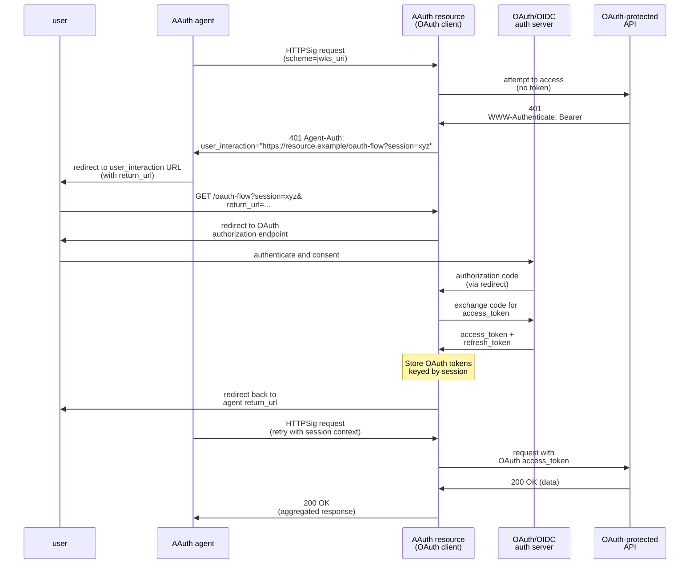

---

## Appendix A: Relationship to OAuth 2.1 and OIDC

> _agent generated_

### A.1. AAuth Design Philosophy

AAuth intentionally blends **OAuth 2.1** (authorization/delegated access) and **OpenID Connect** (authentication/identity) into a unified protocol for both authentication and authorization. This is why AAuth uses the term **"auth"** throughout:

- **`auth_token`** - Contains both authorization (scopes, audience) AND authentication (user identity claims)
- **`Agent-Auth` header** - Indicates need for additional auth (could be authentication, authorization, or both)
- **`request_type=auth`** - Generic request that may result in authentication-only, authorization-only, or both
- **`agent_auth_endpoint`** - User-facing endpoint for authentication and/or consent

The auth server determines what type of auth is needed based on policy, resource requirements, and user context. Resources receive a single token containing everything they need for access control decisions.

### A.2. Adding AAuth Support to Existing Servers

OAuth 2.1 and OpenID Connect servers can be **extended** to support AAuth while continuing to serve existing OAuth 2.1/OIDC clients. This is an addition, not a migration - both protocols can coexist.

**Core additions required:**

1. New endpoints for agent-centric flows
2. HTTP Message Signing validation
3. Agent identity verification
4. Token format extensions

### A.3. Why Not Extend OAuth 2.0?

AAuth explores what a protocol designed specifically for agent-centric scenarios could look like, rather than extending OAuth 2.0. This is a deliberate choice, not a criticism of OAuth's success in its designed use cases.

#### FAPI 2.0: A Successful OAuth Profile

FAPI 2.0 (Financial-grade API) demonstrates OAuth can be successfully profiled for high-security scenarios. FAPI 2.0:
- Builds on OAuth 2.1 base
- Mandates DPoP or mTLS for sender-constrained tokens
- Requires PAR (Pushed Authorization Requests)
- Requires PKCE with S256
- Eliminates optionality: confidential clients only, specific algorithms, limited flows
- Achieves formal security analysis under defined attacker model

**FAPI 2.0 succeeds because it:**
- Profiles OAuth without fundamentally changing it
- Reduces optionality through mandates
- Maintains OAuth compatibility
- Addresses well-defined high-security use case (financial APIs)

#### Why AAuth Takes a Different Approach

AAuth could theoretically be positioned as an OAuth profile, but that would inherit challenges that motivated exploring a fresh approach:

**1. Why HTTP Message Signatures Instead of DPoP or mTLS?**

OAuth 2.0 offers DPoP (token binding) and mTLS (transport security) for proof-of-possession. HTTPSig provides message-level integrity that both lack:

**Comparison:**

| Feature | DPoP | mTLS | HTTPSig (AAuth) |
|---------|------|------|-----------------|
| **Protects** | Token binding | TLS connection | Individual messages |
| **Message integrity** | No | No | Yes |
| **Non-token requests** | No | Auth only | Yes |
| **Survives proxies** | Yes | No | Yes |
| **Detects tampering** | No | In transit | Yes |
| **Certificate management** | Not needed | Required | Not needed |
| **Ephemeral keys** | Yes | No | Yes |

AAuth chose HTTPSig for message integrity across all request types (including pseudonymous), compatibility with modern infrastructure (proxies, CDNs), and simpler key management (ephemeral keys, stronger authorization code binding without PKCE).

**2. Framework Extensibility vs Protocol Prescription**

OAuth 2.0 is explicitly a framework with extensive optionality for flexibility. This creates deployment variability where "OAuth 2.0 compliant" doesn't guarantee interoperability - implementations choose different subsets of authentication methods, token binding mechanisms, and flows. Security depends on configuration choices.

AAuth takes a prescriptive approach: HTTPSig is required (not optional), token formats are specified, and conformance is binary rather than á la carte. This trades flexibility for guaranteed interoperability and clearer security properties.

**3. Model Mismatches for Agent Scenarios**

Some AAuth capabilities represent fundamental design differences from OAuth's client-centric model: progressive authentication (pseudonymous → identified → authorized vs binary token presence), agent delegation (agent server + persistent sub across key rotations vs static client_id), and unified auth (single token with identity and authorization vs separate access/ID tokens).

#### OAuth Community Also Sees Value in HTTPS-Based Identity

The OAuth community recognizes similar needs. The draft specification [Client ID Metadata Document](https://datatracker.ietf.org/doc/draft-ietf-oauth-client-id-metadata-document/) proposes:
- HTTPS URLs as client identifiers (like AAuth's agent)
- Fetching client metadata from that URL
- Avoiding pre-registration overhead

This shows the OAuth ecosystem is evolving toward concepts AAuth explores. The difference is AAuth asks: "What if we designed for this from the start rather than extending?"

#### Main Advantages of AAuth's Approach

**Not an exhaustive list, but key differentiators:**

1. **Provable agent identity**: HTTPS-based identity with JWKS, agent delegation with persistent `sub` across key rotations (vs inconsistent OAuth software statements)
2. **Provable resource identity**: Resources have JWKS and issue signed resource tokens to cryptographically bind access requests to their identity (OAuth has no resource identity mechanism)
3. **Confused deputy prevention**: Resource tokens bind each access request to a specific agent, preventing attackers from substituting different resource identifiers in the authorization flow
4. **Message integrity**: HTTPSig provides tampering detection that DPoP and mTLS don't
5. **No client secrets or bearer tokens**: Eliminates shared secrets and token exfiltration risks through cryptographic proof-of-possession
6. **No optionality**: Clear requirements, guaranteed interoperability
7. **Security by design**: Required proof-of-possession, no optional security features that can be misconfigured
8. **Progressive agent authentication**: Three levels (pseudonymous, identified, authorized)
9. **Unified auth**: Single token, single protocol for authentication and authorization
10. **Token exchange for multi-hop**: Built-in support for downstream resource access with delegation chains
11. **Conformance**: Binary compliance with clear test suites per profile

#### Relationship to OAuth

AAuth is an exploration of agent-centric protocol design for use cases not well-served by OAuth's client-centric model. It's not a replacement for OAuth/OIDC, not backward compatible, and not an OAuth profile. AAuth learns from OAuth's proven patterns (authorization code flow, refresh tokens, metadata) while exploring different design choices. Some concepts might inform future OAuth evolution; others represent fundamental architectural differences.

### A.4. OAuth 2.1 and OIDC Foundation

AAuth builds upon OAuth 2.1 and OpenID Connect, reusing many core mechanisms while introducing fundamental changes to address modern security requirements and autonomous agent scenarios.

**Retained from OAuth 2.1:**

- Authorization code flow with user consent
- Client credentials flow concepts (adapted for autonomous agents)
- Refresh token mechanism
- Redirect-based user authentication
- Scopes and authorization details
- State parameter for CSRF protection
- TLS/HTTPS requirements
- Authorization server metadata (RFC 8414)
- Standard error response format

### A.5. Key Differences from OAuth 2.1

| **Aspect** | **OAuth 2.1** | **AAuth 1.0** |
|------------|---------------|---------------|
| **Access Control** | User identity and scopes | Agent identity, user identity, scopes, and agent-specific policies |
| **Token Format** | Opaque or JWT (RFC 9068) | Signed JWT with `cnf.jwk`, `agent`, and `typ` |
| **Token Security** | Bearer tokens (with optional DPoP) | Proof-of-possession only via HTTPSig |
| **Client/Agent Identity** | Pre-registered `client_id` | HTTPS URL with self-published metadata |
| **Client/Agent Registration** | Required | Optional; self-identification via HTTPS |
| **Authentication** | Client credentials, mTLS, or none | HTTPSig on every request |
| **Request Integrity** | Optional (DPoP or mTLS) | Mandatory via HTTPSig |
| **Key Management** | Long-lived credentials | Frequent key rotation per agent delegate (ephemeral or persisted) |
| **Delegate Management** | Single `client_id` | Unique `sub` (agent delegate identifier) in agent token |
| **Refresh Token Security** | Rotation required for public clients | No rotation needed (proof-of-possession) |
| **Progressive Authentication** | Not defined | Three levels: pseudonymous, identified, authorized |
| **Discovery** | Optional (RFC 8414) | Expected for dynamic ecosystems |

### A.6. Access Control Based on Agent Identity

AAuth enables resources to make access control decisions based on the verified identity of the calling agent (the `agent` claim), in addition to traditional user identity and scope-based authorization.

**Current Capabilities:**

- **Agent allowlisting/denylisting**: Permit only specific agents to access resources
- **Agent-specific rate limiting**: Different limits per agent based on trust level
- **Agent-specific scope interpretation**: Same scope grants different access per agent
- **Combined agent + user authorization**: Require both specific user AND specific agent

**Example authorization decision:**
```
IF auth_token.agent == "https://trusted-agent.example"
   AND auth_token.scope contains "data.write"
   AND auth_token.sub == valid_user_id
THEN allow access to sensitive resource
```

**Future Capabilities:**

Future versions may support **agent delegation policies** where agent servers include claims in agent tokens that constrain what agent delegates can do:

- Purpose limitation (e.g., healthcare data only for appointment scheduling)
- Time restrictions (e.g., business hours only)
- Data minimization (e.g., maximum data volume or specific fields)
- Contextual constraints (e.g., require specific user interaction patterns)

### A.7. Implementation Guide for OAuth 2.1/OIDC Servers

An existing OAuth 2.1 or OpenID Connect server can add AAuth support by implementing the following:

**New endpoints:**
- `agent_token_endpoint` - Receive auth requests (request_type=auth), perform token exchange (request_type=code), and handle refresh (request_type=refresh)
- `agent_auth_endpoint` - User authentication and consent flow (interactive, user-facing)

**HTTP Message Signing support:**
- RFC 9421 implementation
- Signature verification using keys from `Signature-Key` header
- Support for `scheme=hwk`, `scheme=jwks_uri`, `scheme=x509`, and `scheme=jwt` schemes

**Agent token validation:**
- Fetch and validate agent metadata
- Verify agent token JWT signatures
- Validate agent identity binding

**Token issuance changes:**
- Include `agent` claim in auth tokens
- Include `cnf.jwk` for proof-of-possession
- Add `typ` header to distinguish token types
- Bind refresh tokens to agent identifier (`agent` claim) + `sub` (agent delegate identifier)

**Policy engine updates:**
- Evaluate agent identity in authorization decisions
- Support autonomous vs. user consent logic
- Implement agent-specific authorization rules

### A.8. Integration with OAuth/OIDC Protected Resources

AAuth resources can use the user interaction flow ([Section 9.9](#99-resource-initiated-user-interaction)) to access OAuth or OIDC protected resources, enabling seamless integration between AAuth-aware systems and traditional OAuth/OIDC ecosystems.

**Scenario:** An AAuth agent requests data from an AAuth resource, which needs to fetch data from a downstream OAuth-protected API (e.g., a third-party service requiring OAuth access tokens).



**Key flow:** The AAuth resource returns a `user_interaction` URL, the agent redirects the user there, the resource performs a standard OAuth/OIDC authorization flow, stores the OAuth tokens keyed by session, redirects the user back to the agent, and serves subsequent requests using the stored OAuth tokens.

**Implementation requirements:**
- AAuth resource must register as OAuth client and securely correlate agent retry requests with stored OAuth tokens using session cookies, headers, or bound tokens
- OAuth tokens should be stored with session ID, agent identity, user identity, and expiration for proper cleanup
- OAuth refresh tokens enable long-lived access without repeated user interaction

**Benefits:** Enables AAuth agents to transparently access OAuth/OIDC-protected APIs (Google, Microsoft, GitHub, etc.) without protocol awareness, facilitating incremental AAuth adoption and protocol bridging in multi-protocol environments.

---

## Appendix B: Long Tail Agent Servers

> _agent generated_

### B.1. Overview

Long-tail web applications—WordPress, Drupal, Joomla, and similar platforms—often run on shared or self-hosted environments without access to hardware security modules or secrets management systems. These applications act as **agent servers** with their own agent identifier and published JWKS, but face key management challenges:

- Database backups are frequent and widely distributed
- Developers export database dumps for local testing
- Securing persistent private keys adds operational complexity
- File system security may be limited

**The ephemeral key pattern** solves this by keeping both private keys and JWKS in memory only—nothing is persisted to disk or database.

**Key advantage over OAuth/OIDC:** AAuth with ephemeral keys eliminates the need for secret management entirely. OAuth and OIDC typically require client secrets or long-lived credentials that must be securely stored, rotated, and protected from exposure in backups and logs. With AAuth's ephemeral keys, there are no secrets to manage and no persistent keys to protect.

### B.2. The Pattern

**Core principle:** Both private and public keys are ephemeral and memory-only. JWKS is served from memory, not persisted.

**How it works:**

1. **Startup:** Generate new key pair, store both private key and JWKS in memory only
2. **Operation:** Sign requests with in-memory private key, serve JWKS from memory
3. **Restart:** Previous private key is lost, generate new key, serve new JWKS
4. **Auth token impact:** Outstanding auth tokens become unusable (contain old key in `cnf.jwk`)
5. **Recovery:** Use refresh token with new key to obtain new auth token

**Why not persist JWKS:** If JWKS is stored in database, an attacker with database write access could inject their own public key and impersonate the server. Memory-only JWKS prevents this attack.

### B.3. Security Benefits

Memory-only keys and JWKS **dramatically reduce attack surface:**

**Attacks prevented:**
- Backup theft - no keys in backups
- Database dumps - developers exporting DB don't leak keys
- SQL injection - can't steal keys or inject malicious public keys
- Credential theft - stolen DB credentials don't expose keys
- Public key injection - attacker can't add their own keys to JWKS via DB write
- Persistent compromise - keys don't survive indefinitely

**Remaining risk:**
- Sophisticated malicious plugin using reflection/memory inspection (rare, requires active code execution)

**Key insight:** Common attacks (backup theft, DB dumps, SQLi, key injection) are prevented. The remaining attack requires sophisticated active exploitation, far less common in practice.

### B.4. Implementation Notes

**Recommended pattern:** Use PHP closures to encapsulate both the key pair and policy enforcement. The private key remains in closure scope and cannot be exfiltrated. Malicious code can still call the signing function, but cannot extract the key for use elsewhere or after process restart.

**Defense in depth:** Agent servers in AAuth only sign HTTP Message Signatures, so the closure should provide a specific HTTP request signing function, not a general-purpose signing oracle. Validate the target origin inside the closure - only sign requests to pre-configured resources and auth servers.

**Example structure:**
```php
$signer = (function() {
    $keyPair = generateKeyPair();
    $kid = 'key-' . time();
    $allowedOrigins = [
        'https://resource.example',
        'https://auth.example'
    ];

    return [
        'signHTTPRequest' => function($method, $uri, $headers, $body = null)
            use ($privateKey, $kid, $allowedOrigins) {

            // Validate origin inside closure
            $origin = parse_url($uri, PHP_URL_SCHEME) . '://' . parse_url($uri, PHP_URL_HOST);
            if (!in_array($origin, $allowedOrigins)) {
                throw new Exception('Unauthorized origin');
            }

            // Generate HTTP Message Signature
            return [
                'Signature-Input' => /* ... */,
                'Signature' => /* ... */
            ];
        },
        'getJWKS' => function() use ($publicKey, $kid) { /* ... */ }
    ];
})();
```

**Multi-instance consideration:** Each instance generates its own key pair and serves its own JWKS. For high-availability deployments where instances need to share keys, consider a shared signing service instead.

**Restart behavior:** Auth tokens become temporarily unusable on restart until refreshed. Refresh tokens remain valid and can be used with the new key to obtain new auth tokens.

### B.5. When to Use

**Ideal for:**
- Single-instance applications (WordPress, Drupal, Joomla)
- Shared or self-hosted environments
- Plugin/module architectures
- Applications without secrets infrastructure

**Not recommended for:**
- High-availability multi-instance deployments (use shared signing service)
- Applications with HSM or secrets manager access (use those instead)
- Scenarios requiring key escrow or recovery

### B.6. Comparison to Agent Delegates

Agent servers with ephemeral keys (this pattern) have their own agent identifier and publish their own JWKS using `scheme=jwks_uri`. Agent delegates (Appendix C) receive agent tokens from an agent server and use `scheme=jwt`. Most WordPress/Drupal deployments only need the agent server pattern.

---

## Appendix C: Agent Token Acquisition Patterns

> _agent generated_

### C.1. Overview

This appendix describes common patterns for how agent delegates obtain agent tokens from their agent server. The agent token binds the delegate's signing key to the agent server's identity, enabling the delegate to act on behalf of the agent.

The specific mechanism for agent token acquisition is **out of scope** for this specification, but understanding common patterns helps illustrate how AAuth works in practice across different deployment scenarios.

**Common elements across all patterns:**

1. **Key generation**: Agent delegate generates or uses an existing key pair
2. **Authentication**: Agent delegate proves its identity or authorization to the agent server
3. **Token issuance**: Agent server issues an agent token containing:
   - `iss`: Agent server's HTTPS URL (the agent identifier)
   - `sub`: Agent delegate identifier (persists across restarts and key rotations)
   - `cnf.jwk`: Agent delegate's public key
   - `exp`: Short expiration (minutes to hours for frequent rotation)
4. **Key rotation**: When the delegate rotates keys (restart or policy), it requests a new token with the same `sub`

### C.2. Server Workloads

Server workloads include containerized services, microservices, serverless functions, and any backend process running in a datacenter or cloud environment. These workloads need to prove their identity when calling other services or APIs.

**SPIFFE-based workload identity:**

SPIFFE (Secure Production Identity Framework for Everyone) provides workload identity using X.509 SVIDs (SPIFFE Verifiable Identity Documents). In AAuth:

1. **Workload bootstrap**: The workload obtains its SPIFFE ID and X.509 SVID from the SPIFFE Workload API (typically via a local agent)
2. **Key generation**: The workload generates an ephemeral key pair for HTTP Message Signing
3. **Agent token request**: The workload presents its SPIFFE SVID to the agent server (mTLS authentication)
4. **Agent server validates**:
   - Verifies the SPIFFE SVID against the trust domain
   - Extracts the SPIFFE ID (e.g., `spiffe://example.com/workload/api-service`)
5. **Token issuance**: Agent server issues agent token with:
   - `sub`: The SPIFFE ID
   - `cnf.jwk`: The workload's ephemeral public key
   - `exp`: Short-lived (e.g., 1 hour)
6. **Key rotation**: When the workload restarts, it generates a new ephemeral key and obtains a new agent token with the same SPIFFE ID (`sub`)

**WIMSE-based workload identity:**

WIMSE (Workload Identity in Multi-System Environments) extends workload identity concepts with policy-driven delegation. In AAuth:

1. **Policy configuration**: The agent server defines delegation policies for workloads (e.g., "workload X can act as agent Y for purpose Z")
2. **Workload authentication**: The workload authenticates to the agent server using platform credentials (e.g., cloud provider instance identity, Kubernetes service account tokens)
3. **Policy evaluation**: The agent server evaluates whether this workload is authorized to receive an agent token based on:
   - Workload identity claims
   - Requested delegation scope
   - Context (time, environment, resource targets)
4. **Token issuance**: Agent server issues agent token with:
   - `sub`: Workload identifier (may be platform-specific)
   - `cnf.jwk`: Workload's public key (ephemeral or persisted)
   - `scope`: Pre-authorized scopes based on delegation policy
   - `exp`: Policy-determined lifetime
5. **Ongoing policy enforcement**: The agent server may issue short-lived tokens to enable frequent policy reevaluation

**Key benefits for workloads:**

- **No shared secrets**: Ephemeral keys eliminate the need to distribute and rotate long-lived credentials
- **Platform integration**: Leverage existing workload identity infrastructure (SPIFFE, Kubernetes, cloud IAM)
- **Policy-driven**: Agent server controls which workloads can act as delegates and with what constraints
- **Rapid revocation**: Short-lived tokens enable quick response to security events

### C.3. Mobile Applications

Mobile apps prove legitimate installation using platform attestation APIs, with each installation having a unique persistent `sub`:

| Platform | Attestation | Key Storage | Installation ID |
|----------|-------------|-------------|-----------------|
| **iOS** | App Attest | iOS Keychain / Secure Enclave | UUID in keychain |
| **Android** | Play Integrity API | Android Keystore | Keystore-secured ID |

**Common flow:** App generates installation ID and key pair → obtains platform attestation → sends to agent server → server validates attestation and issues agent token with installation-level `sub` → keys rotate without affecting refresh token validity (bound to agent + `sub`).

### C.4. Desktop and CLI Applications

Desktop and CLI tools support multiple patterns based on security requirements:

| Pattern | Key Storage | Identity | Use Case |
|---------|-------------|----------|----------|
| **Platform vaults** | macOS Keychain, Windows TPM, Linux Secret Service | Persistent installation `sub` | Desktop apps with user binding |
| **CLI with user auth** | Home directory or keystore | User-bound installation | Tools requiring user context |
| **Hardware attestation** | TPM / Secure Enclave | Device + user identity | Enterprise high-security |
| **Ephemeral sessions** | In-memory only | Session-based | Simple tools, no persistence |

**Common flow:** User authenticates → app generates/retrieves keys → agent server issues token with installation-level `sub` → persistent identity enables refresh token continuity across key rotations.

### C.5. Browser-Based Applications

Browser-based applications act as agent delegates, with each browser session obtaining an agent token from the web server that hosts the application.

**Pattern:**

1. **Page load**: User loads web application in browser
2. **Key generation**: JavaScript generates ephemeral key pair using Web Crypto API (`crypto.subtle`)
3. **Session identity**: Browser retrieves or creates session identifier (stored in localStorage/IndexedDB)
4. **Agent token request**: Browser requests agent token from web server:
   - User authenticates to web server (login, or anonymous session)
   - Browser sends public key + session ID to web server
   - Web server (acting as agent server) issues agent token
5. **API calls**: Browser uses agent token to sign requests to external resources

**Technical capabilities:**

Modern browsers support the cryptographic operations required for HTTPSig through the Web Crypto API:
- Ed25519 and RSA-PSS with SHA-256
- Ephemeral key pair generation
- Non-extractable keys (Web Crypto flag prevents key export)
- Custom HTTP headers (`Content-Digest`, `Signature-Key`, `Signature`, `Signature-Input`)

**Defense in depth (JavaScript closures):**

Like the PHP pattern in Appendix B, browsers can use JavaScript closures to encapsulate the private key and provide only an HTTP signing function:

```javascript
const signer = (function() {
    let privateKey, publicKey;
    const allowedOrigins = ['https://resource.example', 'https://auth.example'];

    crypto.subtle.generateKey(
        { name: "Ed25519" },
        false, // non-extractable
        ["sign"]
    ).then(keyPair => {
        privateKey = keyPair.privateKey;
        publicKey = keyPair.publicKey;
    });

    return {
        signHTTPRequest: async function(method, uri, headers, body) {
            const origin = new URL(uri).origin;
            if (!allowedOrigins.includes(origin)) {
                throw new Error('Unauthorized origin');
            }
            // Generate HTTP Message Signature with privateKey
            return { 'Signature-Input': /* ... */, 'Signature': /* ... */ };
        },
        getJWK: async function() { /* export public key */ }
    };
})();
```

The private key remains in closure scope and cannot be exfiltrated. Malicious code can call `signHTTPRequest()`, but only for allowed origins, and cannot extract the key for use elsewhere.

**CORS requirements:**

Custom headers trigger CORS preflight. Resources and auth servers must configure CORS headers on all AAuth endpoints:
```http
Access-Control-Allow-Origin: https://webapp.example
Access-Control-Allow-Methods: GET, POST, OPTIONS
Access-Control-Allow-Headers: content-type, content-digest, signature-key, signature, signature-input
Access-Control-Max-Age: 86400
```

**Key benefits:**

- **No long-lived credentials in browser**: Keys are ephemeral per session
- **Platform integration**: Leverages Web Crypto API standard
- **Session-level identity**: Each session has unique `sub` for tracking
- **Cross-origin API calls**: CORS-compatible HTTP Message Signatures

---

## Appendix D: Relationship to Web-Bot-Auth

> _agent generated_

### D.1. Overview

The IETF Web Bot Authentication (webbotauth) Working Group charter aims to standardize methods for websites to manage automated traffic (bots, crawlers, AI agents) and for these agents to prove their authenticity. The charter emphasizes:

- Replacing insecure patterns (IP allowlisting, User-Agent spoofing, shared API keys)
- Using cryptographic signatures for bot authentication
- Enabling websites to apply differentiated policies based on bot identity
- Supporting abuse mitigation and rate limiting

AAuth fulfills these charter goals using HTTP Message Signatures while extending to authorization and delegation use cases.

### D.2. Charter Goal: Flexible Website Policies

**Charter requirement:** Websites need flexibility in handling automated traffic—from rejecting all bots, to allowing pseudonymous signed requests, to requiring full identification.

**How AAuth addresses this:** Resources use the `Agent-Auth` header ([Section 4](#4-agent-auth-response-header)) to signal progressive authentication requirements: pseudonymous signatures (`httpsig`), verified identity (`httpsig; identity=?1`), or full authorization (`auth-token`). This enables progressive rate limiting ([Section 4.4](#45-status-codes-and-progressive-rate-limiting)) where resources apply different policies based on authentication level—fulfilling the charter goal of flexible website policies without forcing a single model.

### D.3. Charter Goal: Bot Identity and Delegation

**Charter requirement:** Enable crawlers and bots to prove their identity using cryptographic signatures.

**How AAuth addresses this:** Bots use HTTPS URLs as identifiers with published JWKS ([Section 8.1](#81-agent-server-metadata)) or agent tokens ([Section 5](#5-agent-tokens)) for delegation. Large-scale crawlers issue agent tokens to distributed instances, each with ephemeral keys and per-instance identity (`sub`), providing no-shared-secrets operation with rapid revocation and central control. This directly fulfills the charter's bot identity goal while solving distributed deployment challenges.

### D.4. Charter Goal: Abuse Mitigation

**Charter requirement:** Help websites distinguish legitimate bots from malicious traffic and apply appropriate rate limits.

**How AAuth addresses this:** Progressive authentication ([Section 4.4](#45-status-codes-and-progressive-rate-limiting)) enables tiered rate limiting based on authentication level: unsigned requests (strictest), pseudonymous signatures (moderate with cryptographic proof), identified bots (allowlist-based), and authorized access (fine-grained control). This directly fulfills the charter's abuse mitigation goal with flexibility for legitimate traffic.

### D.5. What AAuth Adds Beyond Web-Bot-Auth Charter

While fulfilling the web-bot-auth charter goals, AAuth extends to broader agent scenarios:

**Authorization (autonomous and user delegation):**
- Autonomous agents requesting auth tokens for machine-to-machine access
- Agents acting on behalf of users (AI assistants, automation tools) with consent
- Auth tokens binding agent + resource + permissions (with optional user identity)
- Fine-grained access control and policy enforcement beyond simple bot identity

**Interactive agents:**
- Browser-based applications with ephemeral credentials
- Mobile and desktop apps with per-installation identity
- Long-lived sessions with refresh tokens
- Progressive authentication from pseudonymous to fully authorized

**Unified protocol:**
- Single framework for bot identification AND authorization
- Natural on-ramp from abuse management → bot identity → user delegation
- Consistent HTTP Message Signatures across all authentication levels

### D.6. Summary

**AAuth fulfills the web-bot-auth charter by:**

1. **Flexible website policies** - Websites can require signatures without identity (abuse management), identity (bot allowlisting), or authorization (autonomous agents or user data access)

2. **Bot identity with delegation** - Crawlers prove identity using agent identifier and published JWKS, with agent tokens enabling massive scale through distributed instances with ephemeral keys

3. **Abuse mitigation** - Progressive rate limiting based on authentication level (unsigned → pseudonymous → identified → authorized)

**AAuth extends beyond the charter by:**

- Supporting authorization and user delegation use cases
- Providing a unified protocol for both bot identity and user authorization
- Enabling interactive agents (browser, mobile, desktop) alongside autonomous bots

The Signature-Key header's four schemes (scheme=hwk, scheme=jwks_uri, scheme=x509, scheme=jwt) provide the flexibility to address both the web-bot-auth charter's requirements and the broader agent authorization scenarios that AAuth explores.

---

## Appendix E: Redirect Headers for Enhanced Security

> _agent generated_

This appendix describes how the Redirect-Query and Redirect-Origin headers could be used to enhance the security of redirect flows in AAuth, particularly for resource-initiated authorization with user interaction (Section 9.9).

**Status:** Redirect Headers is another proposal in this suite. See: [Redirect Headers](https://github.com/DickHardt/redirect-headers)

**Applicability:** These headers would provide additional security for scenarios where resources act as agents and require user interaction to acquire downstream authorization. When a resource cannot interact directly with users, it returns a `user_interaction` URL to the agent, which then redirects the user through the resource's interaction endpoint. Redirect headers would provide browser-mediated assurance that redirects have not been hijacked.

---

### E.1. Overview

Resources often need to act as agents to access downstream resources. When the downstream resource requires user interaction (consent or authentication), but the resource has no direct user interface, the resource must coordinate with the agent to facilitate the interaction. This creates a redirect chain:

1. Agent redirects user to resource's interaction endpoint (with `return_url`)
2. Resource redirects user to authorization server
3. Authorization server redirects user back to resource
4. Resource redirects user back to agent's `return_url`

Redirect attacks occur when an attacker manipulates redirect URLs to send users to unintended destinations. The Redirect-Query, Redirect-Origin, and Redirect-Path headers would provide three security enhancements:

1. **Query parameter integrity**: The Redirect-Query header would allow the destination to verify that query parameters were not modified during the redirect
2. **Origin validation**: The Redirect-Origin header would allow the destination to validate that the redirect came from an expected origin
3. **Path validation**: The Redirect-Path header would allow validation that redirect URLs use the expected path prefix

---

### E.2. How Redirect Headers Would Be Used

When an agent redirects a user to a resource's interaction endpoint, the agent would include the Redirect-Query and optionally Redirect-Path headers.

**Agent redirect:**
```http
HTTP/1.1 303 See Other
Location: https://resource-r.example/auth-flow?session=xyz789&request=abc&return_url=https://agent-a.example/callback
Redirect-Query: session=xyz789&request=abc&return_url=https%3A%2F%2Fagent-a.example%2Fcallback
Redirect-Path: /callback
```

**Properties:**
- Redirect-Query contains the complete query string with all parameters (URL-encoded)
- Redirect-Path specifies the expected path prefix for the return_url
- User agents supporting these headers would include a Redirect-Origin header in the subsequent request
- User agents would validate that the current path begins with any Redirect-Path provided

**Resource would receive:**
```http
GET /auth-flow?session=xyz789&request=abc&return_url=https://agent-a.example/callback HTTP/1.1
Host: resource-r.example
Redirect-Origin: https://agent-a.example
Redirect-Path: /callback
Redirect-Query: session=xyz789&request=abc&return_url=https%3A%2F%2Fagent-a.example%2Fcallback
```

**Validation:**
1. The resource extracts the `return_url` parameter from Redirect-Query (or falls back to query string)
2. If Redirect-Origin is present, validate that `return_url` starts with the Redirect-Origin value
3. If Redirect-Path is present, validate that `return_url` path starts with the Redirect-Path value
4. Combined: `return_url` MUST start with `Redirect-Origin` + `Redirect-Path`
5. If validation fails, reject the request with an error

**Security benefit:** The Redirect-Origin and Redirect-Path headers would be set by the user agent and cannot be spoofed by scripts or modified in transit. Even if an attacker modified the Location header or query parameters, these browser-controlled headers would reflect the true origin and path of the redirect, preventing redirect hijacking.

---

### E.3. Resource Redirects with Redirect-Query

When a resource (acting as an agent) redirects a user back to the original agent's `return_url`, the resource would also include the Redirect-Query header.

**Resource redirect:**
```http
HTTP/1.1 303 See Other
Location: https://agent-a.example/callback?session=xyz789&status=complete
Redirect-Query: session=xyz789&status=complete
```

**Agent would receive:**
```http
GET /callback?session=xyz789&status=complete HTTP/1.1
Host: agent-a.example
Redirect-Origin: https://resource-r.example
```

The agent could validate that the redirect came from the expected resource by checking that Redirect-Origin matches the resource's origin.

---

### E.4. Authorization Server Redirects

When resources (acting as agents) redirect users to authorization servers and back, Redirect-Query headers would provide additional security at each hop in the chain.

**Resource to Auth Server:**
```http
HTTP/1.1 303 See Other
Location: https://auth2.example/authorize?request=def456&redirect_uri=https://resource-r.example/callback
Redirect-Query: request=def456&redirect_uri=https%3A%2F%2Fresource-r.example%2Fcallback
```

**Auth Server to Resource:**
```http
HTTP/1.1 303 See Other
Location: https://resource-r.example/callback?code=abc123
Redirect-Query: code=abc123
```

At each step, the receiving party could validate the Redirect-Origin matches the expected sender.

---

### E.5. Implementation Considerations

**Feature detection:** Implementations would not be able to reliably detect whether a user agent supports Redirect-Query headers before sending a redirect. Therefore, implementations would need to gracefully handle both supporting and non-supporting user agents.

**Graceful degradation:** When Redirect-Origin is not present in a request, implementations would fall back to standard validation:
- Validate `return_url` uses HTTPS
- Validate `return_url` matches expected patterns or allowlists
- Enforce session timeouts and nonce validation

**When to use:** If adopted, implementations should include Redirect-Query headers in all redirect responses where query parameters contain security-sensitive information such as:
- `return_url` parameters
- Session identifiers
- Authorization codes
- State parameters

**Security improvement:** While not a replacement for existing security measures, Redirect-Query headers would provide defense-in-depth by making certain classes of redirect attacks significantly more difficult, particularly in scenarios where resources act as agents requiring user interaction.

---

### E.6. Example: Complete Flow with Redirect Headers

**Flow:** Agent → Resource → Auth Server → Resource → Agent

**Key redirect (Step 2 - Resource validates agent's return_url):**
```http
GET /auth-flow?...&return_url=https://agent-a.example/callback HTTP/1.1
Host: resource-r.example
Redirect-Origin: https://agent-a.example
Redirect-Path: /callback
```
Resource validates: `return_url` starts with Redirect-Origin + Redirect-Path

**Pattern repeats at each hop:** Browser adds `Redirect-Origin` and `Redirect-Path` headers allowing each recipient to validate redirect targets without URL parsing vulnerabilities. This provides browser-mediated origin validation for multi-hop authorization chains.

---

### E.7. Relationship to AAuth Use Cases

Redirect headers would be particularly valuable for:

1. **Resource-Initiated Authorization (Section 9.9)**: When resources need user interaction to acquire downstream authorization but cannot interact with users directly

2. **Nested authorization chains**: When resources acting as agents coordinate multiple levels of user interaction through various authorization servers

3. **Cross-domain authorization**: When resources need to acquire authorization from authorization servers in different domains, reducing the risk of redirect hijacking across domain boundaries

When adopted, these headers would complement AAuth's proof-of-possession model by providing additional redirect security at the user agent layer.

---

### E.8. References

- Redirect Headers proposal: https://github.com/DickHardt/redirect-headers
- Open redirect attacks: OWASP Top 10 A01:2021 - Broken Access Control

---
