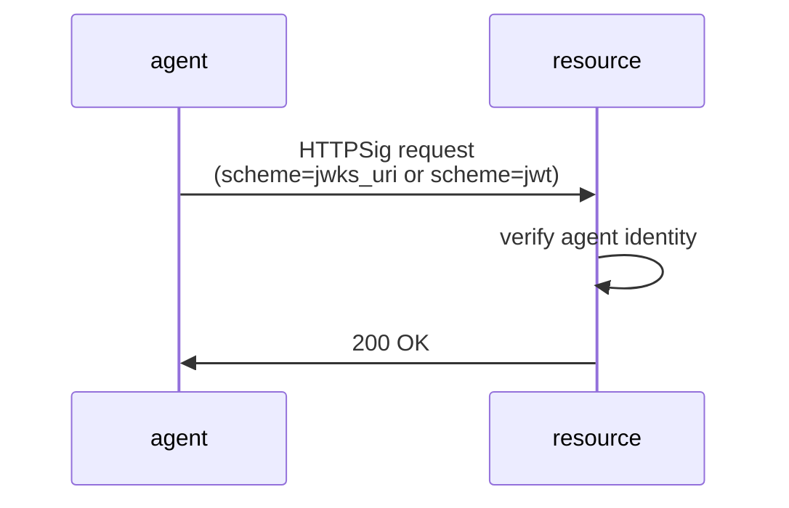
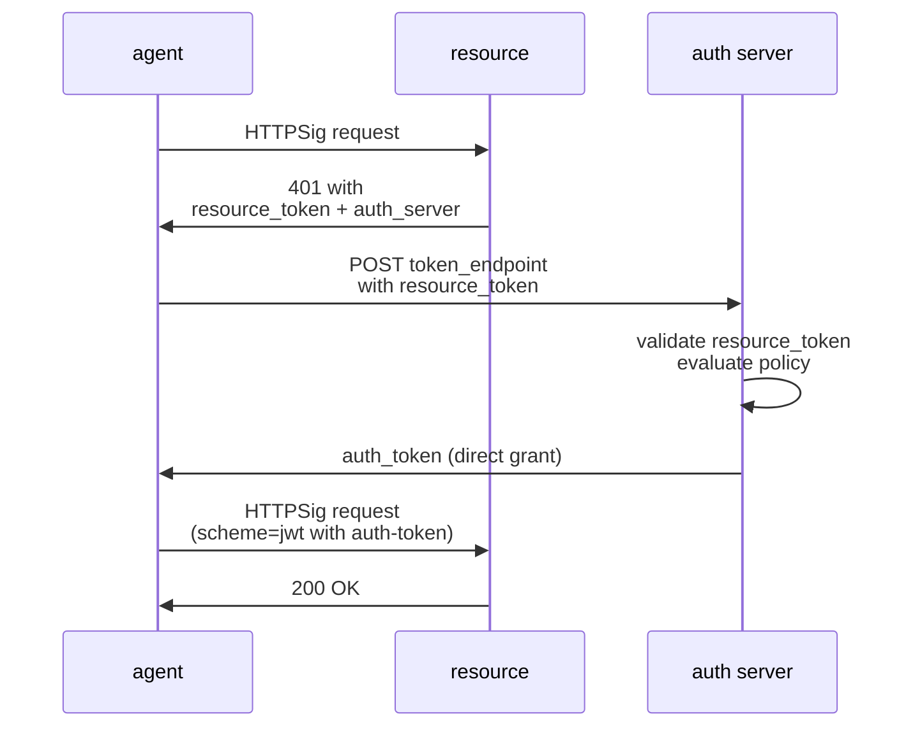
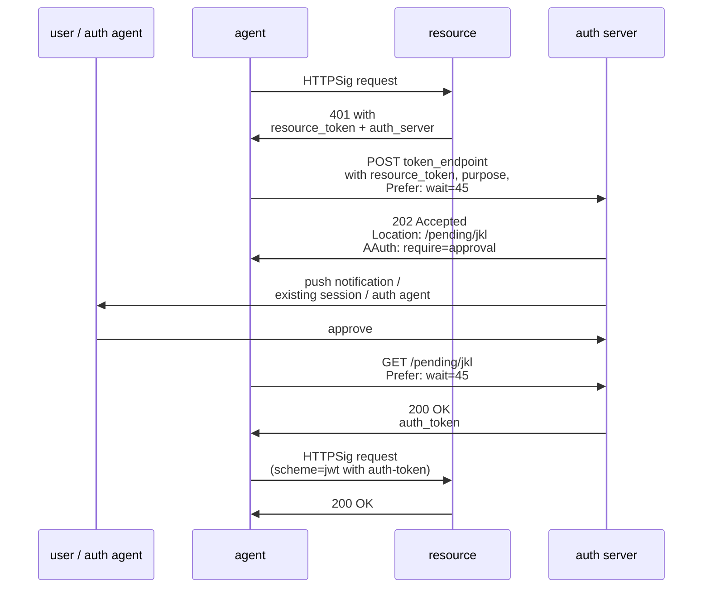
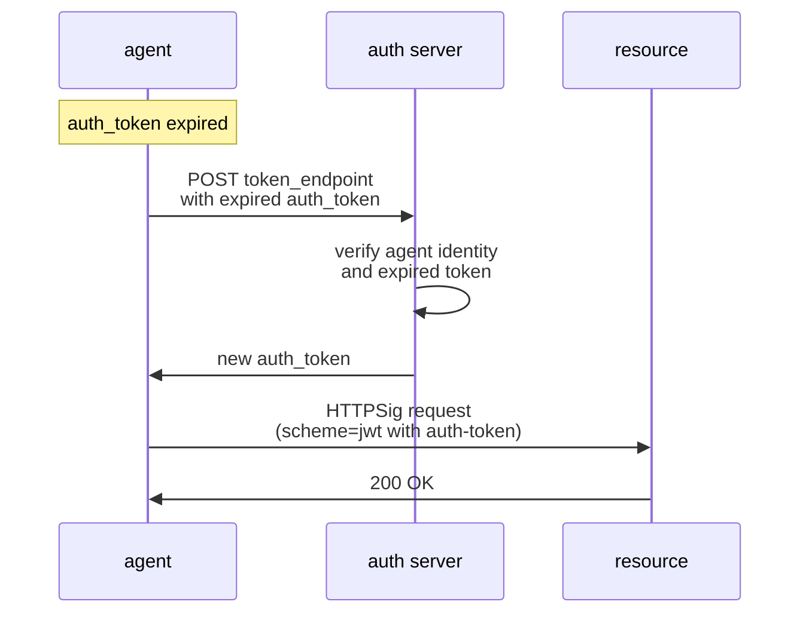
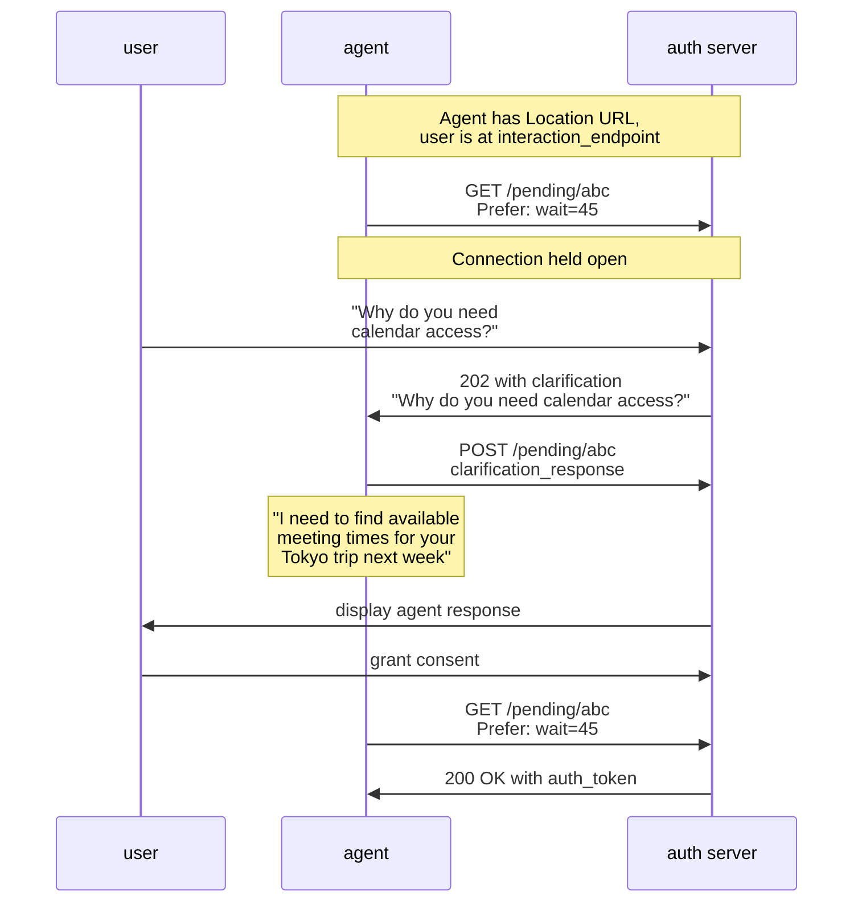
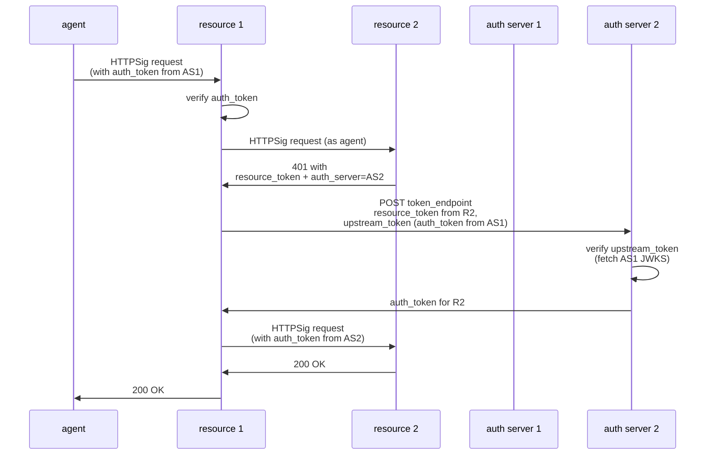

%%%
title = "AAuth Protocol"
abbrev = "AAuth"
ipr = "trust200902"
area = "Security"
workgroup = "TBD"
keyword = ["agent", "authentication", "authorization", "http", "signatures"]

[seriesInfo]
status = "standard"
name = "Internet-Draft"
value = "draft-hardt-aauth-latest"
stream = "IETF"

date = 2026-03-02T00:00:00Z

[[author]]
initials = "D."
surname = "Hardt"
fullname = "Dick Hardt"
organization = "Hellō"
  [author.address]
  email = "dick.hardt@hello.coop"

%%%

.# Abstract

AAuth is an authentication and authorization protocol for modern distributed systems. It provides progressive authentication from abuse prevention to full authorization, verified agent identity alongside user identity, cryptographic proof of resource legitimacy, and unified authentication and authorization in a single flow. The protocol uses HTTP Message Signatures for proof-of-possession on every request, eliminating bearer tokens and shared secrets. Any endpoint may return deferred responses using standard HTTP async semantics (202 Accepted, Location, Prefer: wait), enabling uniform handling of user interaction, long-running authorization, and clarification chat.

.# Discussion Venues

*Note: This section is to be removed before publishing as an RFC.*

Source for this draft and an issue tracker can be found at https://github.com/DickHardt/draft-hardt-aauth.

{mainmatter}

# Introduction

OAuth 2.0 [@!RFC6749] was created to solve a specific problem: users were sharing their passwords with third-party web applications so those applications could access their data at other sites. OAuth replaced this anti-pattern with a delegation model — the user's browser redirects to the authorization server, the user consents, and the application receives an access token without ever seeing the user's credentials. OpenID Connect extended this to federated login. Together, they serve these use cases well and continue to be the right choice for them.

But the landscape has changed. New use cases have emerged that OAuth and OIDC were not designed to address:

- **Autonomous agents** that operate without a browser, cannot receive redirects, and interact with servers they were never pre-registered with.
- **Dynamic ecosystems** like the Model Context Protocol (MCP) where any agent may call any server — pre-registration of client credentials is impractical at scale.
- **Headless and long-running processes** that need authorization but have no user interface for redirect-based flows.
- **Progressive trust** where a resource needs different levels of assurance for different operations — from rate limiting anonymous requests to requiring full user authorization — within a single protocol.
- **Multi-hop resource access** where a resource needs to access a downstream resource on behalf of the caller, requiring call chaining that passes authorization downstream and bubbles user interaction requests up.

AAuth is a separate protocol designed for these new use cases. It complements OAuth and OIDC rather than replacing them — where pre-registered clients, browser redirects, bearer tokens, and static scopes work well, they remain the right choice.

AAuth provides:

- **Proof-of-possession by default**: HTTP Message Signatures on every request eliminate bearer tokens and shared secrets.
- **Agent identity without pre-registration**: HTTPS URLs with self-published metadata and JWKS enable open ecosystems.
- **Decoupled resources and auth servers**: Resources and auth servers operate independently. Authorization requirements are expressed in resource tokens at request time, so resources can change what they require without coordinating with the auth server.
- **Polling-based token delivery**: Deferred responses (`202 Accepted` + `Location` + `Prefer: wait`) support headless agents, long-running consent, and clarification chat.
- **Progressive authentication**: A single protocol covers pseudonymous access, verified identity, and full authorization.
- **Unified AuthN and AuthZ token**: Authentication (user identity via SSO) and authorization (delegated access) work in a single flow and token.
- **Call chaining support**: Resources can act as agents, passing authorization tokens downstream and bubbling interaction requirements back up to the caller.

# Conventions and Definitions

{::boilerplate bcp14-tagged}

# Terminology

Agent
: An application or software component acting on behalf of a user or autonomously. In AAuth, agents have cryptographic identity and make signed requests.

Agent Server
: A server that manages agent identity and issues agent tokens to agent delegates. Identified by an HTTPS URL and publishes metadata at `/.well-known/aauth-agent.json`.

Agent Delegate
: An instance of an agent that holds an agent token and makes requests on behalf of the agent. Each delegate has its own signing key and a unique `sub` identifier.

Agent Token
: A JWT issued by an agent server to an agent delegate, binding the delegate's signing key to the agent's identity.

Auth Server
: A server that authenticates users, obtains consent, and issues auth tokens. Publishes metadata at `/.well-known/aauth-issuer.json`.

Auth Token
: A JWT issued by an auth server that grants an agent access to a resource, containing agent identity, user identity (if applicable), and authorized scopes.

Resource
: A protected API or service that requires authentication and/or authorization. Like agents, resources have cryptographic identity via an HTTPS URL and may publish metadata at `/.well-known/aauth-resource.json`.

Resource Token
: A JWT issued by a resource that binds an access request to the resource's identity, preventing confused deputy attacks.

Interaction Endpoint
: A URL where the user is sent for authentication, consent, or other interaction. Declared as `interaction_endpoint` in entity metadata. Both auth servers and resources MAY have interaction endpoints.

Interaction Code
: A short alphanumeric code that links an agent's pending request to the user's interaction at an interaction endpoint.


# Identifier and URL Requirements

## Server Identifiers

The `agent`, `resource`, and `issuer` values that identify agents, resources, and auth servers MUST conform to the following:

- MUST use the `https` scheme
- MUST contain only scheme and host (no port, path, query, or fragment)
- MUST NOT include a trailing slash
- MUST be lowercase
- Internationalized domain names MUST use the ASCII-Compatible Encoding (ACE) form (A-labels) as defined in [@!RFC5890]

Valid identifiers:

- `https://agent.example`
- `https://xn--nxasmq6b.example` (internationalized domain in ACE form)

Invalid identifiers:

- `http://agent.example` (not HTTPS)
- `https://Agent.Example` (not lowercase)
- `https://agent.example:8443` (contains port)
- `https://agent.example/v1` (contains path)
- `https://agent.example/` (trailing slash)

Implementations MUST perform exact string comparison on server identifiers. The lowercase and ACE requirements ensure that normalization happens at the source rather than requiring comparison logic at every point of use.

## Endpoint URLs

The `token_endpoint`, `interaction_endpoint`, and `callback_endpoint` values MUST conform to the following:

- MUST use the `https` scheme
- MUST NOT contain a fragment
- MUST NOT contain a query string

When `localhost_callback_allowed` is `true` in the agent's metadata, the agent MAY use a localhost callback URL as the `callback` parameter to the interaction endpoint. Localhost callback URLs MUST use the `http` scheme with a loopback address (`127.0.0.1`, `[::1]`, or `localhost`), MUST include a port, MAY include a path, and MUST NOT contain a query string or fragment.

## Other URLs

The `jwks_uri`, `tos_uri`, `policy_uri`, `logo_uri`, and `logo_dark_uri` values MUST use the `https` scheme.

# Protocol Overview

AAuth has three participant types — agents, resources, and auth servers — though not all are required for every interaction. All requests are signed using HTTP Message Signatures ([@!RFC9421]).

## Participants

- **Agent**: Makes signed requests to resources
- **Resource**: Protected API that may require authentication or authorization
- **Auth Server**: Issues auth tokens based on policy, user consent, or both

## Token Types

AAuth defines three token types, all of which are proof-of-possession tokens:

- **Agent Token** (`agent+jwt`): Binds an agent delegate's key to an agent server's identity
- **Resource Token** (`resource+jwt`): Binds an access request to a resource's identity
- **Auth Token** (`auth+jwt`): Grants an agent access to a resource

## Interaction Code

When a server returns `202` with user interaction required, it includes `AAuth: require=interaction; code="..."` in the response header. The interaction code binds the user's browser session to the pending request. The agent presents this code to the user via one of:

- **Direct redirect**: Navigate the user to `{interaction_endpoint}?code={interaction_code}&callback={callback_url}`
- **QR code**: Encode `{interaction_endpoint}?code={interaction_code}` for scanning
- **Manual entry**: Display the `interaction_endpoint` (from metadata) and the code (with optional hyphens for readability)

## Callback URL

The agent includes a callback URL in the interaction redirect. After user interaction completes, the server redirects the user to this URL, returning UX control to the agent. The agent MAY include state in the callback URL (e.g., as a query parameter) to maintain context when multiple sessions are in progress.

## Authentication Levels

Resources can require different authentication levels via the `AAuth` response header:

1. **Pseudonym** (`require=pseudonym`): Signed request proves possession of an included public key, providing consistent identity without verification
2. **Identified** (`require=identity`): Agent identity verified via JWKS or agent token
3. **Authorized** (`require=auth-token`): Full authorization with auth token

During authorization, the auth server may indicate pending status via `202` responses:

4. **Interaction** (`require=interaction`): The agent must direct the user to the interaction endpoint with the provided code
5. **Approval** (`require=approval`): The auth server is obtaining approval directly (from a user or auth agent) — the agent polls until resolved

## Authorization Flow

When an agent needs an auth token, it communicates with the auth server's `token_endpoint`:

1. **Initial request**: The agent POSTs to the token endpoint with the resource token, purpose, and optional parameters to help the auth server identify who authorization is being requested from (login_hint, tenant, domain_hint). The agent includes `Prefer: wait=N` to indicate how long it is willing to hold the connection open.

2. **Auth server response**: The auth server responds with either:
   - A `200` with a direct grant (`auth_token`) if no further processing is required, or
   - A `202 Accepted` with a `Location` header pointing to a pending URL. If user interaction is needed, the response includes `AAuth: require=interaction; code="..."`. If the auth server is obtaining approval directly, the response includes `AAuth: require=approval`.

3. **User interaction**: If interaction is needed, the agent directs the user to the auth server's `interaction_endpoint` (from metadata) with the interaction code. After completing authentication and consent, the auth server either redirects the user to the agent's callback URL, or displays a completion page.

4. **Token delivery**: The agent polls the pending URL with `GET` (including `Prefer: wait=N`) until the auth token is available. Token delivery is always via polling, never via the user redirect.

This design supports headless agents, long-running consent flows, and clarification chat without requiring the agent to receive redirect-based token delivery. Agents that cannot receive callbacks (headless processes, background services) simply omit the callback URL and rely entirely on polling.

## Sequence Diagrams

### Agent Token Only

An agent accesses a resource using only its agent identity, without authorization from an auth server.



### Autonomous Agent

A machine-to-machine agent obtains authorization directly without user interaction.



### User Authorization

Full flow with deferred response and polling for user-authorized access.

```mermaid
sequenceDiagram
    participant User as user
    participant Agent as agent
    participant Resource as resource
    participant Auth as auth server

    Agent->>Resource: HTTPSig request
    Resource->>Agent: 401 with<br/>resource_token + auth_server

    Agent->>Auth: POST token_endpoint<br/>with resource_token, purpose,<br/>Prefer: wait=45
    Auth->>Agent: 202 Accepted<br/>Location: /pending/abc<br/>AAuth: require=interaction; code="ABCD1234"

    Agent->>User: direct to interaction_endpoint<br/>with code

    loop polling
        Agent->>Auth: GET /pending/abc<br/>Prefer: wait=45
        Auth->>Agent: 202 Accepted
    end

    User->>Auth: authenticate and consent
    Auth->>User: redirect to callback_url
    User->>Agent: callback

    Agent->>Auth: GET /pending/abc<br/>Prefer: wait=45
    Auth->>Agent: 200 OK<br/>auth_token

    Agent->>Resource: HTTPSig request<br/>(scheme=jwt with auth-token)
    Resource->>Agent: 200 OK
```

### Agent is Resource (SSO)

An agent authenticates users to itself, combining SSO and API access.

```mermaid
sequenceDiagram
    participant User as user
    participant Agent as agent
    participant Auth as auth server

    Agent->>Auth: POST token_endpoint<br/>with scope (no resource_token),<br/>Prefer: wait=45
    Auth->>Agent: 202 Accepted<br/>Location: /pending/def<br/>AAuth: require=interaction; code="EFGH5678"

    Agent->>User: direct to interaction_endpoint<br/>with code
    User->>Auth: authenticate and consent
    Auth->>User: redirect to callback_url

    Agent->>Auth: GET /pending/def
    Auth->>Agent: 200 OK<br/>auth_token

    Note over Agent: auth_token used for:<br/>1. User identity (SSO)<br/>2. API access by delegates
```

### User Delegated Access

An AI assistant accesses a user's data with explicit consent.

```mermaid
sequenceDiagram
    participant User as user
    participant Agent as agent
    participant Resource as resource
    participant Auth as auth server

    Agent->>Resource: HTTPSig request
    Resource->>Agent: 401 with<br/>resource_token + auth_server

    Agent->>Auth: POST token_endpoint<br/>with resource_token, purpose,<br/>Prefer: wait=45

    Auth->>Agent: 202 Accepted<br/>Location: /pending/ghi<br/>AAuth: require=interaction; code="IJKL9012"

    Agent->>User: direct to interaction_endpoint<br/>with code
    User->>Auth: authenticate and consent
    Auth->>User: redirect to callback_url

    Agent->>Auth: GET /pending/ghi
    Auth->>Agent: 200 OK<br/>auth_token

    Agent->>Resource: HTTPSig request<br/>(scheme=jwt with auth-token)
    Resource->>Agent: 200 OK
```

### Auth Server Direct Approval

The auth server obtains approval directly — from a user (e.g., push notification, existing session, email) or an auth agent — without the agent facilitating a redirect. The agent simply polls until the request resolves.



In this flow, the auth server handles the approval process directly. The `require=approval` value tells the agent that the request is waiting on external approval, but the agent does not need to facilitate any user interaction.

### Auth Token Refresh

An agent refreshes an expired auth token by presenting the expired token.



### Resource User Interaction

When a resource requires user interaction (login, consent for downstream access), it returns `202 Accepted` with a `Location` header and `AAuth: require=interaction; code="..."`. Resource-level user interaction is a deferral, not a denial — the request has been accepted but requires user action before it can complete.

The agent directs the user to the resource's `interaction_endpoint` (from resource metadata) with the interaction code. The resource handles the interaction (which may involve its own AAuth, OAuth, or OIDC flow with a downstream auth server). After completion, the resource redirects the user back to the agent's callback URL. The agent polls the `Location` URL with `GET` until the response is ready.

```mermaid
sequenceDiagram
    participant User as user
    participant Agent as agent
    participant Resource as resource
    participant Auth as auth server

    Agent->>Resource: HTTPSig request<br/>(scheme=jwt with auth-token)
    Resource->>Agent: 202 Accepted<br/>Location: /pending/xyz<br/>AAuth: require=interaction; code="MNOP3456"

    Agent->>User: direct to resource<br/>interaction_endpoint with code
    User->>Resource: authenticate/consent

    Note over Resource,Auth: Resource may perform AAuth,<br/>OAuth, or OIDC flow

    Resource->>User: redirect to agent<br/>callback_url
    User->>Agent: callback

    Agent->>Resource: GET /pending/xyz
    Resource->>Agent: 200 OK (original response)
```

The agent directs the user to the resource's interaction URL with the code. For a direct redirect:

```
https://resource.example/interact?code="MNOP3456"&callback=https%3A%2F%2Fagent.example%2Fcallback%3Fstate%3Dxyz
```

After user interaction completes, the agent polls the pending URL:

```http
GET /pending/xyz HTTP/1.1
Host: resource.example
Prefer: wait=45
Signature-Input: sig=("@method" "@authority" "@path" "signature-key");created=1730217600
Signature: sig=:...signature bytes...:
Signature-Key: sig=jwt;jwt="eyJhbGc..."
```

### Clarification Chat

During consent, the user can ask questions about the agent's purpose. The auth server delivers questions to the agent via polling on the pending URL, and the agent responds.



### Call Chaining

**Editor's Note:** Call chaining is an exploratory feature. The mechanism described here may change in future versions.

When a resource needs to access a downstream resource on behalf of the caller, it acts as an agent. The resource presents the downstream resource's resource token along with the auth token it received from the original caller as the `upstream_token`. This allows the downstream auth server to verify the authorization chain.

#### Direct Grant

When the downstream auth server can issue a token without user interaction:



#### Interaction Chaining

When the downstream auth server requires user interaction, Resource 1 chains the interaction back to the original agent. Resource 1 receives a `202` with `require=interaction` from the downstream auth server, then returns its own `202` with `require=interaction` to the agent. The agent directs the user to Resource 1's interaction endpoint, and Resource 1 redirects the user onward to the downstream interaction endpoint. This keeps the downstream interaction URL opaque to the agent — each link in the chain manages only its own interaction redirect.

```mermaid
sequenceDiagram
    participant User as user
    participant Agent as agent
    participant R1 as resource 1
    participant R2 as resource 2
    participant AS2 as auth server 2

    Agent->>R1: HTTPSig request
    R1->>R2: HTTPSig request (as agent)
    R2->>R1: 401 with resource_token + auth_server=AS2

    R1->>AS2: POST token_endpoint<br/>with upstream_token
    AS2->>R1: 202 Accepted<br/>require=interaction; code=WXYZ

    R1->>Agent: 202 Accepted<br/>Location: /pending/xyz<br/>AAuth: require=interaction; code="MNOP"

    Agent->>User: direct to R1<br/>interaction_endpoint with code
    User->>R1: interaction_endpoint
    R1->>User: redirect to AS2<br/>interaction_endpoint with code
    User->>AS2: authenticate and consent
    AS2->>User: redirect to R1 callback
    R1->>R1: poll AS2 pending URL<br/>receive auth_token for R2

    R1->>R2: HTTPSig request<br/>(with auth_token from AS2)
    R2->>R1: 200 OK

    R1->>User: redirect to agent callback_url
    Agent->>R1: GET /pending/xyz
    R1->>Agent: 200 OK
```

# AAuth Response Header

Servers use the `AAuth` response header to indicate authentication and interaction requirements. The header value is a Structured Fields Dictionary ([@!RFC8941]) with a `require` key whose token value indicates the requirement level. Additional parameters provide context for the requirement.

## Pseudonym

When a resource requires only a signed request:

```http
HTTP/1.1 401 Unauthorized
AAuth: require=pseudonym
```

## Identity Required

When a resource requires verified agent identity:

```http
HTTP/1.1 401 Unauthorized
AAuth: require=identity
```

## Auth Token Required

When a resource requires an auth token:

```http
HTTP/1.1 401 Unauthorized
AAuth: require=auth-token; resource-token="..."; auth-server="https://auth.example"
```

Parameters:

- `resource-token`: A resource token binding this request to the resource's identity
- `auth-server`: The auth server URL where the agent should obtain an auth token

## Interaction Required

When a server requires user interaction, it returns `202 Accepted` per the Deferred Responses protocol with an `AAuth` header and a JSON body:

```http
HTTP/1.1 202 Accepted
Location: /pending/res_abc123
Retry-After: 0
Cache-Control: no-store
AAuth: require=interaction; code="ABCD1234"
Content-Type: application/json

{
  "status": "pending",
  "location": "/pending/res_abc123",
  "require": "interaction",
  "code": "ABCD1234"
}
```

The `code` field is REQUIRED when `require` is `"interaction"`. The agent MUST direct the user to the server's `interaction_endpoint` (from metadata) with the code and poll the `Location` URL with `GET` for the result.

## Approval Pending

When the auth server is obtaining approval directly — from a user (e.g., push notification, existing session) or an auth agent — without the agent's involvement:

```http
HTTP/1.1 202 Accepted
Location: /pending/res_def456
AAuth: require=approval
Retry-After: 0
Cache-Control: no-store
Content-Type: application/json

{
  "status": "pending",
  "location": "/pending/res_def456",
  "require": "approval"
}
```

The agent knows the request is waiting on external approval but does not need to take any action. The agent polls the `Location` URL until the request resolves.

# Agent Tokens

Agent tokens enable agent servers to delegate signing authority to agent delegates while maintaining a stable agent identity.

## Agent Token Structure

An agent token is a JWT with `typ: agent+jwt` containing:

Header:
- `alg`: Signing algorithm
- `typ`: `agent+jwt`
- `kid`: Key identifier

Payload:
- `iss`: Agent server URL (the agent identifier)
- `sub`: Agent delegate identifier (stable across key rotations)
- `cnf`: Confirmation claim with `jwk` containing the delegate's public key
- `iat`: Issued at timestamp
- `exp`: Expiration timestamp

## Agent Token Usage

Agent delegates present agent tokens via the `Signature-Key` header using `scheme=jwt`:

```http
Signature-Key: sig=jwt; jwt="eyJhbGciOiJFZERTQSIsInR5cCI6ImFnZW50K2p3dCJ9..."
```

# Resource Tokens

Resource tokens provide cryptographic proof of resource identity, preventing confused deputy and MITM attacks.

## Resource Token Structure

A resource token is a JWT with `typ: resource+jwt` containing:

Header:
- `alg`: Signing algorithm
- `typ`: `resource+jwt`
- `kid`: Key identifier

Payload:
- `iss`: Resource URL
- `aud`: Auth server URL
- `agent`: Agent identifier
- `agent_jkt`: JWK thumbprint of the agent's current signing key
- `exp`: Expiration timestamp
- `scope`: Requested scopes (optional)

## Resource Token Usage

Resources include resource tokens in the `AAuth` header when requiring authorization:

```http
AAuth: require=auth-token; resource-token="eyJ..."; auth-server="https://auth.example"
```

# Auth Tokens

Auth tokens grant agents access to resources after authentication and authorization.

## Auth Token Structure

An auth token is a JWT with `typ: auth+jwt` containing:

Header:
- `alg`: Signing algorithm
- `typ`: `auth+jwt`
- `kid`: Key identifier

Required payload claims:
- `iss`: Auth server URL
- `aud`: Resource URL
- `agent`: Agent identifier
- `cnf`: Confirmation claim with `jwk` containing the agent's public key
- `iat`: Issued at timestamp
- `exp`: Expiration timestamp

Conditional payload claims (at least one MUST be present):
- `sub`: User identifier
- `scope`: Authorized scopes

**Editor's Note:** A future version may define a URI-based authorization claim (referencing a Rich Authorization Request document with a SHA-256 hash of the contents) as an alternative to scope.

The auth token MAY include additional claims registered in the IANA JSON Web Token Claims Registry [@!RFC7519] or defined in OpenID Connect Core 1.0 Section 5.1.

## Auth Token Usage

Agents present auth tokens via the `Signature-Key` header using `scheme=jwt`:

```http
Signature-Key: sig=jwt; jwt="eyJhbGciOiJFZERTQSIsInR5cCI6ImF1dGgrand0In0..."
```

# Deferred Responses

Any endpoint in AAuth — whether an auth server token endpoint or a resource endpoint — MAY return a `202 Accepted` response when it cannot immediately resolve a request. This is a first-class protocol primitive, not a special case. Agents MUST handle `202` responses regardless of the nature of the original request.

Reasons a `202` MAY be returned include:

- Human approval or interaction is required
- Long-running computation or downstream processing
- Authorization is pending evaluation

## Initial Request

The agent makes a request and signals its willingness to wait using the `Prefer` header ([@!RFC7240]):

```http
POST /token HTTP/1.1
Host: auth.example
Content-Type: application/json
Prefer: wait=45
Signature-Input: sig=("@method" "@authority" "@path" "signature-key");created=1730217600
Signature: sig=:...signature bytes...:
Signature-Key: sig=jwt;jwt="eyJhbGc..."

{
  "resource_token": "eyJhbGc..."
}
```

The `wait` preference tells the server the agent is willing to hold the connection open for up to N seconds before the server MUST respond. The server confirms the honored duration with `Preference-Applied`:

```http
Preference-Applied: wait=45
```

The server SHOULD respond within the requested wait duration. If the request cannot be resolved within that time, it returns a `202`.

## Pending Response

When the server cannot resolve the request within the wait period:

```http
HTTP/1.1 202 Accepted
Location: /pending/f7a3b9c
Retry-After: 0
Cache-Control: no-store
Content-Type: application/json

{
  "status": "pending",
  "location": "/pending/f7a3b9c"
}
```

Headers:

- `Location` (REQUIRED): The pending URL. The server embeds its state in the URL path. The `Location` URL MUST be on the same origin as the responding server.
- `Retry-After` (REQUIRED): Seconds the agent SHOULD wait before polling. `0` means retry immediately.
- `Cache-Control: no-store` (REQUIRED): Prevents caching of pending responses.

Every `202` response MUST include a `Location` header, making each response self-contained.

Body fields:

- `status` (REQUIRED): Always `"pending"`.
- `location` (REQUIRED): The pending URL (echoes the `Location` header).
- `require` (OPTIONAL): The requirement level. `"interaction"` when the agent must direct the user to an interaction endpoint (with `code`). `"approval"` when the auth server is obtaining approval directly from a user or auth agent.
- `code` (OPTIONAL): The interaction code. Present only with `require: "interaction"`. The agent MUST direct the user to the server's `interaction_endpoint` with this code.
- `clarification` (OPTIONAL): A question from the user during consent. Present during clarification chat.

## Polling with GET

After receiving a `202`, the agent switches to `GET` for all subsequent requests to the `Location` URL:

```http
GET /pending/f7a3b9c HTTP/1.1
Host: auth.example
Prefer: wait=45
Signature-Input: sig=("@method" "@authority" "@path" "signature-key");created=1730217600
Signature: sig=:...signature bytes...:
Signature-Key: sig=jwt;jwt="eyJhbGc..."
```

- The agent does NOT resend the original request body
- The `Location` URL contains all state the server needs
- The agent SHOULD include `Prefer: wait=N` on every poll
- While still pending, the server responds with `202` including the same `Location`

The distinction between POST and GET is intentional:

- **POST** — "here is my request, process this" — creates the pending context
- **GET** — "give me the result" — idempotent, safe to retry on network failure

## Terminal Responses

A non-`202` response terminates polling. The agent MUST stop polling and handle the response.

| Status | Meaning | Agent Behavior |
|--------|---------|----------------|
| `200` | Success | Process response body |
| `403` | Denied or abandoned | Surface to user; check `error` field |
| `408` | Expired | MAY initiate a fresh request |
| `410` | Gone — permanently invalid | MUST NOT retry |
| `500` | Internal server error | Start over |

Once a terminal response is returned, the `Location` URL is no longer valid. Subsequent `GET` requests to it MUST return `404`.

## Transient Non-Terminal Responses

| Status | Meaning | Agent Behavior |
|--------|---------|----------------|
| `202` | Pending | Continue polling with `Prefer: wait` |
| `503` | Server temporarily unavailable | Back off using `Retry-After`; MUST honor over `Prefer: wait` |

## Error Response Format

All error responses return JSON with `Content-Type: application/json` and `Cache-Control: no-store`:

```json
{
  "error": "denied",
  "error_description": "User denied the request",
  "error_uri": "https://auth.example/docs/errors#denied"
}
```

- `error` (REQUIRED): Machine-readable error code.
- `error_description` (OPTIONAL): Human-readable explanation for logging or developer display.
- `error_uri` (OPTIONAL): URL to a human-readable page with additional information about the error.

See the Error Responses section for token endpoint error codes and polling error codes.

## Agent State Machine

```
Initial POST (with Prefer: wait=N)
    |
    +-- 200 --> done (direct grant)
    +-- 202 --> note Location URL, check require/code
    +-- 400 --> invalid_request or invalid_resource_token — fix and retry
    +-- 401 --> invalid_signature — check credentials
    +-- 500 --> server_error — start over
    +-- 503 --> back off (Retry-After), retry
               |
               GET Location (with Prefer: wait=N)
               |
               +-- 200 --> done
               +-- 202 --> continue polling (check for clarification)
               +-- 403 --> denied or abandoned — surface to user
               +-- 408 --> expired — MAY retry with fresh request
               +-- 410 --> invalid_code — do not retry
               +-- 500 --> server_error — start over
               +-- 503 --> temporarily_unavailable — back off (Retry-After)
```

# Token Endpoint

The auth server's `token_endpoint` is the endpoint for initiating authorization requests and refreshing auth tokens. Polling and clarification use the pending URL returned in `202` responses (see Deferred Responses).

## Initial Authorization Request

The agent makes a signed POST to the `token_endpoint` to initiate an authorization request.

**Request parameters:**

- `resource_token` (CONDITIONAL): The resource token from a resource's AAuth challenge. Required when requesting access to another resource.
- `scope` (CONDITIONAL): Space-separated scope values. Used when the agent requests authorization to itself (agent is resource).
- `upstream_token` (OPTIONAL): An auth token from an upstream authorization, used in call chaining when a resource acts as an agent to access a downstream resource. Allows the auth server to verify the authorization chain.
- `purpose` (OPTIONAL): Human-readable string declaring why access is being requested.
- `login_hint` (OPTIONAL): Hint about who to authorize, per OpenID Connect Core 1.0 Section 3.1.2.1.
- `tenant` (OPTIONAL): Tenant identifier, per OpenID Connect Enterprise Extensions 1.0.
- `domain_hint` (OPTIONAL): Domain hint, per OpenID Connect Enterprise Extensions 1.0.

**Editor's Note:** Future versions may define additional parameters to indicate how the auth server should process the request, such as authentication strength requirements.

**Example request:**
```http
POST /token HTTP/1.1
Host: auth.example
Content-Type: application/json
Prefer: wait=45
Signature-Input: sig=("@method" "@authority" "@path" "signature-key");created=1730217600
Signature: sig=:...signature bytes...:
Signature-Key: sig=jwt;jwt="eyJhbGc..."

{
  "resource_token": "eyJhbGc...",
  "purpose": "Find available meeting times"
}
```

## Auth Server Response

The auth server validates the request and responds based on policy.

**Direct grant response** (`200` — no user interaction needed):
```json
{
  "auth_token": "eyJhbGc...",
  "expires_in": 3600
}
```

**User interaction required response** (`202` — deferred):
```http
HTTP/1.1 202 Accepted
Location: /pending/abc123
Retry-After: 0
Cache-Control: no-store
AAuth: require=interaction; code="ABCD1234"
Content-Type: application/json

{
  "status": "pending",
  "location": "/pending/abc123",
  "require": "interaction",
  "code": "ABCD1234"
}
```

The `location` field contains the pending URL the agent polls with `GET`. When `require` is `"interaction"`, the agent directs the user to the auth server's `interaction_endpoint` with the `code`. When `require` is `"approval"`, the auth server is obtaining approval directly (from a user or auth agent) and the agent simply polls.

**Error response** (request validation failed):
```json
{
  "error": "invalid_resource_token",
  "error_description": "Resource token has expired"
}
```

See Token Endpoint Errors in the Deferred Responses section for the full set of error codes.

Polling, terminal responses, and error handling follow the Deferred Responses protocol described above.

## Clarification Chat

During user consent, the user may ask questions about the agent's stated purpose. The auth server delivers these questions to the agent, and the agent responds.

A `202` polling response may include a `clarification` field containing the user's question:

```json
{
  "status": "pending",
  "location": "/pending/abc123",
  "clarification": "Why do you need access to my calendar?"
}
```

The agent responds by POSTing JSON with `clarification_response` to the pending URL:

```http
POST /pending/abc123 HTTP/1.1
Host: auth.example
Content-Type: application/json
Signature-Input: sig=("@method" "@authority" "@path" "signature-key");created=1730217600
Signature: sig=:...signature bytes...:
Signature-Key: sig=jwt;jwt="eyJhbGc..."

{
  "clarification_response": "I need to find available meeting times for your Tokyo trip next week"
}
```

Auth servers SHOULD enforce limits on clarification rounds (recommended: 5 rounds maximum) and overall timeout to prevent abuse.

## User Interaction

When a server responds with `202` and `AAuth: require=interaction; code="..."`, the agent directs the user to the server's `interaction_endpoint` (from metadata) with the interaction code. The agent has three options:

**Manual entry**: Display the `interaction_endpoint` and the code separately. The agent MAY insert hyphens into the code for readability (e.g., `ABCD-1234`). The code itself MUST NOT contain hyphens.

**QR code**: Encode the full URL for scanning:
```
{interaction_endpoint}?code={interaction_code}
```

**Direct redirect** (when the agent has a browser): Navigate the user directly, optionally with a callback:
```
{interaction_endpoint}?code={interaction_code}&callback={callback_url}
```

**Example redirect URL:**
```
https://auth.example/interact?code="ABCD1234"&callback=https%3A%2F%2Fagent.example%2Fcallback%3Fstate%3Dabc123
```

The server authenticates the user and displays consent information (including the agent's `purpose`, identity, and requested scopes).

**After consent, the server determines the callback behavior:**

If the agent provided a `callback` parameter, the server redirects the user to that URL:

```http
HTTP/1.1 303 See Other
Location: https://agent.example/callback?state=abc123
```

If no `callback` was provided, the server displays a completion page telling the user they may close the window.

## Token Refresh

When an auth token expires, the agent requests a new one by presenting the expired auth token.

**Request:**
```http
POST /token HTTP/1.1
Host: auth.example
Content-Type: application/json
Signature-Input: sig=("@method" "@authority" "@path" "signature-key");created=1730217600
Signature: sig=:...signature bytes...:
Signature-Key: sig=jwt;jwt="eyJhbGc..."

{
  "auth_token": "eyJhbGc..."
}
```

**Response:**
```json
{
  "auth_token": "eyJhbGc...",
  "expires_in": 3600
}
```

The auth server verifies the agent's HTTP signature, validates the expired auth token, and issues a new auth token. The auth server MAY reject the refresh if the token has been expired beyond its refresh window.

# Agent Delegate User Binding

An agent delegate SHOULD be associated with at most one user. The auth server tracks the association between an agent delegate (identified by the `sub` claim in the agent token) and the user who authorized it. The user may be anonymous to the agent and to the resource, but the auth server always knows who authorized the delegate.

This association enables:

- **Re-authorization for long-running tasks**: When an agent delegate needs to refresh an expired auth token or re-authorize access, the auth server can associate the request with the original authorizing user without requiring a new interactive flow.
- **Organizational authorization**: In enterprise contexts, any authorized person within a tenant can approve access for the agent delegate. The auth server tracks which user authorized the delegate, but the agent need not know the user's identity.
- **Audit trail**: The auth server maintains a record of which user authorized which agent delegate, enabling compliance and security review.

# Metadata Documents

Participants publish metadata at well-known URLs to enable discovery.

## Agent Server Metadata

Published at `/.well-known/aauth-agent.json`:

```json
{
  "agent": "https://agent.example",
  "jwks_uri": "https://agent.example/.well-known/jwks.json",
  "client_name": "Example AI Assistant",
  "logo_uri": "https://agent.example/logo.png",
  "logo_dark_uri": "https://agent.example/logo-dark.png",
  "callback_endpoint": "https://agent.example/callback",
  "localhost_callback_allowed": true,
  "tos_uri": "https://agent.example/tos",
  "policy_uri": "https://agent.example/privacy"
}
```

Fields:

- `agent` (REQUIRED): The agent's HTTPS URL
- `jwks_uri` (REQUIRED): URL to the agent's JSON Web Key Set
- `client_name` (OPTIONAL): Human-readable agent name (per RFC 7591)
- `logo_uri` (OPTIONAL): URL to agent logo (per RFC 7591)
- `logo_dark_uri` (OPTIONAL): URL to agent logo for dark backgrounds
- `callback_endpoint` (OPTIONAL): The agent's HTTPS callback endpoint URL. The agent MAY append path and query parameters at runtime to construct the callback URL — any URL on the same origin is valid. If absent, the agent does not support callbacks.
- `localhost_callback_allowed` (OPTIONAL): Boolean indicating whether the agent supports localhost callbacks (for CLI tools and desktop applications). Default: `false`. When `true`, any `http` URL with a loopback address (`127.0.0.1`, `[::1]`, or `localhost`) and a port is permitted as a callback URL at runtime.
- `tos_uri` (OPTIONAL): URL to terms of service (per RFC 7591)
- `policy_uri` (OPTIONAL): URL to privacy policy (per RFC 7591)

## Auth Server Metadata

Published at `/.well-known/aauth-issuer.json`:

```json
{
  "issuer": "https://auth.example",
  "token_endpoint": "https://auth.example/token",
  "interaction_endpoint": "https://auth.example/interact",
  "jwks_uri": "https://auth.example/.well-known/jwks.json"
}
```

Fields:

- `issuer` (REQUIRED): The auth server's HTTPS URL
- `token_endpoint` (REQUIRED): Single endpoint for all agent-to-auth-server communication
- `interaction_endpoint` (REQUIRED): URL where users are sent for authentication and consent
- `jwks_uri` (REQUIRED): URL to the auth server's JSON Web Key Set

## Resource Metadata

Published at `/.well-known/aauth-resource.json`:

```json
{
  "resource": "https://resource.example",
  "jwks_uri": "https://resource.example/.well-known/jwks.json",
  "client_name": "Example Data Service",
  "logo_uri": "https://resource.example/logo.png",
  "logo_dark_uri": "https://resource.example/logo-dark.png",
  "interaction_endpoint": "https://resource.example/interact",
  "scope_descriptions": {
    "data.read": "Read access to your data and documents",
    "data.write": "Create and update your data and documents",
    "data.delete": "Permanently delete your data and documents"
  },
  "additional_signature_components": ["content-type", "content-digest"]
}
```

Fields:

- `resource` (REQUIRED): The resource's HTTPS URL
- `jwks_uri` (REQUIRED): URL to the resource's JSON Web Key Set
- `client_name` (OPTIONAL): Human-readable resource name (per RFC 7591)
- `logo_uri` (OPTIONAL): URL to resource logo (per RFC 7591)
- `logo_dark_uri` (OPTIONAL): URL to resource logo for dark backgrounds
- `interaction_endpoint` (OPTIONAL): URL where users are sent for resource-level interaction
- `scope_descriptions` (OPTIONAL): Object mapping scope names to human-readable descriptions, for the auth server to use in consent UI
- `additional_signature_components` (OPTIONAL): Additional HTTP message components that must be covered in signatures

# Purpose

The `purpose` parameter is an optional human-readable string that an agent passes to the auth server when requesting an auth token. It declares why access is being requested, providing context for authorization decisions without requiring the auth server or resource to evaluate or enforce the stated purpose.

## Usage

When an agent requests an auth token from the auth server, it MAY include a `purpose` parameter that describes the reason for the access request in terms meaningful to the authorizing user.

The auth server SHOULD present the `purpose` value to the user during consent. The auth server MAY log the `purpose` for audit and monitoring purposes. The `purpose` is also available to the user during clarification chat.

## Security Considerations for Purpose

The `purpose` parameter is self-asserted by the requesting agent or application. Auth servers and users SHOULD treat it as informational context, not as a trusted assertion. A malicious agent could declare a benign purpose while intending harmful actions.

However, the declared purpose creates accountability. If an agent declares its purpose is to "find available meeting times" but then reads email content, the discrepancy between declared purpose and actual behavior is detectable by monitoring systems.

# HTTP Message Signing Profile

AAuth uses HTTP Message Signatures ([@!RFC9421]) for request authentication.

## Required Headers

All AAuth requests MUST include:

- `Signature-Key`: Public key or key reference for signature verification
- `Signature-Input`: Signature metadata including covered components
- `Signature`: The HTTP message signature

## Signature-Key Header

The `Signature-Key` header ([@!I-D.hardt-httpbis-signature-key]) provides keying material:

- `scheme=hwk`: Header Web Key (inline public key)
- `scheme=jwks_uri`: Reference to JWKS endpoint
- `scheme=jwt`: JWT containing public key in `cnf` claim
- `scheme=x509`: X.509 certificate

## Covered Components

HTTP Message Signatures in AAuth MUST cover:

- `@method`: HTTP method
- `@authority`: Target host
- `@path`: Request path
- `signature-key`: The Signature-Key header value

Resources MAY require additional components via `additional_signature_components` in metadata.

## Signature Parameters

The `Signature-Input` header MUST include:

- `created`: Signature creation timestamp (Unix time)

The `created` timestamp MUST NOT be more than 60 seconds in the past or future.

# Error Responses

AAuth defines error responses for both `401` authentication challenges and deferred response error codes. Token and signature errors use `401` with JSON error bodies. Deferred response errors use standard HTTP status codes with JSON error bodies as defined in the Deferred Responses section.

## Error Response Format

```json
{
  "error": "invalid_request",
  "error_description": "Human-readable description"
}
```

## Authentication Error Codes

These errors are returned as `401` responses to API requests.

### invalid_signature

The HTTP Message Signature is missing, malformed, or verification failed. When the signature is missing required components, the response SHOULD include `required_components`:

```json
{
  "error": "invalid_signature",
  "error_description": "Signature missing required components",
  "required_components": ["@method", "@authority", "@path", "signature-key"]
}
```

### invalid_agent_token

The agent token is missing, malformed, expired, or signature verification failed.

### invalid_resource_token

The resource token is missing, malformed, expired, or signature verification failed.

### invalid_auth_token

The auth token is missing, malformed, expired, or signature verification failed.

### key_binding_failed

The key binding verification failed. The public key used to sign the request does not match the key bound in the token.

## Token Endpoint Error Codes

Errors returned in response to the initial POST to the token endpoint:

| Error | Status | Meaning |
|-------|--------|---------|
| `invalid_request` | 400 | Malformed JSON, missing required fields, or invalid parameter values |
| `invalid_resource_token` | 400 | Resource token is invalid, expired, or malformed |
| `invalid_signature` | 401 | HTTP signature verification failed |
| `invalid_auth_token` | 400 | Expired auth token presented for refresh is invalid or beyond the refresh window |
| `server_error` | 500 | Internal error |

## Polling Error Codes

Errors returned as terminal responses when polling a pending URL:

| Error | Status | Meaning |
|-------|--------|---------|
| `denied` | 403 | User or approver explicitly denied the request |
| `abandoned` | 403 | Interaction code was used but the user did not complete the interaction |
| `expired` | 408 | Timed out — interaction code was never used |
| `invalid_code` | 410 | Interaction code not recognized or already consumed |
| `server_error` | 500 | Internal error |

Agents MUST treat unknown `error` values as fatal.

# Design Rationale

## Why Standard HTTP Async Pattern

AAuth uses standard HTTP async semantics (`202 Accepted`, `Location`, `Prefer: wait`, `Retry-After`) rather than custom polling mechanisms. This pattern:

- **Applies uniformly to all endpoints**: Token endpoint, resource endpoints, and any future endpoints use the same deferred response protocol without per-endpoint async documentation.
- **Aligns with RFC 7240**: The `Prefer: wait` semantics negotiate connection hold duration between agent and server.
- **Enables transparent async upgrades**: Resources that were synchronous can become async (requiring user interaction, long-running computation) without breaking existing agents.
- **Replaces OAuth device flow**: The `Location` URL serves as the device code, `Prefer: wait` replaces the polling interval, and standard status codes replace custom error strings.
- **Supports headless agents**: CLI tools, background services, and IoT devices can obtain authorization without hosting a redirect endpoint.
- **Enables long-running consent**: Complex authorization decisions (enterprise approvals, multi-party consent) can take minutes or hours.
- **Enables clarification chat**: The agent can respond to user questions during consent via the same polling mechanism.
- **Eliminates authorization code interception**: There is no authorization code in the redirect URL to intercept or replay.

## Why No Authorization Code

OAuth 2.0 uses an authorization code as an intermediary: the auth server redirects the user to the client with a code in the URL, and the client exchanges the code for tokens via a back-channel request. This two-step process was designed to prevent tokens from appearing in browser history and server logs. However, authorization codes introduce their own attack surface:

- **Code interception**: Authorization codes pass through the user's browser via URL query parameters, making them vulnerable to interception by malicious browser extensions, open redirectors, or referrer leakage. PKCE mitigates but does not eliminate this risk.
- **Code replay**: Without PKCE, intercepted codes can be replayed. With PKCE, the code is bound to a verifier, but the complexity of correct PKCE implementation has led to widespread deployment errors.
- **Redirect URI validation**: The auth server must validate redirect URIs to prevent code delivery to attacker-controlled endpoints. This validation is a frequent source of security vulnerabilities.

AAuth eliminates authorization codes entirely. The user redirect carries only the callback URL (which the agent chose and may include its own state), which has no security value to an attacker — it cannot be exchanged for tokens. The auth token is delivered exclusively via polling on the pending URL, authenticated by the agent's HTTP Message Signature. This means:

- No sensitive material passes through the user's browser
- No redirect URI validation is needed for token security (callback URLs serve only UX purposes)
- No PKCE-equivalent is needed since there is no code to protect
- Token delivery is authenticated end-to-end between agent and auth server

## Why HTTPSig on Every Request

AAuth requires HTTP Message Signatures on every request to the auth server and resources. This differs from OAuth 2.0 where client authentication is optional or uses separate mechanisms (client secrets, mTLS, DPoP).

- **Message integrity, not just token binding**: HTTPSig covers the HTTP method, path, authority, and optionally body, providing tamper detection that DPoP and mTLS do not offer.
- **Survives proxies and CDNs**: Unlike mTLS which terminates at the first TLS endpoint, HTTPSig signatures survive through proxies, load balancers, and CDNs.
- **No bearer tokens**: Every request proves possession of the signing key. There are no bearer tokens to exfiltrate.
- **Consistent across all auth levels**: The same signing mechanism works for pseudonym, identity, and auth-token requests.

## Why HTTPS-Based Agent Identity

AAuth uses HTTPS URLs as agent identifiers rather than pre-registered client IDs. Agents publish metadata and JWKS at well-known endpoints.

- **Dynamic ecosystems without pre-registration**: Agents can interact with any auth server or resource without prior registration, enabling open ecosystems like MCP.
- **Self-published metadata**: Agent metadata (name, logo, callback URLs, policies) is published by the agent and discoverable by any party.
- **Works with ephemeral keys**: Agent delegates use short-lived keys bound to the agent's stable HTTPS identity, enabling frequent key rotation without registration changes.

## Why Interaction Codes Instead of Opaque Tokens

- **Human-enterable**: Short alphanumeric codes (e.g., `ABCD1234`) can be typed, read aloud, or entered from a different device.
- **QR-friendly**: Short codes produce simple QR codes that scan reliably.
- **Displayable**: Codes fit on any screen, terminal, or notification without truncation.
- **Self-contained tokens would be too long**: A token carrying cryptographic binding, expiry, and issuer information would be too long for manual entry or simple QR codes.

## Why Pending URLs Instead of Tokens

- **Standard HTTP resource**: The pending URL is a standard HTTP resource polled with `GET`. No custom token exchange endpoint is needed.
- **Supports repeated polling**: Unlike OAuth's authorization code (presented once to exchange for tokens), the pending URL supports repeated polling and long-hold connections via `Prefer: wait`.
- **Enables clarification chat**: The agent can POST clarification responses to the same URL during consent.
- **Server-controlled state**: The agent treats the URL as opaque. The server may embed state in the URL path or use it as a reference to server-side state.

## Why No Refresh Token

- **HTTP signatures prove identity on every request**: The agent's signing key already proves it is the legitimate token holder. A separate refresh token would be redundant proof.
- **Expired auth token provides authorization context**: The expired token carries the audience, scope, and user binding. The auth server can issue a new token from this context.
- **Simpler agent implementation**: Agents store one token per resource, not two. No refresh token rotation or revocation logic is needed.

## Why JSON Instead of Form-Encoded

- **Modern API convention**: JSON is the standard format for modern APIs. Form encoding is an OAuth legacy from browser form POST origins.
- **Structured data**: JSON naturally represents nested objects (e.g., token endpoint responses with multiple fields). Form encoding requires flattening.
- **Consistent across request and response**: Both request bodies and response bodies use JSON, avoiding format asymmetry.

## Why Callback URL Has No Security Role

- **Tokens never pass through the user's browser**: The auth token is delivered exclusively via polling. The callback URL carries no sensitive material.
- **No redirect URI validation needed for security**: Unlike OAuth's authorization code flow, there is no code in the redirect to protect. Callback validation is unnecessary.
- **Purely a UX optimization**: The callback wakes the agent up immediately rather than waiting for the next poll interval. If an attacker redirects the callback, the agent simply polls sooner — no tokens are exposed.

## Why Separate Approval and Interaction

- **Unambiguous agent action**: `require=interaction` means the agent must facilitate a redirect with the interaction code. `require=approval` means the AS is handling approval directly — the agent just polls.
- **Different user experiences**: Interaction requires the agent to present a code or redirect a user. Approval may use push notifications, existing sessions, email, or an auth agent — none requiring agent involvement.
- **Prevents unnecessary UX**: Without distinct values, agents would not know whether to prompt the user or wait silently.

## Why Restrict Interaction Code Character Set

Interaction codes are restricted to unreserved URI characters ([@!RFC3986] Section 2.3: `A-Z a-z 0-9 - . _ ~`). Unreserved characters do not require percent-encoding in URI query parameters, eliminating double-encoding, missing encoding, and inconsistent encoding across implementations.

# Security Considerations

## Proof-of-Possession

All AAuth tokens are proof-of-possession tokens. The holder must prove possession of the private key corresponding to the public key in the token's `cnf` claim.

## HTTP Message Signature Security

HTTP Message Signatures provide:

1. **Request Integrity**: The signature covers HTTP method, target URI, and headers
2. **Replay Protection**: The `created` timestamp limits signature validity
3. **Key Binding**: Signatures are bound to specific keys via `Signature-Key`

## Token Security

- Agent tokens bind delegate keys to agent identity
- Resource tokens bind access requests to resource identity, preventing confused deputy attacks
- Auth tokens bind authorization grants to agent keys

## Interaction Code Security

- Interaction code values MUST be single-use, time-limited, and bound to the pending request
- Callback URLs are agent-specified; agents SHOULD include unguessable state values to prevent CSRF

## Pending URL Security

- Pending URLs (`Location` values in `202` responses) MUST be unguessable and SHOULD have limited lifetime
- Pending URLs MUST be on the same origin as the server that issued them
- Servers MUST verify the agent's identity on every `GET` poll to the pending URL
- Once a terminal response is returned, the pending URL MUST return `404` on subsequent requests

## Clarification Chat Security

- Auth servers MUST enforce a maximum number of clarification rounds to prevent abuse
- Auth servers SHOULD enforce a timeout on clarification exchanges
- Clarification responses from agents are untrusted input and MUST be sanitized before display to users

# IANA Considerations

## Well-Known URI Registrations

This specification registers the following Well-Known URIs:

- `aauth-agent.json`: Agent server metadata
- `aauth-issuer.json`: Auth server metadata
- `aauth-resource.json`: Resource metadata

## Media Type Registrations

This specification registers the following media types:

- `application/agent+jwt`: Agent token
- `application/auth+jwt`: Auth token
- `application/resource+jwt`: Resource token

## HTTP Header Field Registrations

This specification registers the following HTTP header:

- `AAuth`: Authentication, authorization, and interaction requirements

{backmatter}

# Agent Token Acquisition Patterns

This appendix describes common patterns for how agent delegates obtain agent tokens from their agent server. The specific mechanism is out of scope for this specification.

## Server Workloads

Server workloads include containerized services, microservices, and serverless functions. These workloads prove identity using platform attestation.

**SPIFFE-based**: The workload obtains a SPIFFE SVID from the Workload API, generates an ephemeral key pair, and presents the SVID to the agent server via mTLS. The agent server issues an agent token with `sub` set to the SPIFFE ID.

**WIMSE-based**: The workload authenticates using platform credentials (cloud provider instance identity, Kubernetes service account tokens). The agent server evaluates delegation policies before issuing tokens.

## Mobile Applications

Mobile apps prove legitimate installation using platform attestation APIs (iOS App Attest, Android Play Integrity API). Each installation generates a persistent ID and key pair. The agent server validates the attestation and issues an agent token with an installation-level `sub`.

## Desktop and CLI Applications

Desktop and CLI tools use platform vaults (macOS Keychain, Windows TPM, Linux Secret Service) or ephemeral keys. After user authentication, the agent server issues tokens with an installation-level `sub` that persists across key rotations.

## Browser-Based Applications

Browser-based applications generate ephemeral key pairs using the Web Crypto API. The web server acts as agent server and issues agent tokens to the browser session. Each session has a unique `sub` for tracking.

# Acknowledgments

The author would like to thank reviewers for their feedback on concepts and earlier drafts: Aaron Pareki, Christian Posta, Frederik Krogsdal Jacobsen, Jared Hanson, Karl McGuinness, Nate Barbettini, Wils Dawson.
